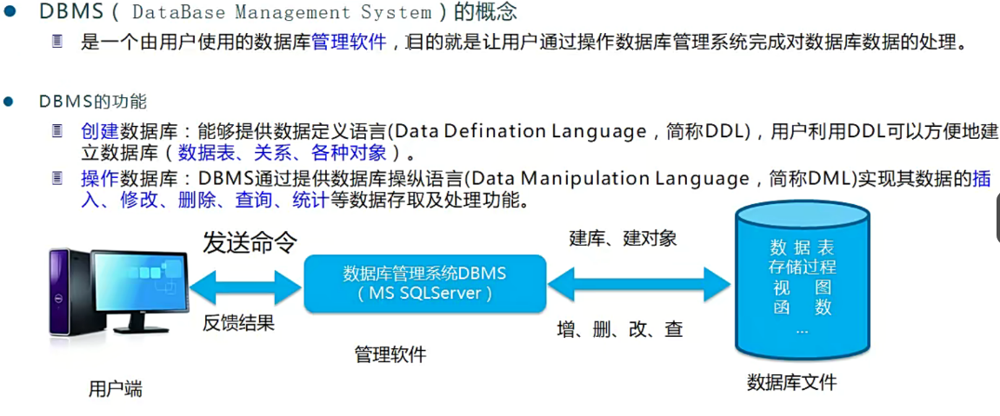
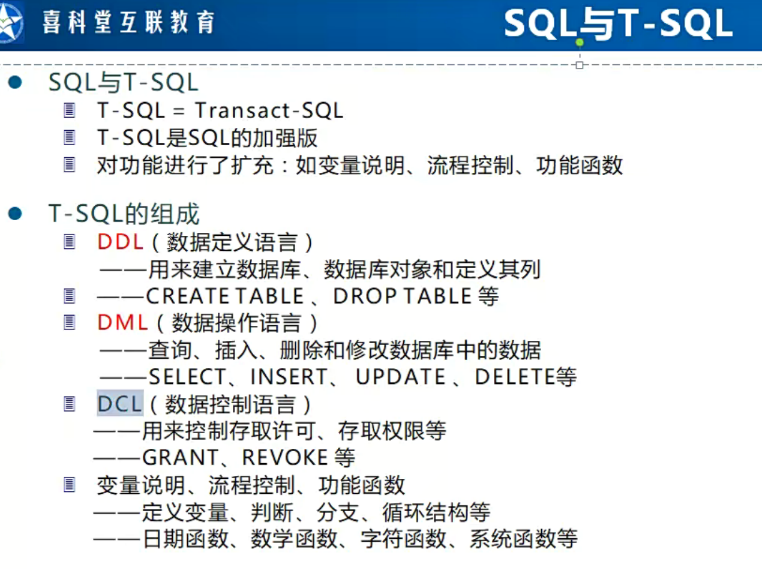
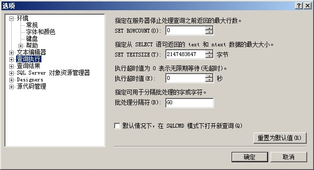

# 数据库

## 1.数据库概述

### 1.1 数据库和实体类的概述

### 1.2.数据库安装和软件

#### 1.2.1 使用的数据库

SQLServer

#### 1.2.2 使用的可视化工具

DBMS（DataBase Management System）



### 1.3 主要学习数据库方向

#### 1.3.1 T-SQL



## 2. 基本语法

SQL语句中，字符都是用单引号表示的。‘  ’

### 2.1 T-SQL脚本创建数据库

好处：创建T-SQL脚本，兼容性更好。

#### 2.1.1 案例，创建数据库格式

二、基于T-SQL创建数据库

数据库：课程管理系统数据（CourseManageDB）

课程表（保存课程信息）

课程分类表（包括课程分类信息）

讲师表

——————————————————————————————

系统数据库：master数据主要用来管理其他数据库的信息。

    model数据库：模板数据...

一、用户数据库：

数据文件：

【1】主数据文件，一个数据库有，且只能有一个主数据文件。mdf扩展名。

【2】次要数据文件，可以根据需要，添加多个，并且分布到不同的磁盘路径。ndf扩展名

【3】日志文件，有且至少有一个。也可以有多个。ldf

学会，脚本的保存，和重新打开。大家跟着常老师学习T-SQL脚本，最大的好处就是

你能感觉到你学了东西！并且，在数据库兼容性上非常强大！

特别注意：drop关键字，如果你在开发中使用，要特别小心，万一删错是无法挽回的。

#### 2.1.2 基本代码

```sql

```

2

### 2.2 关键字语法

#### 2.2.1 go

GO不是标准SQL语句，甚至不是T-SQL语句。它只是SQL **Server**管理器（SSMS）中用来提交T-SQL语句的一个标志。你可以在SSMS中任意指定这个提交标志。SSMS->工具->选项->查询执行->SQL Server->批分隔符中指定这个提交标志。如下图：



#### 2.2.2 约束

#### 2.2.3 CRUD操作

## 3. 关键字

### 3.1 数据库的增删改查关键字

3.1.1 create database <数据库名>

3.1.2 drop database <数据库名>

### 3.2 表的增删改查关键字

3.2.1 create table <表名>

3.2.2 drop table <表名>

### 3.3 表的约束

3.3.1

### 3.4 数据的增删改查

### 3.5 联合查询

### 3.6 其它辅助关键字

3.6.1 go

GO不是标准SQL语句，甚至不是T-SQL语句。它只是SQL **Server**管理器（SSMS）中用来提交T-SQL语句的一个标志。

3.6.2 use

use <数据库名>;跳转到指定数据库

3.6.3 if exists()

判断语法

### 3.7 数据类型

int

vchar

### 3.8 SQL关键字类型划分


#### DDL（数据定义语言）

#### DML（数据操作语言）

#### DCL（数据控制语言）

#### 变量说明、流程控制、功能函数


## ORM数据库框架

SqlSugar
