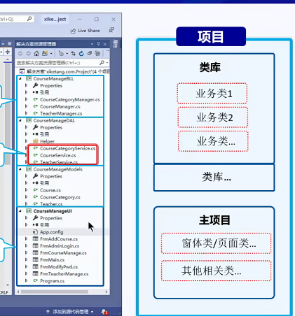
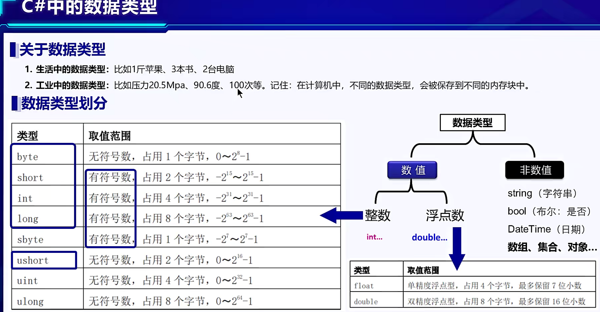

# CSharp笔记

## 1.代码和项目规范

良好的好的项目规范和代码规范不可以让项目结构更稳定，更容易维护升级。

### 1.1 项目规范

1.1.1 创建项目：

项目解决方案名称和项目名称不放到同一目录，这样就相当于项目模块话，不臃肿。

项目解决方案：我们实际说的一个项目和VS里的项目不一样，这里的项目解决方案才相当于一个实际的项目方案，而项目解决方案中的先相当于一个item，类似一个大项目中拆分出的一个小项目。

项目名字一般以公司名字开头，项目名紧跟后面。

1.1.2 架构

### 1.2 代码规范

1.2.1 命名规范：项目名，类名，方法名首字母大写（包括结构体struck，enum，delegate）。变量名小写。

1.2.2

## 2.CSharp简介

CSharp中的框架，主要有.NET FormWork  ，  .NET Core 和 Xamarin

.NET 生态有三个主要的高级别组件 - .NET Framework, .NET Core, 和 Xamarin。

### 1.1 .NET Framework

支持 Windows 和 Web 应用。

可以使用 Windows Forms（WinForms）、WPF、和 UWP 来构建Windows 应用程序。

ASP.NET MVC 的 Web 应用。

### 1.2 .NET Core

是最新的开源跨平台框架，用于构建包括 Windows, Mac 和 Linux 操作系统在内的应用程序。

.NET Core 支持 Windows Forms、 WPF、UWP和 ASP.NET Core。

UWP用于构建 Windows10 目标Windows和移动应用程序。

ASP.NET Core用于构建基于浏览器的 Web 应用程序。

### 1.3 Xamarin

毋庸置疑，当你想通过 C# 来构建移动应用（IOS，Android 和 Windows Mobile），Xamarin 是你唯一的选择。

.NET Framework 的优点

* 如果你是一位传统的 .NET 开发者，希望快速构建和发布应用，没有时间学习.NET Core，那么 .NET Framework 对你来说是一个不错的选择，.NET Core 可能会有一些学习曲线。
* 如果你目前主要是维护和更新现有 .NET 应用程序，那么 .NET Framework 是你一个不错的选择。将现有 .NET 程序移植到 .NET Core 上可能还是需要一些工作。
* 找工作？ 您现在可能在.NET Core 中找不到太多工作。

这就是 .NET Framework 的现状。当前版本的.NET Framework 4.8 应该是.NET Framework的最新版本。 将来不会再计划新版本的.NET Framework。

.NET Core 的优点

* 微软已经宣布了 .NET Core v 3.0 ，这是一个有非常多改进的 .NET Core 版本，如果你想学习和使用里面的新特性，那么.NET Core 是值得尝试的。
* .NET Core 3.0 目前支持 WPF 和 Windows Forms，.NET Core 3.0 同样也支持在 UWP, WPF 和 Windows Forms 之间进行混合开发。这将使得开发者能够更灵活地将 UWP 中一些更现代化的接口引入到 WPF 和 Windows Forms 中。
* 如果你正在构建新的应用程序，并且你的公司支持使用 .NET Core，那么 .NET Core 是一个不错的选择，总之 .NET Core 会越来越好的。
* .NET Core 更适合跨平台的需求， .NET Core 的应用程序支持在 Windows, Linux, and macOS 运行。微软广受好评的开源代码编辑器 Visual Studio Code 支持 Linux 和 macOS，同时它也支持更加现代化的编辑需求，如 智能感知[`IntelliSense`] 和 调试[`debugging`]，大多数其它第三方的编辑器，如 Sublime, Emacs, 和 VI 同样支持 .NET Core。
* 微服务架构同样在 .NET Core 中适用，它可以和不同平台的服务共同工作。包括通过 .NET Framework, Java, Ruby 等语言开发的。在容器化大行其道的今天，.NET Core 的模块化、轻量级以及它的灵活性使得它能很容易地部署到容器中，容器可以部署到任何平台，如 云上、Linux 和 Windows 上。 .NET Core 适用于 Docker 和 Azure Kubernetes 服务。

.NET Core 和 .NET 5/6

目前 .NET Framework 的版本为 4.8(后续应该不会在更新了)，并且仍由 Microsoft 支持。2014 年，Microsoft 开始编写 .NET Framework 的跨平台开源后续产品。

.NET 5 是继 3.1 之后 .NET Core 的下一个主要版本。

出于以下两个原因，我们将此新版本命名为 .NET 5，而不是 .NET Core 4：

* 我们跳过了版本编号 4.x，以避免与 .NET Framework 4.x 混淆。
* 我们从名称中删除了“Core”，是为了强调这是 .NET 未来的主要实现。 与 .NET Core 或 .NET Framework 相比，.NET 5 会支持类型更多的应用和平台。

总结：

1.1 .NET FormWork是一个类似JDK的编译和运行工具。

1.1.1 WinForms和WPF都是基于.NET FormWork的UI框架。

## .NET程序两次编译过程

C#代码.cs文件，通过编译器编译成中间语言exe或者dll文件（通过中间语言IL，JIT编译器，即时编译IL）。在通过公共语言运行时CLR，编译成机器码给操作系统运行。

## 混合语言开发

如VB和C#的混合开发。

创建dll库，通过编写dll库，再来引用到项目中使用。

为什么编译成dll就能使用呢？

因为所有c#托管的代码 都是在CLR公共语言运行时管理的。

CLR公共语言运行库：包括下面两个依赖，都属于CLR。

CLS（Common Language Specification）：公共语言规范，解决不同开发语言的语法问题。

CTS（Common Type System）：通用类型系统，解决不同开发语言之间的数据类型差异。

CLR公共语言运行时：包括下面的功能

JIT编译，内存管理，垃圾清理，异常处理，类加载器，反射。

## 项目和工程的理解

解决方案：

方案就是解决某些问题一系列的组合。

我们开发 一个软件项目，可能包含多个模块，这些模块通过解决方案连接一起，统一编译更新，

### DeBug和Release区别

DeBug：调试使用，排查错误。

Release：调试好的程序发布，通过release方式编译，release后的程序更加轻量级，并做了优化。

Release可以取消项目属性的pbd文件生成，不进行dubug调试。

### 引用

引用就是类库，写好的dll。

### 项目模块分类

先写UI模块

在创建需要的实体类

通讯，数据获取的项目模块

在编写DLL业务处理模块

其实可以参考Java项目模块的分类。

## 3.Csharp基本语法

### 项目的命名空间

#### 命名空间的，命名

在C#中，项目的命名空间不是包含关系的，只是一个便于理解的层级关系。比如system和system.Data。是两个命名空间，其中system中的类和接口不一定会包含system.Data的类和接口，他们两个没有直接关系的。这里用点分隔只是好编写时好分层管理。

同一个命名空间中，不允许同名称的类。不同命名空间可以有相同类的名字。

引用相同类名，则要写全命名空间。

#### 类和对象之间抽象概述

一个类可以比喻一个饭店的菜单。对象就是我们将菜单上的才点了做出来的东西。

### 数据类型

byte：0-255.注意默认的

short：0-65536

#### 枚举enum

枚举的使用：枚举的使用如同static变量一样，可被直接使用。

[深入浅出OOP（六）: 理解C#的Enums - 葡萄城技术团队 - 博客园 (cnblogs.com)](https://www.cnblogs.com/powertoolsteam/p/Diving-in-OOP-Day-Understanding-Enums-in-Csharp-A.html)

### 生命周期：这个对程序的调用使用理解很重要

类的生命周期：属性，普通方法都是要类实例化后才有的，而static是类创建时就有了。

对象的生命周期：属性，普通方法都是要类实例化后才有的。

### 常用API

typeof

## 工具

1.查看C#编译后的代码

ildasm.exe：现在。那天 自带的工具。存放目录：C:\Program Files (x86)\Microsoft SDKs\Windows\v10.0A\bin\NETFX 4.8 Tools\ildasm.exe

## VS快捷键

Ctrl+**L**:删除当前行 （这个很有用哦 因为大家常常会要删除多余的空行 哈哈 这组快捷键会让你省力不少）

Ctrl+K:代码格式化

Ctrl+G：跳转指定代码行
