# CSharp笔记

## 1.代码和项目规范

良好的好的项目规范和代码规范不可以让项目结构更稳定，更容易维护升级。

### 1.1 项目规范

1.1.1 创建项目：

项目解决方案名称和项目名称不放到同一目录，这样就相当于项目模块话，不臃肿。

项目解决方案：我们实际说的一个项目和VS里的项目不一样，这里的项目解决方案才相当于一个实际的项目方案，而项目解决方案中的先相当于一个item，类似一个大项目中拆分出的一个小项目。

项目名字一般以公司名字开头，项目名紧跟后面。

1.1.2 架构

### 1.2 代码规范

1.2.1 命名规范：项目名，类名，方法名、属性方法（包括结构体struck，enum，delegate）首字母大写。属性字段首字母小写、变量名小写。常量全大写。

12.1.1 方法名：一般是动词或者动宾短语。

1.2.2 下划线：data_a_0 = 10；data_a_1 = 10； 这个通过下划线来区分有关联性的分组。比如a组的第一个数据

1.2.3 注释：

    单行注释：//

    文档注释：///

    代码折叠：#region  #endregion

12.4 变量声明时，最好赋予初始值，成员变量也是。

### 1.3 帮助文档和编程细节错误

1.3.1 帮助文档MSDN。微软的官方帮助文档，类似Java的API，用来查询使用方法的。[System 命名空间 | Microsoft Learn](https://learn.microsoft.com/zh-cn/dotnet/api/system?view=netframework-4.8.1)

1.3.2 编程细节问题：对象或者类的方法、属性调用必须放在方法中。

### 1.4 程序的优化

1.4.1 变量的数据类型选择合理，可以节约计算机的内存资源，减少开销。

## 2.CSharp简介

CSharp中的框架，主要有.NET FormWork  ，  .NET Core 和 Xamarin

.NET 生态有三个主要的高级别组件 - .NET Framework, .NET Core, 和 Xamarin。

### 1.1 .NET Framework

支持 Windows 和 Web 应用。

可以使用 Windows Forms（WinForms）、WPF、和 UWP 来构建Windows 应用程序。

ASP.NET MVC 的 Web 应用。

### 1.2 .NET Core

是最新的开源跨平台框架，用于构建包括 Windows, Mac 和 Linux 操作系统在内的应用程序。

.NET Core 支持 Windows Forms、 WPF、UWP和 ASP.NET Core。

UWP用于构建 Windows10 目标Windows和移动应用程序。

ASP.NET Core用于构建基于浏览器的 Web 应用程序。

### 1.3 Xamarin

毋庸置疑，当你想通过 C# 来构建移动应用（IOS，Android 和 Windows Mobile），Xamarin 是你唯一的选择。

.NET Framework 的优点

* 如果你是一位传统的 .NET 开发者，希望快速构建和发布应用，没有时间学习.NET Core，那么 .NET Framework 对你来说是一个不错的选择，.NET Core 可能会有一些学习曲线。
* 如果你目前主要是维护和更新现有 .NET 应用程序，那么 .NET Framework 是你一个不错的选择。将现有 .NET 程序移植到 .NET Core 上可能还是需要一些工作。
* 找工作？ 您现在可能在.NET Core 中找不到太多工作。

这就是 .NET Framework 的现状。当前版本的.NET Framework 4.8 应该是.NET Framework的最新版本。 将来不会再计划新版本的.NET Framework。

.NET Core 的优点

* 微软已经宣布了 .NET Core v 3.0 ，这是一个有非常多改进的 .NET Core 版本，如果你想学习和使用里面的新特性，那么.NET Core 是值得尝试的。
* .NET Core 3.0 目前支持 WPF 和 Windows Forms，.NET Core 3.0 同样也支持在 UWP, WPF 和 Windows Forms 之间进行混合开发。这将使得开发者能够更灵活地将 UWP 中一些更现代化的接口引入到 WPF 和 Windows Forms 中。
* 如果你正在构建新的应用程序，并且你的公司支持使用 .NET Core，那么 .NET Core 是一个不错的选择，总之 .NET Core 会越来越好的。
* .NET Core 更适合跨平台的需求， .NET Core 的应用程序支持在 Windows, Linux, and macOS 运行。微软广受好评的开源代码编辑器 Visual Studio Code 支持 Linux 和 macOS，同时它也支持更加现代化的编辑需求，如 智能感知[`IntelliSense`] 和 调试[`debugging`]，大多数其它第三方的编辑器，如 Sublime, Emacs, 和 VI 同样支持 .NET Core。
* 微服务架构同样在 .NET Core 中适用，它可以和不同平台的服务共同工作。包括通过 .NET Framework, Java, Ruby 等语言开发的。在容器化大行其道的今天，.NET Core 的模块化、轻量级以及它的灵活性使得它能很容易地部署到容器中，容器可以部署到任何平台，如 云上、Linux 和 Windows 上。 .NET Core 适用于 Docker 和 Azure Kubernetes 服务。

.NET Core 和 .NET 5/6

目前 .NET Framework 的版本为 4.8(后续应该不会在更新了)，并且仍由 Microsoft 支持。2014 年，Microsoft 开始编写 .NET Framework 的跨平台开源后续产品。

.NET 5 是继 3.1 之后 .NET Core 的下一个主要版本。

出于以下两个原因，我们将此新版本命名为 .NET 5，而不是 .NET Core 4：

* 我们跳过了版本编号 4.x，以避免与 .NET Framework 4.x 混淆。
* 我们从名称中删除了“Core”，是为了强调这是 .NET 未来的主要实现。 与 .NET Core 或 .NET Framework 相比，.NET 5 会支持类型更多的应用和平台。

总结：

1.1 .NET FormWork是一个类似JDK的编译和运行工具。

1.1.1 WinForms和WPF都是基于.NET FormWork的UI框架。

## .NET程序两次编译过程

C#代码.cs文件，通过编译器编译成中间语言exe或者dll文件（通过中间语言IL，JIT编译器，即时编译IL）。在通过公共语言运行时CLR，编译成机器码给操作系统运行。

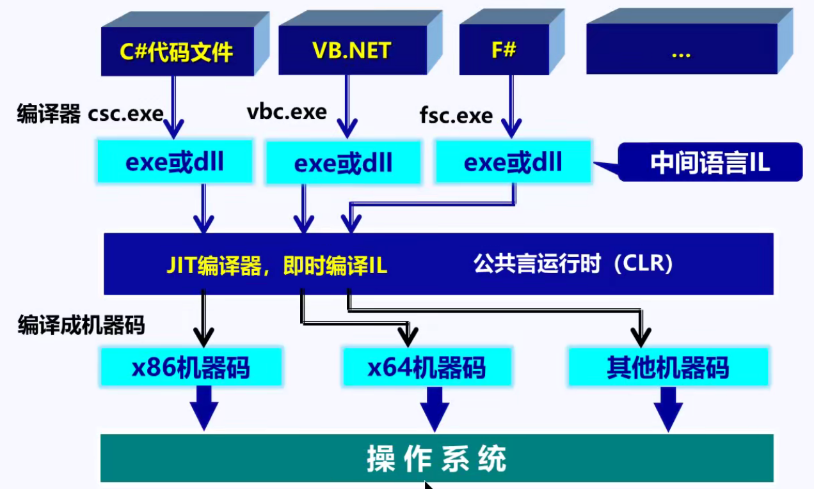

## 混合语言开发

如VB和C#的混合开发。

创建dll库，通过编写dll库，再来引用到项目中使用。

为什么编译成dll就能使用呢？

因为所有c#托管的代码 都是在CLR公共语言运行时管理的。

CLR公共语言运行库：包括下面两个依赖，都属于CLR。

CLS（Common Language Specification）：公共语言规范，解决不同开发语言的语法问题。

CTS（Common Type System）：通用类型系统，解决不同开发语言之间的数据类型差异。

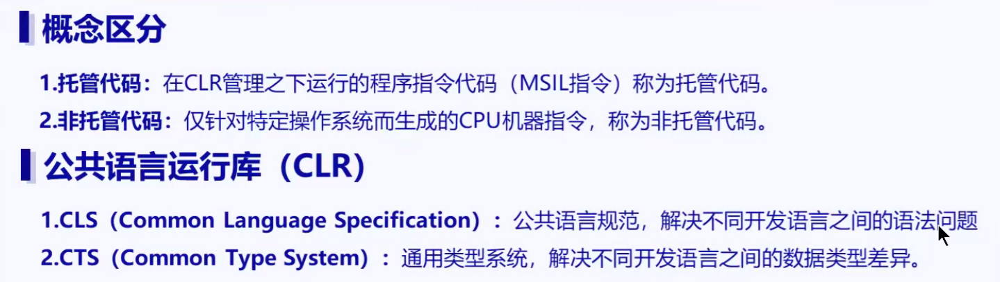

CLR公共语言运行时：包括下面的功能

JIT编译，内存管理，垃圾清理，异常处理，类加载器，反射。

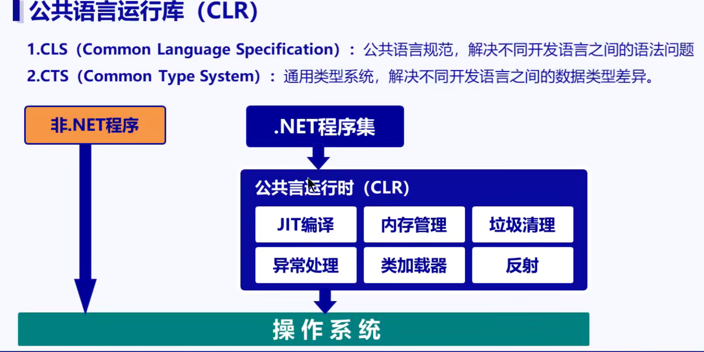

## 项目和工程的理解

解决方案：

方案就是解决某些问题一系列的组合。

我们开发 一个软件项目，可能包含多个模块，这些模块通过解决方案连接一起，统一编译更新，

### DeBug和Release区别

DeBug：调试使用，排查错误。

Release：调试好的程序发布，通过release方式编译，release后的程序更加轻量级，并做了优化。

Release可以取消项目属性的pbd文件生成，不进行dubug调试。

### 引用

引用就是类库，写好的dll。

### 项目模块分类

先写UI模块

在创建需要的实体类

通讯，数据获取的项目模块

在编写DLL业务处理模块

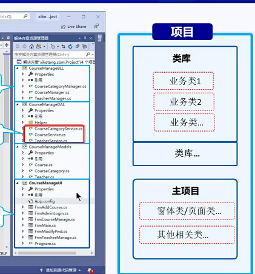

其实可以参考Java项目模块的分类。

## 3.Csharp基本语法

### static方法

静态方法只能用类名调用。

### 项目的命名空间

#### 命名空间的，命名

在C#中，项目的命名空间不是包含关系的，只是一个便于理解的层级关系。比如system和system.Data。是两个命名空间，其中system中的类和接口不一定会包含system.Data的类和接口，他们两个没有直接关系的。这里用点分隔只是好编写时好分层管理。

同一个命名空间中，不允许同名称的类。不同命名空间可以有相同类的名字。

引用相同类名，则要写全命名空间。

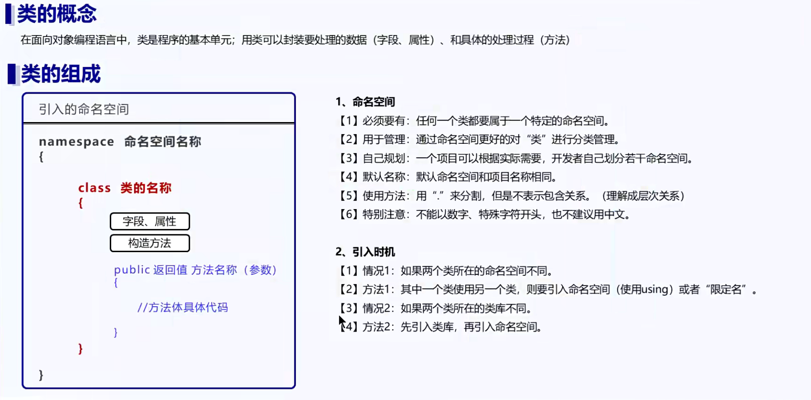

#### 类和对象之间抽象概述

一个类可以比喻一个饭店的菜单。对象就是我们将菜单上的才点了做出来的东西。

### 数据类型

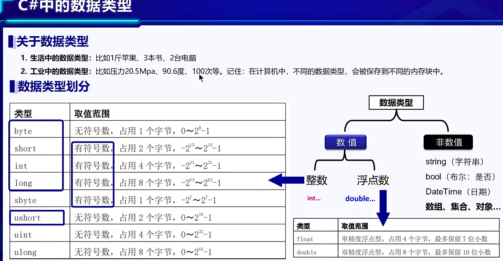

注意：byte默认是无符号的。0-255。

#### object类型

object可以存储任意类型的数据。

#### 数据的初始值

string默认为null。

decimal默认0.0M

#### 可为空类型 ？ 和 ？？

#### 程序优化

根据变量实际使用的情况来选择对于的数据类型，可以减少内存的开销，优化程序。

static可以根据实际情况使用，因为static会一直占用内存空间，GC不会释放掉。

#### 字符串

##### 字符串格式化

1. 使用 + 拼接字符串
2. 使用占位符拼接字符串：

string.Format(”{0} {1}}, “变量1，变量2)

3. 字符串模板：使用$"Hello World {变量1} {变量2} {...}"（注意：该特性4.6才开始支持的）

console.WriteLine();里面都支持2和3.

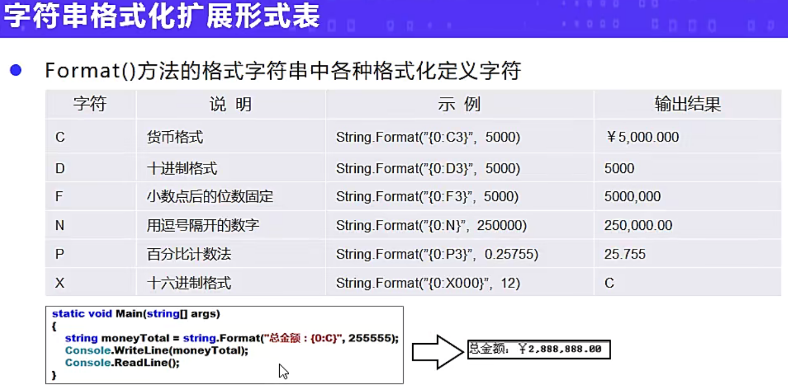

##### 判断字符串是否为空

string创建时，不初始化是null。控制的不输入是空字符串  ""。

string == ""

string.Empty;//这个就是 表示空字符串   ""

string.Length == 0;//空字符串为0

##### 字符串初始化

string str = null;//这个是会报错的。

system.NullReferenceException:”未将对象引用设置到对象实例“

对象必须实例化才能用。

##### StringBuilder类

使用StringBuilder类可以定义可变字符串，实现字符串的追加。比直接使用 + 号拼接节省内存。+号每拼接一下就开辟一个新的内存空间。

###### 常用方法

Append

Insert

Remove

AppendFormat

#### 数据类型转换

注意：不管使用哪种方式，必须保证要转换的变量值必须是目标类型的有效表示形式。

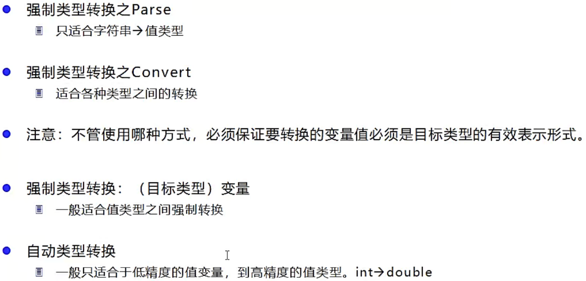

##### 使用 as 关键字 转换

as 关键字是 C# 中用于类型转换的关键词，它允许将一个对象转换为指定的类型。如果对象的类型不能转换为指定的类型，as将返回 null 而不是抛出异常，这使得类型转换更加安全。

###### 使用场景

* **安全类型转换** ：当你不确定一个对象是否可以转换为某个类型时，可以使用 as 进行安全转换。
* **避免异常** ：使用 `as` 可以避免在转换过程中可能出现的 `InvalidCastException` 异常。

```csharp
// 使用 as 进行类型转换
        Dog myDog = myAnimal as Dog;
  
        if (myDog != null) // 检查转换是否成功
        {
            myDog.Bark(); // 调用 Dog 类的方法
        }
        else
        {
            Console.WriteLine("转换失败");
        }
```

#### 枚举enum

枚举的使用：枚举的使用如同static变量一样，可被直接使用。

[深入浅出OOP（六）: 理解C#的Enums - 葡萄城技术团队 - 博客园 (cnblogs.com)](https://www.cnblogs.com/powertoolsteam/p/Diving-in-OOP-Day-Understanding-Enums-in-Csharp-A.html)

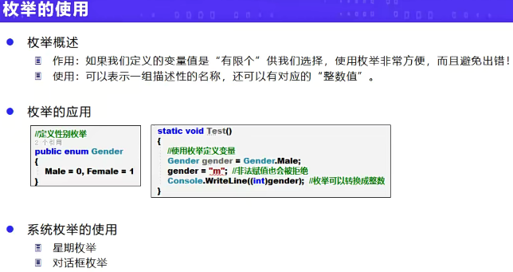

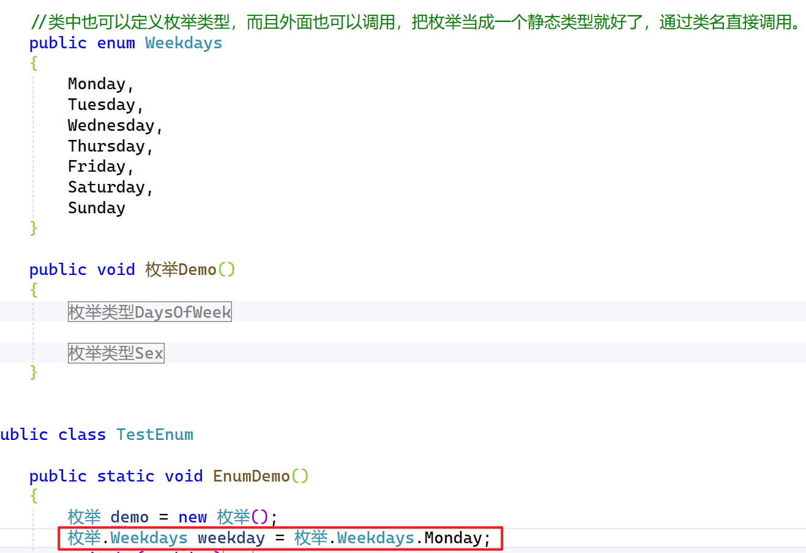

#### 值类型和引用类型

##### 值类型变量：又称基本数据类型变量

int、long、decimal、string(包装过后的字符串是值类型，我们使用的一般就是值类型)、bool、struct、enum

##### 引用(地址、指针)类型变量：

数组、对象、String(作为对象的话就是引用类型)

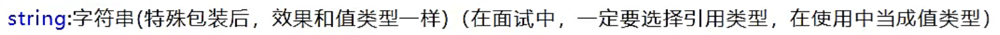

##### 常量

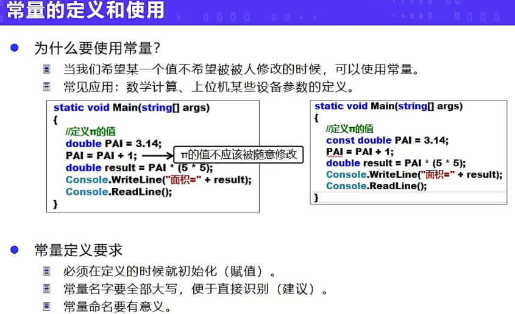

### 运算符

逻辑运算符：

三元运算符： c = a-b >0 ? a : c;

### 条件语句和表达式

#### 判断类

if else

if

else if

switch case break default

#### 循环类

for

##### 循环遍历

//不关心循环次数和循环结束

foreach(a in arr) {}

while

do while

#### 数组

数组也是一个对象，需要实例话才能使用。

##### 数组的初始化

整数类型的数组默认会初始化为0；

int[] arr = new int[5]

int[] arr3;
//arr3 = { 1, 2, 3, 4, 5 };//错误,不能这样赋值
arr3 = new int[] { 1, 2, 3, 4, 5 };

### is 判断关键字

可以判断当前 变量 类似 是否属于 这个

```csharp
if(ctr is Button)
{

}
```

### .NET底层类和C#关键字的区别

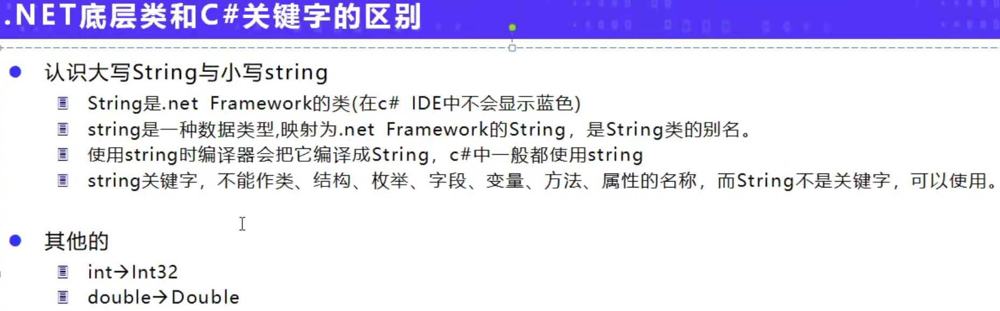

string就是String的别名，一般统一使用小写字母开头的

### 关键字（关键字基本都是小写）

const    常量关键字

break;

continue;

readonly   只读关键字修饰符

### 生命周期：这个对程序的调用使用理解很重要

类的生命周期：属性，普通方法都是要类实例化后才有的，而static是类创建时就有了。

对象的生命周期：属性，普通方法都是要类实例化后才有的。

### 输入输出

#### Console.WriteLine

#### Console.ReadLine

##### 输出格式

//字符串格式化输出，前面空2格
string str6 = string.Format("The value of pi is {0,10}.", pi);
Console.WriteLine(str6);
//字符串格式化输出，后面空2格
string str7 = string.Format("The value of pi is {0,-10:F2}.", pi);
Console.WriteLine(str7);

##### 输出制表符

### 常用API

#### typeof

#### sizeof();获取数据类型的大小。

`sizeof` 运算符返回给定类型的变量所占用的字节数。 `sizeof` 运算符的参数必须是一个[非托管类型](https://learn.microsoft.com/zh-cn/dotnet/csharp/language-reference/builtin-types/unmanaged-types)的名称，或是一个[限定](https://learn.microsoft.com/zh-cn/dotnet/csharp/programming-guide/generics/constraints-on-type-parameters#unmanaged-constraint)为非托管类型的类型参数。

`sizeof` 运算符需要[不安全](https://learn.microsoft.com/zh-cn/dotnet/csharp/language-reference/keywords/unsafe)上下文。 但下表中的表达式在编译时被计算为相应的常数值，并不需要“不安全”的上下文：

| Expression          | 常量值 |
| ------------------- | ------ |
| `sizeof(sbyte)`   | 1      |
| `sizeof(byte)`    | 1      |
| `sizeof(short)`   | 2      |
| `sizeof(ushort)`  | 2      |
| `sizeof(int)`     | 4      |
| `sizeof(uint)`    | 4      |
| `sizeof(long)`    | 8      |
| `sizeof(ulong)`   | 8      |
| `sizeof(char)`    | 2      |
| `sizeof(float)`   | 4      |
| `sizeof(double)`  | 8      |
| `sizeof(decimal)` | 16     |
| `sizeof(bool)`    | 1      |

sizeof是不能够得到string类型所占的内存大小，因为[字符串长度](https://so.csdn.net/so/search?q=%E5%AD%97%E7%AC%A6%E4%B8%B2%E9%95%BF%E5%BA%A6&spm=1001.2101.3001.7020)是可变的、不定的。

#### 转换类方法

##### Convert 方法可以将任意类型转换成其他数据类型

DateTime now2 = Convert.ToDateTime("2021-12-25"); 方法可以将字符串转换为日期类型

Convert也可以转换数字类型。如Convert.ToLong();

| Convert.ToInt16()    | 转换为整型(short)          |
| -------------------- | -------------------------- |
| Convert.ToInt32()    | 转换为整型(int)            |
| Convert.ToInt64()    | 转换为整型(long)           |
| Convert.ToChar()     | 转换为字符型(char)         |
| Convert.ToString()   | 转换为字符串型(string)     |
| Convert.ToDateTime() | 转换为日期型(datetime)     |
| Convert.ToDouble()   | 转换为双精度浮点型(double) |
| Conert.ToSingle()    | 转换为单精度浮点型(float)  |

对于[整型](https://so.csdn.net/so/search?q=%E6%95%B4%E5%9E%8B&spm=1001.2101.3001.7020)和浮点型的强制数据类型操作也可以使用 Convert 方法代替，但是依然会损失存储范围大的数据类型的精度。

##### parse();方法，将字符串转换成数字。

int，double都有这个方法。

int age = int.Parse(Console.ReadLine() );

#### 字符串的方法

string.Empty;//赋值空字符串用这个取代    ”“；注意空字符串是占空间的，null不占空间。

string.Format();//字符串的格式化

IndexOf();//判断字符串索引。

Length;获取字符串的长度

Substring()；//字符串截取

split();//字符串分隔。

string.Join();//连接，这个是静态方法，要用类名直接调用

Equals();//比较

Trim();//移除字符串前后的字符串。

ToLower();//转小写

ToUpper();//转大写

Replace();//字符串的替换

#### List

AddRange();//数组添加到集合中

list.ToArray();//集合变成数组

Count;//属性，获取当前集合元素个数。类似length,使用时直接调用

Contains();//判断List集合中是否存在改元素了

Clear();//清空列表元素

## CSharp面向对象OOP

### 类

#### 设计

所以面向对象的编程语言，都是把要处理的”数据“和”行为“封装到类中。

面向对象编程：设计类、关联类、使用类

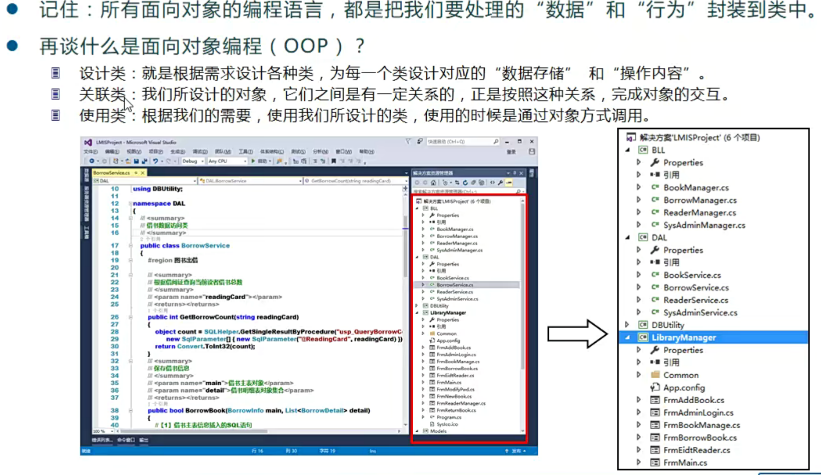

#### static 静态属性

会一直占用内存，不宜使用过多。

#### 类的基本组成

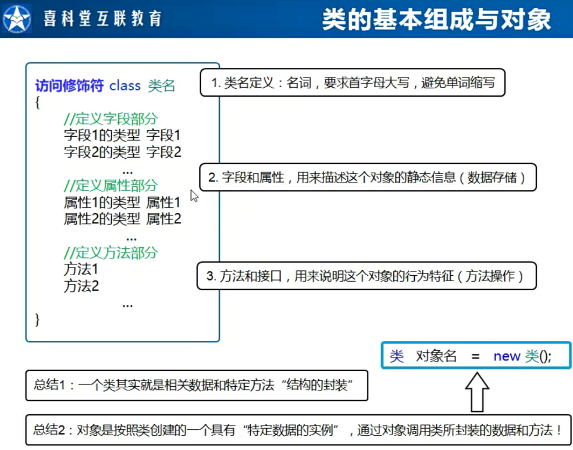

##### 成员变量（字段）

用来数据存储或对外提供数据。

字段一般是private修饰符

##### 属性

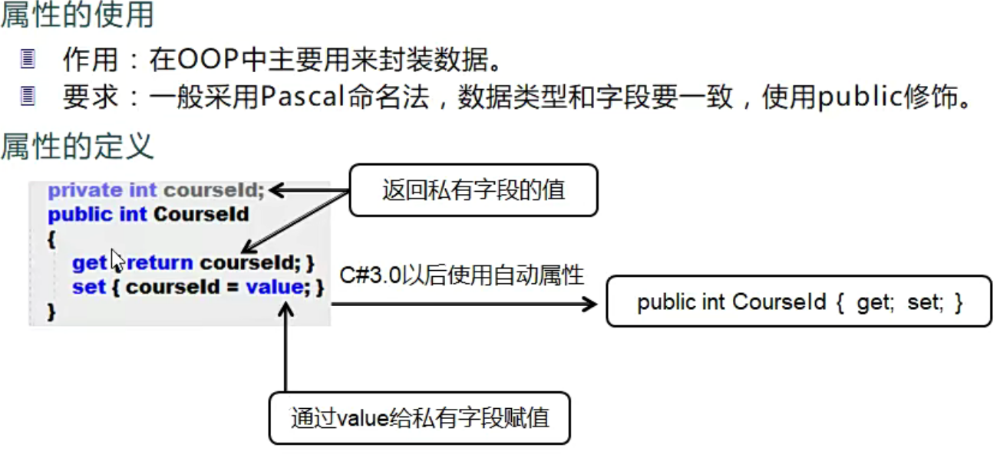

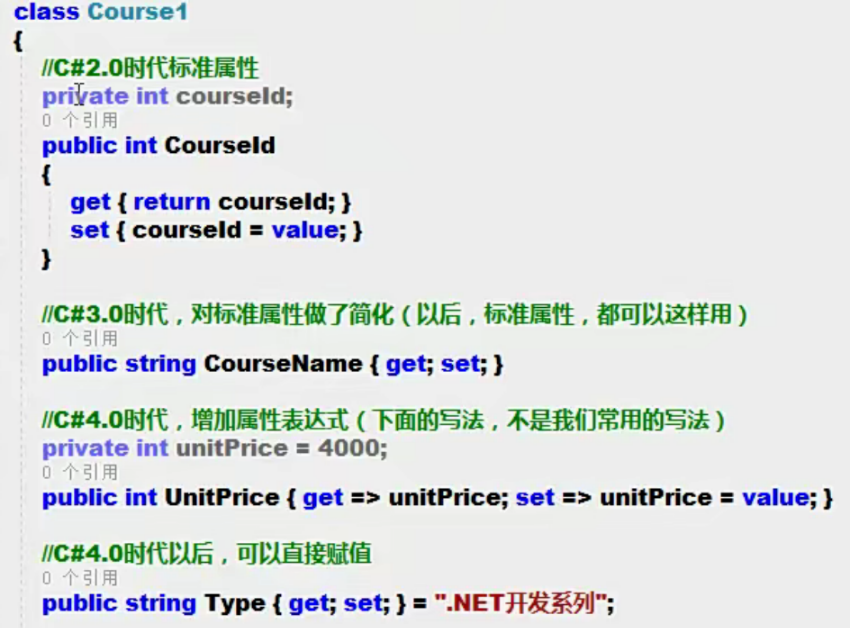

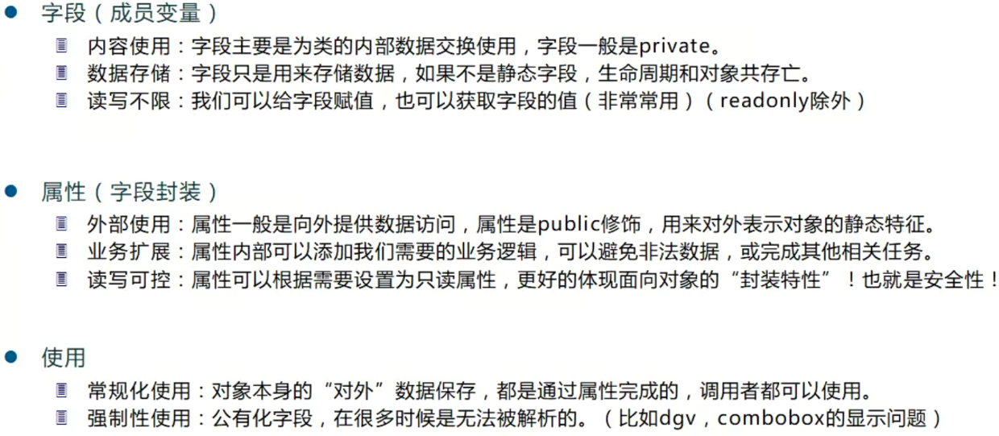

C#3.0中，自动属性

如果不需要对字段赋值操作进行判断就可以这样写，因为这样写没法对字段进行判断

自动属性的可以在声明属性时赋初始值

只读属性：没有set的属性外面的方法无法访问，但是在类的内部是能够访问的，因为属性只是字段的包装，类内部还是能够正常访问和赋值。

###### 案例代码

```csharp
using System;
using System.Collections.Generic;
using System.Linq;
using System.Text;
using System.Threading.Tasks;

namespace CSharp高级
{
    public class 类的属性使用
    {
        private long id;
        private int age;

        //C#2.0 实现属性的get和set标准写法
        public long Id
        {
            get
            {
                return id;
            }

            set
            {
                id = value;
            }
        }
        //c#3.0 新特性，自动实现属性的get和set方法 可以不写name字段，编译后会自动生成。
        //这样是不需要对Name进行赋值操作和判断就可以这样写。
        public string Name { get; set; }

        //c#4.0 新特性，lamdba表达式简化属性的get和set方法
        public int Age
        {
            get => age;
            set => age = value;
        }

        //设置属性的只读特性，可以赋初始值，但是注意，只有自动生成的属性才赋初始值
        public int birthYear { get; } = 2000;

  

        //设置属性为只可写特性,不行必须有get方法
        //public string Address {set; }


    }
}

```

##### 方法

###### 方法参数的修饰符

**6.1 ref和out**

* 共同点：都是引用传递，方法中修改，传递过的参数也会修改。
* 不同点：ref传递的参数前，必须赋值，否则传递不了，编译报错，在方法内部不需要赋值。不可以在传递参数时，临时定义一个ref修饰的变量。
* out传递参数时可以不用赋值，因为规定方法中必须赋值，否则编译失败。可以在传递参数时，临时定义一个out修饰的变量。
* 语法规范：函数创建和传递时，都要在不前面加上ref或者out关键字

例子

```csharp

int m = 10;
RefAndOut.SendRef(ref m, out int k);
Console.WriteLine(m);

public static string SendRef(ref int a, out int b)
{

    Console.WriteLine(a++);
    b = 10;

    return "fff";
}

```

**6.2 params可变参数**

###### 方法定义的形式

**6.1 可以形参带默认值 的方法，可以带默认值的参数就可以在调用的时候不用传递**

```csharp
//带默认值的参数，调用时可以不传值
public int GetIntStudent(int id, string name = "tom")
{
    //GetStringStudent(18,name);
    //命名参数，可以不按顺序传参
    GetStringStudent(age:18, name:name);
    return id;
}

public string GetStringStudent(string name, int age)
{
    //调用带默认值的参数
    GetIntStudent(18);
    return name + " " + age.ToString();
}
```

**6.2 命名参数（调用的时候使用）**

可以顺便传递方法调用的参数。前面要添加形参的名字。

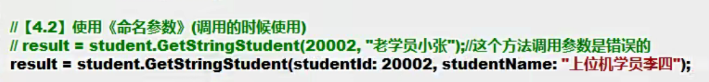

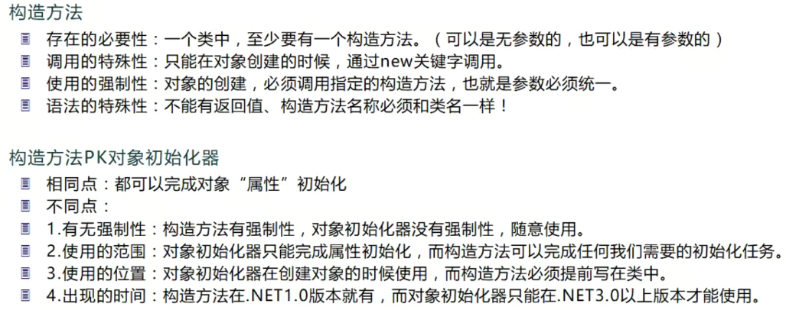

###### 构造方法

构造方法的相互调用。可以通过this可以在构造方法中相互调用，避免重复性。

构造函数重载,可以通过this调用其他构造函数。如果有继承可以通过base()调用基类的构造函数。

```csharp
namespace 类和对象
{
    public class 构造函数的使用
    {
        public int Id { get; set; }
        public string Name { get; set; }
        public int Age { get; set; }

        public 构造函数的使用()
        {
            this.Id = 1;
            this.Name = "张三";
        }
        public 构造函数的使用(int id, string name)
        {
            this.Id = id;
            this.Name = name;
        }
        /// <summary>
        /// 构造函数重载,可以通过this调用其他构造函数。如果有继承可以通过base()调用基类的构造函数。
        /// </summary>
        /// <param name="id"></param>
        /// <param name="name"></param>
        /// <param name="age"></param>
        public 构造函数的使用(int id, string name, int age) : this(id, name)
        {
            this.Age = age;
        }
    }
}
```

###### 对象初始器。

可以避免类中写多个构造方法。但是只能初始化属性。

注意，对象初始化器中用的是逗号分隔。

```csharp
namespace 类和对象
{

    class Program
    {
        //对象初始化器，这样可以快速初始化对象。
        构造函数的使用 test = new 构造函数的使用()
        {
            Id = 2,
            Name = "李",
            Age = 2,
        };
    }

    public class 构造函数的使用
    {
        public int Id { get; set; }
        public string Name { get; set; }
        public int Age { get; set; }

        public 构造函数的使用()
        {
            this.Id = 1;
            this.Name = "张三";
        }
        public 构造函数的使用(int id, string name)
        {
            this.Id = id;
            this.Name = name;
        }
        /// <summary>
        /// 构造函数重载,可以通过this调用其他构造函数。如果有继承可以通过base()调用基类的构造函数。
        /// </summary>
        /// <param name="id"></param>
        /// <param name="name"></param>
        /// <param name="age"></param>
        public 构造函数的使用(int id, string name, int age) : this(id, name)
        {
            this.Age = age;
        }
    }
}
```

#### 内存

类不会占用内存空间，当new以后，才占用内存空间。

#### 对象

对象是在内存当中的。

##### 对象初始化的顺序

先字段，在构造函数

#### this关键字

this是表示对象。this只能指向对象中的属性和方法。不能指向局部变量和静态变量的。

#### 生命周期

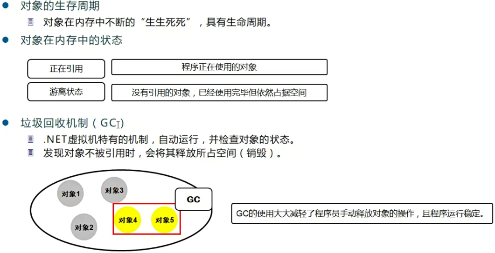

#### 析构函数

通过波浪号，作为修饰符。

```csharp
~构造函数的使用()
{
    Console.WriteLine("析构函数被调用");
}
```

##### 显示清除对象的引用

就是给对象赋值null空引用

course = null;

##### 隐式调用GC

就是GC会自动回收没有引用的对象，这个回收时间是不确定的。

##### 显示调用GC

通过GC类，主动回收，一帮不用，了解就行

```csharp
//类和对象
构造函数的使用 tc = new 构造函数的使用();
//tc对象的引用指向为null
tc = null;
//垃圾回收
GC.Collect();
```

### 继承接口和多态机制

在C#中，通过在类的后面加 ：冒号进行继承和实现，接口都用冒号。如果多个接口实现，后面用逗号分隔。一个继承多个实现时，一般继承放最前面。

### 集合和泛型

#### 泛型

##### 泛型约束

wher 是泛型关键字。

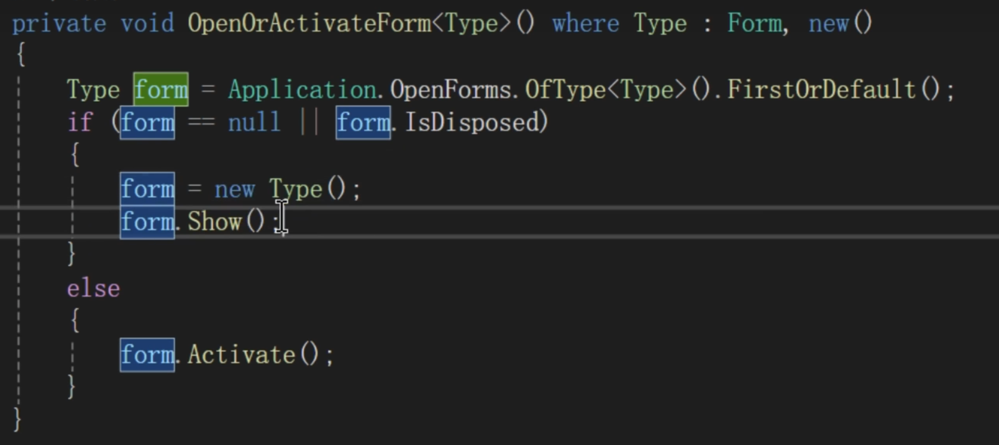

#### List `<T>`

**4.1 list的初始化**

使用list初始化器初始化

```csharp
//集合初始化:方式一
List<Student> students1 = new List<Student>();
students1.Add(new Student { Id = 1, Name = "Tom", Age = 18, Class = "1班", Score = 90 });
students1.Add(new Student { Id = 2, Name = "Jerry", Age = 19, Class = "2班", Score = 85 });
students1.Add(new Student { Id = 3, Name = "Mike", Age = 17, Class = "1班", Score = 95 });
//集合初始化:方式二，list初始化器语法
List<Student> students2 = new List<Student>()
{ 
    //拆用的是对象初始化语法
    new Student { Id = 4, Name = "Lily", Age = 18, Class = "2班", Score = 80 },
    new Student { Id = 5, Name = "Lucy", Age = 19, Class = "1班", Score = 85 },
    new Student { Id = 6, Name = "Lucas", Age = 17, Class = "2班", Score = 90 }
};
```

**4.2 获取元素**

直接通过类似数组的下标索引获取元素

```csharp
//集合获取
Student studentA = students1[0];//索引获取
```

**4.3 排序**

sort方法，元素的类通过实现IComparable或者创建IComparer类来实现排序，使用的是多态。

Reverse();//倒序

**4.4 判断元素是否存在**

Contains();

**4.5 使用LINQ查询**

**4.6集合的复制**

List list = new List(要复制的list);

list = list1；这是两个一样的指向。

#### Dictionary `<K,V>`

**4.1 dictionary的初始化**

使用dictionary初始化器初始化

```csharp
//集合初始化
Dictionary<string, Student> studentsDict1 = new Dictionary<string, Student>();
studentsDict1.Add("Tom", new Student { Id = 1, Name = "Tom", Age = 18, Class = "1班", Score = 90 });
studentsDict1.Add("Jerry", new Student { Id = 2, Name = "Jerry", Age = 19, Class = "2班", Score = 85 });
studentsDict1.Add("Mike", new Student { Id = 3, Name = "Mike", Age = 17, Class = "1班", Score = 95 });
//集合的初始化方式二，使用字典初始化器语法
Dictionary<string, Student> studentsDict2 = new Dictionary<string, Student>()
{
    {"Lily", new Student { Id = 4, Name = "Lily", Age = 18, Class = "2班", Score = 80 }},
    {"Lucy", new Student { Id = 5, Name = "Lucy", Age = 19, Class = "1班", Score = 85 }},
    {"Lucas", new Student { Id = 6, Name = "Lucas", Age = 17, Class = "2班", Score = 90 }}
};
```

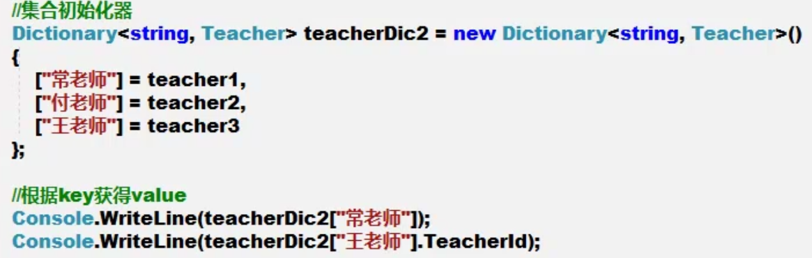

4.2 获取元素

```csharp
//Dictionary的获取
Student studentC = studentsDict1["Tom"];
```

#### 比较器和比较类

比较类就是多态的应用

4.1 通过类实现IComparable来比较排序

```csharp
class Student : IComparable<Student>
{
    public int Id { get; set; }
    public string Name { get; set; }
    public int Age { get; set; }
    public string Class { get; set; }
    public int Score { get; set; }
    //重写IComparable<Student>接口的CompareTo方法
    public int CompareTo(Student other)
    {
        //this在前面是升序，如果想降序，则改为other.Score.CompareTo(this.Score)
        return this.Score.CompareTo(other.Score);//这里调用的是int的CompareTo方法
    }
}
```

4.2 通过创建自定义比较器来实现排序。IComparer

```csharp
//自定义比较器
class StudentDesc : IComparer<Student>
{
    public int Compare(Student x, Student y)
    {
        //降序
        return y.Score.CompareTo(x.Score);
    }
}
//自定义比较器
class StudentAsc : IComparer<Student>
{
    public int Compare(Student x, Student y)
    {
        //升序
        return x.Score.CompareTo(y.Score);
    }
}
```

#### 接口或父类作为返回值和参数

如果接口或者父类作为参数，那么传递的一般都是实现类或者子类。

如果接口或者父类作为方法返回值，那么返回的基本上就是实现类或者子类。

## IO操作

ini文件的读取

文件的读取

文件夹的读取

### 相对路劲

("../../../images/a.jpg");是从生成的EXE文件中一层层套出去的。

### using提前写法

```
“using (QRCodeDetector qRCodeDetector = new QRCodeDetector ())” 是 C# 语言中使用 “using” 语句的写法。
在 C# 中，“using” 语句用于确保在代码块执行完毕后，正确地释放实现了IDisposable接口的对象所占用的资源。这里创建了一个QRCodeDetector对象，在代码块执行完毕后，会自动调用该对象的Dispose方法来释放资源，以防止资源泄漏。
这种写法有助于提高代码的可靠性和资源管理的效率，避免手动管理资源可能带来的错误。例如，对于文件操作、数据库连接等需要及时释放资源的场景，“using” 语句非常有用。
```

#### using豆包解释

以下是对 `using (FileStream file = new FileStream("outputFilePath.xlsx", FileMode.Create)) {... }` 这种写法的详细解释：

##### 1. `using` 语句的基本概念

在C#中，`using` 语句是一种方便且重要的语法结构，它主要用于确保正确地处置（释放）实现了 `IDisposable` 接口的对象所占用的非托管资源。

当一个类实现了 `IDisposable` 接口，意味着这个类在使用过程中可能会占用一些诸如文件句柄、数据库连接、网络套接字等系统层面的非托管资源，而这些资源不能单纯依靠.NET的垃圾回收机制（GC）自动、及时地回收，需要显式地调用 `Dispose` 方法来释放，以避免资源泄漏等问题。

`using` 语句就是为了简化这个释放资源的操作过程，它提供了一种简洁且可靠的语法糖，能够自动确保在代码块执行结束后，无论代码块内部是正常执行完毕还是抛出了异常，都会调用所包裹对象的 `Dispose` 方法来释放相关资源。

##### 2. 具体到这段代码的分析

在 `using (FileStream file = new FileStream("outputFilePath.xlsx", FileMode.Create))` 这行代码中：

- **对象创建部分**：`new FileStream("outputFilePath.xlsx", FileMode.Create)` 这部分代码是在创建一个 `FileStream` 对象。`FileStream` 类用于对文件进行读写操作，它实现了 `IDisposable` 接口，因为它在底层操作文件时会占用文件相关的系统资源（比如文件句柄等）。这里创建 `FileStream` 对象时传入了文件名 `"outputFilePath.xlsx"` 以及文件模式 `FileMode.Create`，表示以创建新文件的方式来打开（如果文件已存在则会覆盖它）。
- **`using` 包裹部分**：将创建的 `FileStream` 对象 `file` 放在 `using` 语句块中，意味着在后续紧跟的代码块（也就是大括号 `{}` 内部的代码）执行期间，这个 `FileStream` 对象是可用的，可以使用它来进行相应的操作（在这段代码里就是使用 `workbook.Write(file)` 将数据写入到这个文件流所关联的文件中）。

一旦代码执行到 `using` 语句块结束的大括号 `}` 处，.NET 运行时会自动调用 `file`（即 `FileStream` 对象）的 `Dispose` 方法，从而正确关闭文件流，释放其占用的文件相关的系统资源，这样就避免了忘记手动关闭文件流导致的文件资源占用问题，使代码更加健壮、安全。

总的来说，这种写法在操作像文件流这类需要显式释放资源的对象时非常实用，可以让代码在资源管理方面更加规范、简洁，同时降低因资源未正确释放而引发问题的风险。

##### 3. 对比不使用 `using` 语句的情况

如果不使用 `using` 语句来处理 `FileStream` 对象，代码可能会写成如下形式：

```csharp
FileStream file = new FileStream("outputFilePath.xlsx", FileMode.Create);
try
{
    workbook.Write(file);
}
finally
{
    file.Dispose();
}
```

可以看到，为了确保 `FileStream` 对象最终能被正确释放资源，需要使用 `try-finally` 结构，在 `finally` 块中显式地调用 `Dispose` 方法。相比之下，使用 `using` 语句就大大简化了这样的代码结构，让代码更加简洁明了且不容易出错。

所以，`using` 语句在C#中是一种很实用的语法，常用于处理需要显式管理资源的场景，提高代码的可靠性和可维护性。

### 序列化和反序列化对象

用于对对象的一次性完整存储，让数据再次使用时不丢失。二进制格式。

而且序列化会变成二进制文件，文本打开会乱码，相当于加密了。

对象序列化标记

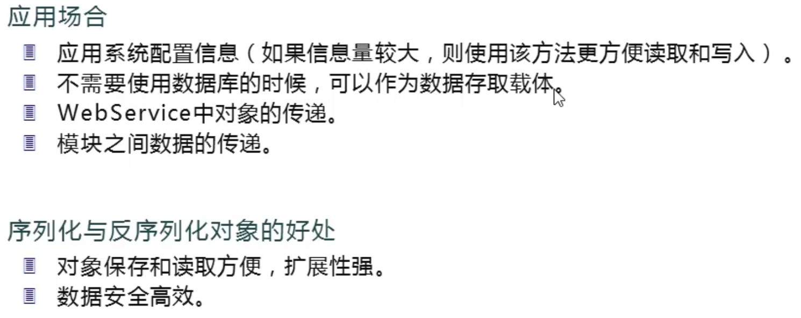

## 异常处理

try catch finally

throw

throw new Exception();

## XML数据标记语言操作

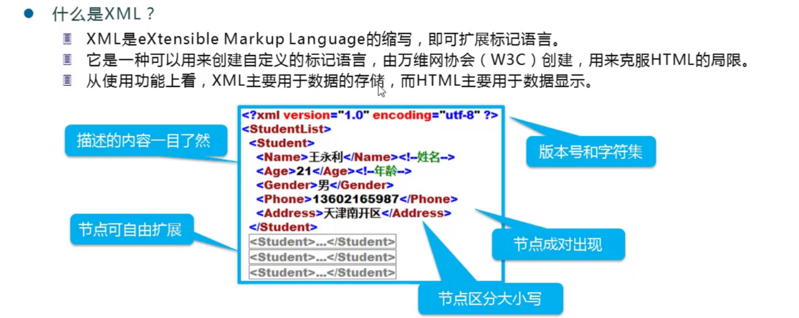

XML格式语法要求

## 多线程

多线程操作UI控件问题：

多线程操控UI需要InvokeRequired来操作控件，不是同一个线程创建的UI，不能直接操作，必须通过InvokeRequired的Invoke操作


## 工具

1.查看C#编译后的代码

ildasm.exe：现在自带的工具。存放目录：C:\Program Files (x86)\Microsoft SDKs\Windows\v10.0A\bin\NETFX 4.8 Tools\ildasm.exe

## 设计

1.重复的方法抽取规则

封装变化的，抽取不变的。变化的作为参数，不变的作为方法体。

2.可以仿照若依前后端不分离框架搭建。每个模块都有一个domain(Models)，server，controller。

### 三层架构设计

controller（BLL）:放置业务逻辑代码，不涉及直接对数据库的操作。

server(DAL)：放置对数据库的操作。

UI：放置UI界面的，通过使用Controller获取数据

Models：放置实体类，用于数据交互的通用模块。

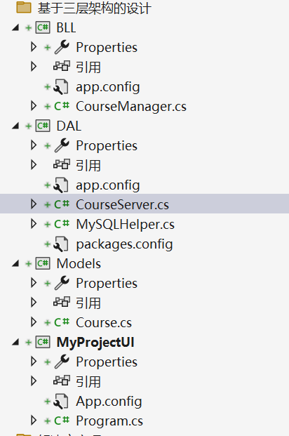

实体类：其实就是一个数据载体。

模块：在.NET平台，其实主要是指类库项目。

一个模块，可以包括一个或多个类库项目（dll）

Q：一个项目通常包括哪些模块？

【1】UI

【2】数据模块（一般数据访问类+通用数据访问类）

【3】业务模块（三层结构里面必须要有的，一般对应大项目）

【4】通信模块、通用类模块、服务模块...

三层结构

【1】UI-->【2】业务模块-->【3】数据模块   （实体模块是独立层）

### 想法

将IO操作也封装成单独的一个模块：ini，txt，系统日志，软件日志等操作

Excel操作也封装成单独一个模块：表格的增删改查。

### OOP的基础原则

1、面向对象编程学什么？面向对象就是学习OOP的各种原则、方法（天天在用的）、技巧（基础知识灵活的组合或者解决问题的技巧）、模式（20+种设计模式，等你学的差不多了，再去看）、经验。

原则：因为这个是指导思想。公认的有六大原则。

第一、对象职责明确原则。（对象单一职责）：我们设计一个对象（类）它所包括的各种行为，必须的对象本身的。

人：属性、方法，都是人的特征。常见错误：设计万能类。

第二、开放封闭原则。我们的程序设计应该尽可能的考虑用户的需求变化，当需求真的变化时做到轻松扩展，很少修改。

开发了扩展（增加对象、增加配置）、封闭修改（原有的业务逻辑代码，最好不要去动）

第三、里氏替换原则。（我们学习继承的时候，要用的，接口也是类似的，你必须要掌握的！！！！！！！！）

   public partial class FrmMain : Form

在上面的继承中，Form是父类，FrmMain是子类。

FrmMain  frm=new FrmMain（）；

Form frm=new FrmMain（）；

   Form frm = new FrmMain();
            frm = new Form1();

//其实这个Run方法里面类型就是Form类型（父类类型，实际我们传递的时候是子类对象）
 Application.Run(new FrmMain());

目的：通常是和多态关联的。

第四、迪米特法则（最小耦合原则，最小知道原则、最小知识原则）==>高级内聚、低耦合

也是我们后面学习项目的分层架构，分模块，重要的理论依据。

第五、接口隔离原则。

第六、依赖倒置原则。（面向抽象编程、面向接口编程、面向切面编程....）归根结底还是为了项目的扩展。

父类  变量=子类对象

接口  变量=接口实现类对象

依赖抽象（写程序、模块衔接）而不是依赖细节（具体）。

## VS快捷键

Ctrl+L:删除当前行 （这个很有用哦 因为大家常常会要删除多余的空行 哈哈 这组快捷键会让你省力不少）

Ctrl+K+f:代码格式化；Ctrl+K+d:代码格式化那个能用用那个。

Ctrl+G：跳转指定代码行

双击选择。F12跳转到定义。
