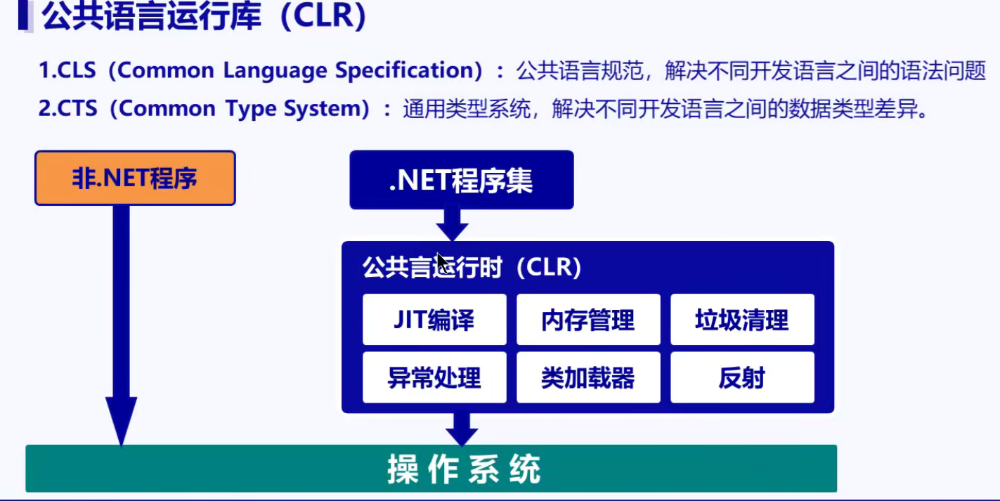
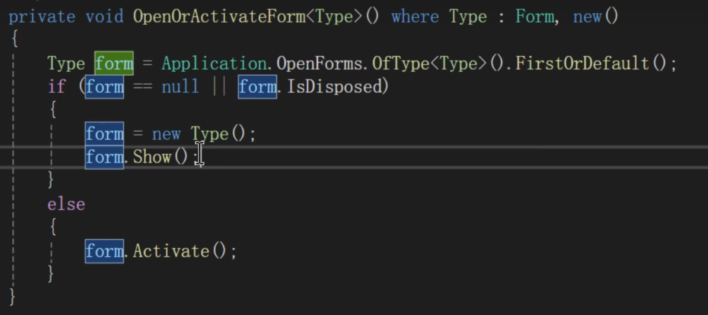
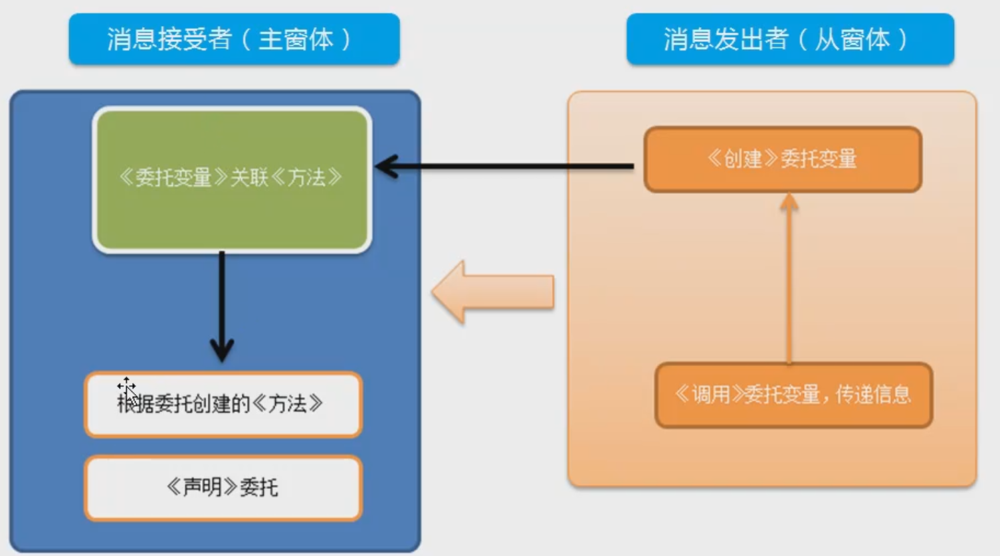

# CSharp笔记

## 1.代码和项目规范

良好的好的项目规范和代码规范不可以让项目结构更稳定，更容易维护升级。

### 1.1 项目规范

1.1.1 创建项目：

项目解决方案名称和项目名称不放到同一目录，这样就相当于项目模块话，不臃肿。

项目解决方案：我们实际说的一个项目和VS里的项目不一样，这里的项目解决方案才相当于一个实际的项目方案，而项目解决方案中的先相当于一个item，类似一个大项目中拆分出的一个小项目。

项目名字一般以公司名字开头，项目名紧跟后面。

1.1.2 架构

### 1.2 代码规范

1.2.1 命名规范：项目名，类名，方法名、属性方法（包括结构体struck，enum，delegate）首字母大写。属性字段首字母小写、变量名小写。常量全大写。

12.1.1 方法名：一般是动词或者动宾短语。

1.2.2 下划线：data_a_0 = 10；data_a_1 = 10； 这个通过下划线来区分有关联性的分组。比如a组的第一个数据

1.2.3 注释：
    单行注释：//
    文档注释：///
    代码折叠：#region  #endregion

12.4 变量声明时，最好赋予初始值，成员变量也是。

### 1.3 帮助文档和编程细节错误

1.3.1 帮助文档MSDN。微软的官方帮助文档，类似Java的API，用来查询使用方法的。[System 命名空间 | Microsoft Learn](https://learn.microsoft.com/zh-cn/dotnet/api/system?view=netframework-4.8.1)

1.3.2 编程细节问题：对象或者类的方法、属性调用必须放在方法中。

### 1.4 程序的优化

1.4.1 变量的数据类型选择合理，可以节约计算机的内存资源，减少开销。

1.4.2 少用全局变量，因为垃圾回收机制对全局变量不生效，程序不关，全局变量的值就一直在。

## 2.CSharp简介

CSharp中的框架，主要有.NET FormWork  ，  .NET Core 和 Xamarin

.NET 生态有三个主要的高级别组件 - .NET Framework, .NET Core, 和 Xamarin。

### 1.1 .NET Framework

支持 Windows 和 Web 应用。

可以使用 Windows Forms（WinForms）、WPF、和 UWP 来构建Windows 应用程序。

ASP.NET MVC 的 Web 应用。

### 1.2 .NET Core

是最新的开源跨平台框架，用于构建包括 Windows, Mac 和 Linux 操作系统在内的应用程序。

.NET Core 支持 Windows Forms、 WPF、UWP和 ASP.NET Core。

UWP用于构建 Windows10 目标Windows和移动应用程序。

ASP.NET Core用于构建基于浏览器的 Web 应用程序。

### 1.3 Xamarin

毋庸置疑，当你想通过 C# 来构建移动应用（IOS，Android 和 Windows Mobile），Xamarin 是你唯一的选择。

.NET Framework 的优点

* 如果你是一位传统的 .NET 开发者，希望快速构建和发布应用，没有时间学习.NET Core，那么 .NET Framework 对你来说是一个不错的选择，.NET Core 可能会有一些学习曲线。
* 如果你目前主要是维护和更新现有 .NET 应用程序，那么 .NET Framework 是你一个不错的选择。将现有 .NET 程序移植到 .NET Core 上可能还是需要一些工作。
* 找工作？ 您现在可能在.NET Core 中找不到太多工作。

这就是 .NET Framework 的现状。当前版本的.NET Framework 4.8 应该是.NET Framework的最新版本。 将来不会再计划新版本的.NET Framework。

.NET Core 的优点

* 微软已经宣布了 .NET Core v 3.0 ，这是一个有非常多改进的 .NET Core 版本，如果你想学习和使用里面的新特性，那么.NET Core 是值得尝试的。
* .NET Core 3.0 目前支持 WPF 和 Windows Forms，.NET Core 3.0 同样也支持在 UWP, WPF 和 Windows Forms 之间进行混合开发。这将使得开发者能够更灵活地将 UWP 中一些更现代化的接口引入到 WPF 和 Windows Forms 中。
* 如果你正在构建新的应用程序，并且你的公司支持使用 .NET Core，那么 .NET Core 是一个不错的选择，总之 .NET Core 会越来越好的。
* .NET Core 更适合跨平台的需求， .NET Core 的应用程序支持在 Windows, Linux, and macOS 运行。微软广受好评的开源代码编辑器 Visual Studio Code 支持 Linux 和 macOS，同时它也支持更加现代化的编辑需求，如 智能感知[`IntelliSense`] 和 调试[`debugging`]，大多数其它第三方的编辑器，如 Sublime, Emacs, 和 VI 同样支持 .NET Core。
* 微服务架构同样在 .NET Core 中适用，它可以和不同平台的服务共同工作。包括通过 .NET Framework, Java, Ruby 等语言开发的。在容器化大行其道的今天，.NET Core 的模块化、轻量级以及它的灵活性使得它能很容易地部署到容器中，容器可以部署到任何平台，如 云上、Linux 和 Windows 上。 .NET Core 适用于 Docker 和 Azure Kubernetes 服务。

.NET Core 和 .NET 5/6

目前 .NET Framework 的版本为 4.8(后续应该不会在更新了)，并且仍由 Microsoft 支持。2014 年，Microsoft 开始编写 .NET Framework 的跨平台开源后续产品。

.NET 5 是继 3.1 之后 .NET Core 的下一个主要版本。

出于以下两个原因，我们将此新版本命名为 .NET 5，而不是 .NET Core 4：

* 我们跳过了版本编号 4.x，以避免与 .NET Framework 4.x 混淆。
* 我们从名称中删除了“Core”，是为了强调这是 .NET 未来的主要实现。 与 .NET Core 或 .NET Framework 相比，.NET 5 会支持类型更多的应用和平台。

总结：

1.1 .NET FormWork是一个类似JDK的编译和运行工具。

1.1.1 WinForms和WPF都是基于.NET FormWork的UI框架。

## .NET程序两次编译过程

C#代码.cs文件，通过编译器编译成中间语言exe或者dll文件（通过中间语言IL，JIT编译器，即时编译IL）。在通过公共语言运行时CLR，编译成机器码给操作系统运行。


## 混合语言开发

如VB和C#的混合开发。

创建dll库，通过编写dll库，再来引用到项目中使用。

为什么编译成dll就能使用呢？

因为所有c#托管的代码 都是在CLR公共语言运行时管理的。

CLR公共语言运行库：包括下面两个依赖，都属于CLR。

CLS（Common Language Specification）：公共语言规范，解决不同开发语言的语法问题。

CTS（Common Type System）：通用类型系统，解决不同开发语言之间的数据类型差异。


CLR公共语言运行时：包括下面的功能

JIT编译，内存管理，垃圾清理，异常处理，类加载器，反射。



## 项目和工程的理解

解决方案：

方案就是解决某些问题一系列的组合。

我们开发 一个软件项目，可能包含多个模块，这些模块通过解决方案连接一起，统一编译更新，

### DeBug和Release区别

DeBug：调试使用，排查错误。

Release：调试好的程序发布，通过release方式编译，release后的程序更加轻量级，并做了优化。

Release可以取消项目属性的pbd文件生成，不进行dubug调试。

### 引用

引用就是类库，写好的dll。

### 项目模块分类

先写UI模块

在创建需要的实体类

通讯，数据获取的项目模块

在编写DLL业务处理模块


其实可以参考Java项目模块的分类。

## 3.Csharp基本语法

### static方法

静态方法只能用类名调用。

### 代码块（匿名代码块）

你可以使用大括号来创建一个匿名代码块，这种代码块可以用于限定变量的作用域。在大括号前面没有特定的关键字，只是单纯地使用大括号来界定一个代码区域。

```csharp
static void Main()
    {
        // 外部作用域
        int outerVariable = 10;

        {
            // 内部代码块
            int innerVariable = 20;
            Console.WriteLine($"外部变量: {outerVariable}, 内部变量: {innerVariable}");
        }

        // 这里无法访问 innerVariable，因为它的作用域仅限于内部代码块
        // Console.WriteLine(innerVariable); // 这行代码会导致编译错误

        Console.WriteLine($"外部变量: {outerVariable}");
    }
```

1

### 项目的命名空间

#### 命名空间的，命名

在C#中，项目的命名空间不是包含关系的，只是一个便于理解的层级关系。比如system和system.Data。是两个命名空间，其中system中的类和接口不一定会包含system.Data的类和接口，他们两个没有直接关系的。这里用点分隔只是好编写时好分层管理。

同一个命名空间中，不允许同名称的类。不同命名空间可以有相同类的名字。

引用相同类名，则要写全命名空间。


#### 类和对象之间抽象概述

一个类可以比喻一个饭店的菜单。对象就是我们将菜单上的才点了做出来的东西。

### 数据类型


注意：byte默认是无符号的。0-255。

#### object类型

object可以存储任意类型的数据。

#### 数据的初始值

string默认为null。

decimal默认0.0M

#### 可为空类型 ？ 和 ？？

C# 中的 ?? 是 空合并运算符，用于在左操作数为 null 时返回右操作数的值。? 则用于定义可空类型或进行空检查。

为了更清晰对比，用表格总结：

| 运算符 / 用法 | 名称         | 核心作用                   | 语法结构               | 处理场景                |
| -------- | ---------- | ---------------------- | ------------------ | ------------------- |
| `??`     | 空合并运算符     | 左侧为 null 时取右侧默认值，否则取左侧 | `左 ?? 右`           | 给 null 值设置默认值       |
| `?.`     | null 条件运算符 | 安全访问对象成员，避免空引用异常       | `对象?.成员`           | 多层对象访问（如 `a?.b?.c`） |
| `T?`     | 可空类型修饰符    | 让值类型可以存储 null          | `值类型? 变量`          | 值类型需要表示 “无值” 场景     |
| `?:`     | 三元条件运算符    | 简化二选一的 if-else 判断      | `条件 ? 表达式1 : 表达式2` | 简单条件分支判断            |


#### 程序优化

根据变量实际使用的情况来选择对于的数据类型，可以减少内存的开销，优化程序。

static可以根据实际情况使用，因为static会一直占用内存空间，GC不会释放掉。

#### 字符串

##### 字符串格式化

1. 使用 + 拼接字符串
2. 使用占位符拼接字符串：

string.Format(”{0} {1}}, “变量1，变量2)

3. 字符串模板：使用$"Hello World {变量1} {变量2} {...}"（注意：该特性4.6才开始支持的）

console.WriteLine();里面都支持2和3.


##### 判断字符串是否为空

string创建时，不初始化是null。控制的不输入是空字符串  ""。

string == ""

string.Empty;//这个就是 表示空字符串   ""

string.Length == 0;//空字符串为0

##### 字符串初始化

string str = null;//这个是会报错的。

system.NullReferenceException:”未将对象引用设置到对象实例“

对象必须实例化才能用。

##### StringBuilder类

使用StringBuilder类可以定义可变字符串，实现字符串的追加。比直接使用 + 号拼接节省内存。+号每拼接一下就开辟一个新的内存空间。

###### 常用方法

Append

Insert

Remove

AppendFormat

#### 数据类型转换

注意：不管使用哪种方式，必须保证要转换的变量值必须是目标类型的有效表示形式。


##### 使用 as 关键字 转换

as 关键字是 C# 中用于类型转换的关键词，它允许将一个对象转换为指定的类型。如果对象的类型不能转换为指定的类型，as将返回 null 而不是抛出异常，这使得类型转换更加安全。

###### 使用场景

* **安全类型转换** ：当你不确定一个对象是否可以转换为某个类型时，可以使用 as 进行安全转换。
* **避免异常** ：使用 `as` 可以避免在转换过程中可能出现的 `InvalidCastException` 异常。

```csharp
// 使用 as 进行类型转换
        Dog myDog = myAnimal as Dog;

        if (myDog != null) // 检查转换是否成功
        {
            myDog.Bark(); // 调用 Dog 类的方法
        }
        else
        {
            Console.WriteLine("转换失败");
        }
```

#### 枚举enum

枚举的使用：枚举的使用如同static变量一样，可被直接使用。

[深入浅出OOP（六）: 理解C#的Enums - 葡萄城技术团队 - 博客园 (cnblogs.com)](https://www.cnblogs.com/powertoolsteam/p/Diving-in-OOP-Day-Understanding-Enums-in-Csharp-A.html)


#### 元组类型

元组类型就是两个数据类型的组合变量，可以是引用类型也可以是值类型的数据，可以多个类型组合，使用时和类调用字段差不多，变量名加点选择要的元组里面的变量名。

```csharp
(double, int) t1 = (4.5, 3);
Console.WriteLine($"Tuple with elements {t1.Item1} and {t1.Item2}.");
// Output:
// Tuple with elements 4.5 and 3.

(double Sum, int Count) t2 = (4.5, 3);
Console.WriteLine($"Sum of {t2.Count} elements is {t2.Sum}.");
// Output:
// Sum of 3 elements is 4.5.
```


#### 值类型和引用类型

##### 值类型变量：又称基本数据类型变量

int、long、decimal、string(包装过后的字符串是值类型，我们使用的一般就是值类型)、bool、struct、enum

##### 引用(地址、指针)类型变量：

数组、对象、String(作为对象的话就是引用类型)


##### 数据传递

值类型是复制传递，引用类型是引用传递，只是传递了引用。要通过深拷贝才能传递副本。

深拷贝方法一：通过序列化，前提是所有要深拷贝的对象要添加能够序列化的特性

// 标记类为可序列化
[Serializable]

```
public static class DeepCopyHelper
{
    public static T DeepCopy<T>(T obj)
    {
        using (MemoryStream stream = new MemoryStream())
        {
            BinaryFormatter formatter = new BinaryFormatter();
            formatter.Serialize(stream, obj);
            stream.Position = 0;
            return (T)formatter.Deserialize(stream);
        }
    }
}

传递时通过DeepCopyHelper(传递的对象)进行传递，进行深拷贝。
```

深拷贝方法一：通过安装三方引用

例如 `AutoMapper` 或者 `CloneExtensions` 这类第三方库

##### Intprt类型可以看成就是指针

###### 与非托管代码交互

* **调用 Windows API** ：在与 Windows API 进行交互时，许多 API 函数需要传递指针或句柄作为参数。例如，使用 `FindWindow` 函数查找窗口时，需要传递窗口类名和窗口标题的指针。通过 `IntPtr`，可以将这些指针正确地传递给 API 函数，实现对 Windows 系统功能的调用。
* **访问非托管资源** ：当需要访问非托管的内存区域、文件句柄、设备句柄等资源时，`IntPtr` 可以用来表示这些资源的句柄或指针。比如，在操作文件时，可以使用 `CreateFile` 函数获取文件句柄，该句柄就可以用 `IntPtr` 来保存，后续对文件的操作都可以通过这个句柄来进行。

###### 内存操作

* **动态分配内存** ：在某些情况下，需要在非托管内存中动态分配空间，`IntPtr` 可以用于表示分配的内存地址。通过 `Marshal.AllocHGlobal` 方法可以在非托管堆上分配指定大小的内存，返回的就是一个 `IntPtr` 类型的指针，指向分配的内存区域。之后可以通过这个指针来读写非托管内存中的数据。
* **指针运算** ：虽然 C# 中不支持像 C 或 C++ 那样直接对指针进行大量的算术运算，但 `IntPtr` 可以进行一些基本的指针运算，如偏移计算等。这在处理一些需要按特定格式或顺序访问内存数据的场景中非常有用。

###### 与 COM 组件交互

* **COM 对象操作** ：在与 COM（Component Object Model）组件进行交互时，`IntPtr` 用于表示 COM 对象的接口指针等。通过 `IntPtr`，可以调用 COM 组件的方法、获取和设置 COM 对象的属性等。例如，在使用 Office COM 组件进行文档处理时，需要使用 `IntPtr` 来操作 COM 对象，实现文档的创建、编辑等功能。

###### 跨平台兼容性

* **适应不同平台** ：`IntPtr` 的大小会根据目标平台（32 位或 64 位）自动调整，在不同的平台上都能正确地表示指针或句柄的地址。这使得使用 `IntPtr` 的代码具有更好的跨平台兼容性，在编写需要在多种操作系统和硬件平台上运行的应用程序时非常重要。
* 比如相机和电脑之间的操作。

##### 常量


#### 默认返回值default关键字

在泛型编程中，用于返回类型的默认值。


值类型：返回零值。例如，int 的默认值是 0，bool 的默认值是 false。

引用类型：返回 null。

结构体：所有字段初始化为其默认值。

泛型编程：在不知道具体类型时，使用 default(T) 安全地初始化变量。


### 运算符

逻辑运算符：

三元运算符： c = a-b >0 ? a : c;

#### 域解析运算符

在 C# 等编程语言中，`::`是一种作用域解析运算符，主要用于明确指定类型、成员等所在的作用域，有以下几种常见的用法：

#### 访问全局命名空间中的类型或成员

* 当存在命名空间冲突，即当前命名空间下存在与全局命名空间中同名的类型或成员时，使用 `global::`可以明确访问全局命名空间中的类型或成员。如 `global::System.Console.WriteLine("Hello, World!");`，确保使用的是全局命名空间中的 `System.Console`类型，而不是可能存在的同名自定义类型。

#### 访问嵌套类型或成员

* 用于访问嵌套在其他类型中的类型或成员。如 `OuterType::InnerType inner = new OuterType::InnerType();`，可以创建嵌套在 `OuterType`中的 `InnerType`类型的实例。

#### 访问命名空间别名中的类型或成员

* 当为命名空间创建了别名时，可使用 `::`通过别名来访问该命名空间中的类型或成员。比如 `using Alias = SomeLongNamespaceName;`，之后可以用 `Alias::TypeName`来访问 `SomeLongNamespaceName`命名空间中的 `TypeName`类型。

访问静态成员或类型

* 可以用于明确访问类的静态成员或嵌套的静态类型。例如，`ClassName::StaticMethod();`用于调用 `ClassName`类的静态方法 `StaticMethod`，`ClassName::StaticNestedType`用于访问 `ClassName`类中嵌套的静态类型 `StaticNestedType`。

### 条件语句和表达式

#### 判断类

if else

if

else if

switch case break default

#### 循环类

for

##### 循环遍历

//不关心循环次数和循环结束

foreach(a in arr) {}

while

do while

##### 并行for

Parallel.For();


#### 数组

数组也是一个对象，需要实例话才能使用。

##### 数组的初始化

整数类型的数组默认会初始化为0；

int[] arr = new int[5]

int[] arr3;
//arr3 = { 1, 2, 3, 4, 5 };//错误,不能这样赋值
arr3 = new int[] { 1, 2, 3, 4, 5 };

### is 判断关键字

`if(item is CheckBox chk)` 是 C# 中的**模式匹配语法**，属于类型模式匹配的一种应用，下面为你详细解释其含义和使用场景。

### 含义

这行代码的核心功能是对 `item` 变量的类型进行检查，判断它是否为 `CheckBox` 类型。若 `item` 确实是 `CheckBox` 类型，那么就会将 `item` 转换为 `CheckBox` 类型，并赋值给新变量 `chk`，同时条件表达式返回 `true`；若 `item` 不是 `CheckBox` 类型，条件表达式则返回 `false`，且不会执行赋值操作。

```csharp
if (item is CheckBox chk)
        {
            // 如果 item 是 CheckBox 类型，执行以下代码
            chk.Checked = true;
            Console.WriteLine("这是一个 CheckBox，已将其选中状态设置为 true。");
        }
        else
        {
            // 如果 item 不是 CheckBox 类型，执行以下代码
            Console.WriteLine("这不是一个 CheckBox。");
        }
```

1

相较于传统的类型检查和转换方式，这种模式匹配语法更加简洁和安全。传统方式可能需要先使用 `is` 关键字进行类型检查，再使用 `as` 关键字进行类型转换，而模式匹配语法将这两个步骤合并为一步，减少了代码量，同时避免了多次类型检查可能带来的错误。例如传统方式代码如下：

```csharp
if (item is CheckBox)
{
    CheckBox chk = item as CheckBox;
    if (chk != null)
    {
        chk.Checked = true;
    }
}
```

### .NET底层类和C#关键字的区别


string就是String的别名，一般统一使用小写字母开头的

### 关键字（关键字基本都是小写）

const    常量关键字

break;

continue;

readonly   只读关键字修饰符

### 生命周期：这个对程序的调用使用理解很重要

类的生命周期：属性，普通方法都是要类实例化后才有的，而static是类创建时就有了。

对象的生命周期：属性，普通方法都是要类实例化后才有的。

### 输入输出

#### Console.WriteLine

#### Console.ReadLine

##### 输出格式:字符串格式化

//字符串格式化输出，前面空2格
string str6 = string.Format("The value of pi is {0,10}.", pi);
Console.WriteLine(str6);
//字符串格式化输出，后面空2格
string str7 = string.Format("The value of pi is {0,-10:F2}.", pi);
Console.WriteLine(str7);

##### 输出制表符

### 常用API

#### typeof(); 获取类的信息

* **功能解释** ：就是 将一个类的信息 比如就是有几个方法，方法的名字，有几个字段，字段的名字数据类型，还有类的名字 这些信息给获取到了，让后将这些信息 封装成了一个对象给typeof。
* 在 C# 中，`typeof` 是一个运算符，用于获取一个类型的 `Type` 对象。这个 `Type` 对象包含了有关该类型的信息，例如名称、基类、接口等。
* 通常用于反射操作，例如动态加载程序集、查找类的成员、调用方法等。

```
// typeof 用于获取类型信息
using System;

class Program
{
    static void Main()
    {
        Type intType = typeof(int);
        Console.WriteLine(intType); // 输出: System.Int32

        Type stringType = typeof(string);
        Console.WriteLine(stringType); // 输出: System.String

        Type customType = typeof(CustomClass);
        Console.WriteLine(customType); // 输出: CustomClass 的完全限定名
    }
}

class CustomClass { }
```

6

在 C# 中，`typeof(FrmSiemens)` 会返回一个 `Type` 对象，该对象包含了 `FrmSiemens` 类型的相关信息。以下是一个更详细的解释和示例代码：

收起

csharp

```csharp
using System;

class FrmSiemens
{
    // 这里可以添加类的成员，例如字段、属性、方法等
    public string FormName { get; set; }
    public void ShowMessage()
    {
        Console.WriteLine("This is FrmSiemens form.");
    }
}

class Program
{
    static void Main()
    {
        Type frmSiemensType = typeof(FrmSiemens);
        Console.WriteLine(frmSiemensType); 
        // 输出: 程序集限定名，例如：你的命名空间.FrmSiemens, 程序集名称, 版本号, 文化, 公钥等
        Console.WriteLine(frmSiemensType.FullName); 
        // 输出: 完全限定名，例如：你的命名空间.FrmSiemens
        Console.WriteLine(frmSiemensType.Name); 
        // 输出: FrmSiemens
        Console.WriteLine(frmSiemensType.BaseType); 
        // 输出: System.Object，因为 FrmSiemens 没有显式继承其他类，所以基类是 Object
    }
}
```

解释：

* `typeof(FrmSiemens)` 是 C# 中的一个运算符，它返回一个 `Type` 对象，该对象表示 `FrmSiemens` 类的类型信息。
* 你可以使用这个 `Type` 对象进行各种操作，例如：
  * 获取类的完全限定名：`frmSiemensType.FullName`。
  * 获取类的简单名称：`frmSiemensType.Name`。
  * 查看类的基类：`frmSiemensType.BaseType`。
  * 获取类的接口：`frmSiemensType.GetInterfaces()`。
  * 查找类的成员（字段、属性、方法等）：`frmSiemensType.GetMembers()`。

#### sizeof();获取数据类型的大小。

`sizeof` 运算符返回给定类型的变量所占用的字节数。 `sizeof` 运算符的参数必须是一个[非托管类型](https://learn.microsoft.com/zh-cn/dotnet/csharp/language-reference/builtin-types/unmanaged-types)的名称，或是一个[限定](https://learn.microsoft.com/zh-cn/dotnet/csharp/programming-guide/generics/constraints-on-type-parameters#unmanaged-constraint)为非托管类型的类型参数。

`sizeof` 运算符需要[不安全](https://learn.microsoft.com/zh-cn/dotnet/csharp/language-reference/keywords/unsafe)上下文。 但下表中的表达式在编译时被计算为相应的常数值，并不需要“不安全”的上下文：

| Expression        | 常量值 |
| ----------------- | --- |
| `sizeof(sbyte)`   | 1   |
| `sizeof(byte)`    | 1   |
| `sizeof(short)`   | 2   |
| `sizeof(ushort)`  | 2   |
| `sizeof(int)`     | 4   |
| `sizeof(uint)`    | 4   |
| `sizeof(long)`    | 8   |
| `sizeof(ulong)`   | 8   |
| `sizeof(char)`    | 2   |
| `sizeof(float)`   | 4   |
| `sizeof(double)`  | 8   |
| `sizeof(decimal)` | 16  |
| `sizeof(bool)`    | 1   |

sizeof是不能够得到string类型所占的内存大小，因为[字符串长度](https://so.csdn.net/so/search?q=%E5%AD%97%E7%AC%A6%E4%B8%B2%E9%95%BF%E5%BA%A6&spm=1001.2101.3001.7020)是可变的、不定的。

#### 转换类方法

##### Convert 方法可以将任意类型转换成其他数据类型

DateTime now2 = Convert.ToDateTime("2021-12-25"); 方法可以将字符串转换为日期类型

Convert也可以转换数字类型。如Convert.ToLong();

| Convert.ToInt16()    | 转换为整型(short)      |
| -------------------- | ----------------- |
| Convert.ToInt32()    | 转换为整型(int)        |
| Convert.ToInt64()    | 转换为整型(long)       |
| Convert.ToChar()     | 转换为字符型(char)      |
| Convert.ToString()   | 转换为字符串型(string)   |
| Convert.ToDateTime() | 转换为日期型(datetime)  |
| Convert.ToDouble()   | 转换为双精度浮点型(double) |
| Conert.ToSingle()    | 转换为单精度浮点型(float)  |

对于[整型](https://so.csdn.net/so/search?q=%E6%95%B4%E5%9E%8B&spm=1001.2101.3001.7020)和浮点型的强制数据类型操作也可以使用 Convert 方法代替，但是依然会损失存储范围大的数据类型的精度。

##### parse();方法，将字符串转换成数字。

int，double都有这个方法。

int age = int.Parse(Console.ReadLine() );

#### 字符串的方法

string.Empty;//赋值空字符串用这个取代    ”“；注意空字符串是占空间的，null不占空间。

string.Format();//字符串的格式化

IndexOf();//判断字符串索引。

Length;获取字符串的长度

Substring()；//字符串截取

split();//字符串分隔。

string.Join();//连接，这个是静态方法，要用类名直接调用

Equals();//比较

Trim();//移除字符串前后的字符串。

ToLower();//转小写

ToUpper();//转大写

Replace();//字符串的替换

#### List

AddRange();//数组添加到集合中

list.ToArray();//集合变成数组

Count;//属性，获取当前集合元素个数。类似length,使用时直接调用

Contains();//判断List集合中是否存在改元素了

Clear();//清空列表元素

## CSharp面向对象OOP

### 类

#### 设计

所以面向对象的编程语言，都是把要处理的”数据“和”行为“封装到类中。

面向对象编程：设计类、关联类、使用类


#### static 静态属性

会一直占用内存，不宜使用过多。

#### 类的基本组成


##### 成员变量（字段）

用来数据存储或对外提供数据。

字段一般是private修饰符

##### 属性


c#2.0之前，需要创建字段，3.0过后，使用get;set自动属性的可以部不创建字段。要是要对字段判断，就必须要创建字段。


C#3.0中，自动属性

如果不需要对字段赋值操作进行判断就可以这样写，因为这样写没法对字段进行判断

自动属性的可以在声明属性时赋初始值

只读属性：没有set的属性外面的方法无法访问，但是在类的内部是能够访问的，因为属性只是字段的包装，类内部还是能够正常访问和赋值。

###### 案例代码

```csharp
using System;
using System.Collections.Generic;
using System.Linq;
using System.Text;
using System.Threading.Tasks;

namespace CSharp高级
{
    public class 类的属性使用
    {
        private long id;
        private int age;

        //C#2.0 实现属性的get和set标准写法
        public long Id
        {
            get
            {
                return id;
            }

            set
            {
                id = value;
            }
        }
        //c#3.0 新特性，自动实现属性的get和set方法 可以不写name字段，编译后会自动生成。
        //这样是不需要对Name进行赋值操作和判断就可以这样写。
        public string Name { get; set; }

        //c#4.0 新特性，lamdba表达式简化属性的get和set方法
        public int Age
        {
            get => age;
            set => age = value;
        }

        //设置属性的只读特性，可以赋初始值，但是注意，只有自动生成的属性才赋初始值
        public int birthYear { get; } = 2000;


        //设置属性为只可写特性,不行必须有get方法
        //public string Address {set; }


    }
}

```

##### 方法

###### 方法参数的修饰符

###### **6.1 ref和out**

* 共同点：都是引用传递，方法中修改，传递过的参数也会修改。
* 不同点：ref传递的参数前，必须赋值，否则传递不了，编译报错，在方法内部不需要赋值。不可以在传递参数时，临时定义一个ref修饰的变量。
* out传递参数时可以不用赋值，因为规定方法中必须赋值，否则编译失败。可以在传递参数时，临时定义一个out修饰的变量。
* 语法规范：函数创建和传递时，都要在不前面加上ref或者out关键字

例子

```csharp

int m = 10;
RefAndOut.SendRef(ref m, out int k);
Console.WriteLine(m);

public static string SendRef(ref int a, out int b)
{

    Console.WriteLine(a++);
    b = 10;

    return "fff";
}

```

**6.2 params可变参数**

###### 方法定义的形式

**6.1 可以形参带默认值 的方法，可以带默认值的参数就可以在调用的时候不用传递**

```csharp
//带默认值的参数，调用时可以不传值
public int GetIntStudent(int id, string name = "tom")
{
    //GetStringStudent(18,name);
    //命名参数，可以不按顺序传参
    GetStringStudent(age:18, name:name);
    return id;
}

public string GetStringStudent(string name, int age)
{
    //调用带默认值的参数
    GetIntStudent(18);
    return name + " " + age.ToString();
}
```

**6.2 命名参数（调用的时候使用）**

可以顺便传递方法调用的参数。前面要添加形参的名字。


###### 构造方法

构造方法的相互调用。可以通过this可以在构造方法中相互调用，避免重复性。

构造函数重载,可以通过this调用其他构造函数。如果有继承可以通过base()调用基类的构造函数。

```csharp
namespace 类和对象
{
    public class 构造函数的使用
    {
        public int Id { get; set; }
        public string Name { get; set; }
        public int Age { get; set; }

        public 构造函数的使用()
        {
            this.Id = 1;
            this.Name = "张三";
        }
        public 构造函数的使用(int id, string name)
        {
            this.Id = id;
            this.Name = name;
        }
        /// <summary>
        /// 构造函数重载,可以通过this调用其他构造函数。如果有继承可以通过base()调用基类的构造函数。
        /// </summary>
        /// <param name="id"></param>
        /// <param name="name"></param>
        /// <param name="age"></param>
        public 构造函数的使用(int id, string name, int age) : this(id, name)
        {
            this.Age = age;
        }
    }
}
```

###### 对象初始器。

可以避免类中写多个构造方法。但是只能初始化属性。

注意，对象初始化器中用的是逗号分隔。

```csharp
namespace 类和对象
{

    class Program
    {
        //对象初始化器，这样可以快速初始化对象。
        构造函数的使用 test = new 构造函数的使用()
        {
            Id = 2,
            Name = "李",
            Age = 2,
        };
    }

    public class 构造函数的使用
    {
        public int Id { get; set; }
        public string Name { get; set; }
        public int Age { get; set; }

        public 构造函数的使用()
        {
            this.Id = 1;
            this.Name = "张三";
        }
        public 构造函数的使用(int id, string name)
        {
            this.Id = id;
            this.Name = name;
        }
        /// <summary>
        /// 构造函数重载,可以通过this调用其他构造函数。如果有继承可以通过base()调用基类的构造函数。
        /// </summary>
        /// <param name="id"></param>
        /// <param name="name"></param>
        /// <param name="age"></param>
        public 构造函数的使用(int id, string name, int age) : this(id, name)
        {
            this.Age = age;
        }
    }
}
```

#### 内存

类不会占用内存空间，当new以后，才占用内存空间。

#### 对象

对象是在内存当中的。

##### 对象初始化的顺序

先字段，在构造函数

#### this关键字

this是表示对象。this只能指向对象中的属性和方法。不能指向局部变量和静态变量的。

#### 生命周期


#### 析构函数

通过波浪号，作为修饰符。

```csharp
~构造函数的使用()
{
    Console.WriteLine("析构函数被调用");
}
```

##### 显示清除对象的引用

就是给对象赋值null空引用

course = null;

##### 隐式调用GC

就是GC会自动回收没有引用的对象，这个回收时间是不确定的。

##### 显示调用GC

通过GC类，主动回收，一帮不用，了解就行

```csharp
//类和对象
构造函数的使用 tc = new 构造函数的使用();
//tc对象的引用指向为null
tc = null;
//垃圾回收
GC.Collect();
```

### 虚方法

### 继承接口和多态机制

在C#中，通过在类的后面加 ：冒号进行继承和实现，接口都用冒号。如果多个接口实现，后面用逗号分隔。一个继承多个实现时，一般继承放最前面。

#### 接口

接口多用于多人协助时扩展开发，或者项目扩展，通过反射，获取不同的实现类

让项目的代码符合某种"规范"，但是又不可能看着别人写代码吧,那好办,先出一套接口，其它人就按照这个接口有的功能添加上去就好了。

接口中的属性只能有get和set，不能有具体实现和赋值

### 反射

assname填写bin生成的exe程序名称(就是程序集)，className填写反射类的namespce空间名称和类名。

```
(IMeeting)Assembly.Load(assname).CreateInstance(className);
```

### 多态

#### virtual虚方法h和abstract抽象类和方法

C# 语言规范明确规定，只有抽象类（使用 `abstract` 关键字修饰的类）中才能声明 `abstract` 方法。virtual可以在普通类中使用。

##### 主要区别总结

* **实现要求** ：
* 虚方法在基类中有具体的实现，派生类可选择重写或不重写。
* 抽象方法在抽象类中没有实现，派生类必须重写所有抽象方法。
* **实例化能力** ：
* 包含虚方法的类可以被实例化。
* 抽象类不能被实例化，只能作为基类使用。
* **设计意图** ：
* 虚方法用于在基类中提供一个默认的实现，同时允许派生类根据需要进行修改，以实现多态。
* 抽象类和抽象方法用于定义一个通用的接口或规范，强制派生类实现特定的功能，确保派生类遵循统一的设计

#### override作用

`override` 关键字用于在派生类中重写基类的虚方法（使用 `virtual` 关键字声明的方法）或抽象方法（使用 `abstract` 关键字声明的方法）。重写后的方法会根据对象的实际类型来调用，实现了多态性。

#### new作用

`new` 关键字用于隐藏基类中具有相同名称的成员（方法、属性、事件等）。当在派生类中使用 `new` 关键字定义一个与基类同名的成员时，派生类的这个成员会覆盖基类的成员，但只是在语法层面进行隐藏，并没有真正意义上的重写

#### 主要区别总结

* **基类成员要求不同** ：
* `new` 关键字不要求基类成员是 `virtual` 或 `abstract` 方法，可以隐藏任何基类成员。
* `override` 关键字只能用于重写基类的 `virtual` 或 `abstract` 方法。
* **多态性表现不同** ：
* `new` 关键字只是隐藏基类成员，不会实现多态性，基类引用仍然调用基类的成员。
* `override` 关键字实现了多态性，基类引用会根据对象的实际类型调用派生类的重写方法。
* **意图不同** ：
* `new` 关键字用于创建一个新的成员，与基类成员没有直接的逻辑关联，只是名称相同。
* `override` 关键字用于在派生类中修改基类虚方法或抽象方法的实现，保持了基类和派生类之间的逻辑一致性。

### 集合和泛型

#### 泛型

##### 泛型约束

wher 是泛型关键字。



```

以下是对 `protected void ConfigAppSettings<T>(T appSettings = null) where T : JxContainer, new()` 这种写法的详细解释：

### 1. 访问修饰符与返回类型
- `protected`：这是一个访问修饰符，表示该方法只能在当前类及其派生类中被访问，其他外部类无法直接调用这个方法，起到了一定的封装和访问控制作用。
- `void`：说明这个方法没有返回值，它执行完相应的操作后，不会向调用者返回一个具体的数据结果。

### 2. 泛型方法定义
- `<T>`：这是定义泛型方法的标识，意味着这个方法可以适用于多种不同类型的参数，具体类型会在方法调用时确定。这里的 `T` 是一个类型参数占位符，可以代表符合后面约束条件的任何类型。

### 3. 参数部分
- `(T appSettings = null)`：定义了一个名为 `appSettings` 的参数，其类型是 `T`（也就是前面定义的泛型类型），并且给这个参数设置了默认值为 `null`。这意味着在调用这个方法时，如果不传入对应参数，那么 `appSettings` 参数就会默认取 `null` 值。

### 4. 泛型类型约束
- `where T : JxContainer, new()`：这是对泛型类型 `T` 的约束条件。它规定了 `T` 必须满足以下两个要求：
    - `T` 必须是 `JxContainer` 类型或者是 `JxContainer` 的派生类型，这样保证了传入的这个泛型参数具有 `JxContainer` 类型所定义的一些特性、属性和方法等，便于在方法内部基于 `JxContainer` 的相关功能进行操作。
    - `T` 必须有一个无参的构造函数（通过 `new()` 来表示），这使得在方法内部如果需要创建 `T` 类型的实例时，可以使用 `new T()` 这种语法来实例化对象，确保代码的合法性和可操作性。

总体来说，这种写法定义了一个受保护的泛型方法，该方法可以接收一个特定类型（受 `JxContainer` 及其派生类型、有无参构造函数约束）的参数，且参数有默认值，方法内部可以基于这个参数以及泛型类型的相关特性去执行一些配置相关的操作（具体要根据方法内部的实现逻辑来确定实际做了什么配置）。 

```

#### List `<T>`

**4.1 list的初始化**

使用list初始化器初始化

```csharp
//集合初始化:方式一
List<Student> students1 = new List<Student>();
students1.Add(new Student { Id = 1, Name = "Tom", Age = 18, Class = "1班", Score = 90 });
students1.Add(new Student { Id = 2, Name = "Jerry", Age = 19, Class = "2班", Score = 85 });
students1.Add(new Student { Id = 3, Name = "Mike", Age = 17, Class = "1班", Score = 95 });
//集合初始化:方式二，list初始化器语法
List<Student> students2 = new List<Student>()
{ 
    //拆用的是对象初始化语法
    new Student { Id = 4, Name = "Lily", Age = 18, Class = "2班", Score = 80 },
    new Student { Id = 5, Name = "Lucy", Age = 19, Class = "1班", Score = 85 },
    new Student { Id = 6, Name = "Lucas", Age = 17, Class = "2班", Score = 90 }
};
```

**4.2 获取元素**

直接通过类似数组的下标索引获取元素

```csharp
//集合获取
Student studentA = students1[0];//索引获取
```

**4.3 排序**

sort方法，元素的类通过实现IComparable或者创建IComparer类来实现排序，使用的是多态。

Reverse();//倒序

**4.4 判断元素是否存在**

Contains();

**4.5 使用LINQ查询**

**4.6集合的复制**

List list = new List(要复制的list);

list = list1；这是两个一样的指向。

#### Dictionary `<K,V>`

**4.1 dictionary的初始化**

使用dictionary初始化器初始化

```csharp
//集合初始化
Dictionary<string, Student> studentsDict1 = new Dictionary<string, Student>();
studentsDict1.Add("Tom", new Student { Id = 1, Name = "Tom", Age = 18, Class = "1班", Score = 90 });
studentsDict1.Add("Jerry", new Student { Id = 2, Name = "Jerry", Age = 19, Class = "2班", Score = 85 });
studentsDict1.Add("Mike", new Student { Id = 3, Name = "Mike", Age = 17, Class = "1班", Score = 95 });
//集合的初始化方式二，使用字典初始化器语法
Dictionary<string, Student> studentsDict2 = new Dictionary<string, Student>()
{
    {"Lily", new Student { Id = 4, Name = "Lily", Age = 18, Class = "2班", Score = 80 }},
    {"Lucy", new Student { Id = 5, Name = "Lucy", Age = 19, Class = "1班", Score = 85 }},
    {"Lucas", new Student { Id = 6, Name = "Lucas", Age = 17, Class = "2班", Score = 90 }}
};
```


##### 4.2 获取元素

```csharp
//Dictionary的获取
Student studentC = studentsDict1["Tom"];

//方法二
Thread value;
bool exists = keyValueThread.TryGetValue("thread", out value);


```

1

#### 常用集合数据类型

##### List

##### Hashset

存储不重复的数据

##### `DataTable`

* **介绍** ：`DataTable` 是 `DataSet` 的基本组成部分，它表示内存中的一张二维数据表，包含行和列，能独立于 `DataSet` 存在。若你仅需处理单张表的数据，使用 `DataTable` 会更简单直接。
* DataTable一般用来存储数据库查询到的数据。
* DataRow：它是 DataTable 的主要组件之一，主要用于检索、评估、插入、删除和更新 DataTable 中的值。

##### DataSet

用来存储DataTable的

#### 比较器和比较类

比较类就是多态的应用

4.1 通过类实现IComparable来比较排序

```csharp
class Student : IComparable<Student>
{
    public int Id { get; set; }
    public string Name { get; set; }
    public int Age { get; set; }
    public string Class { get; set; }
    public int Score { get; set; }
    //重写IComparable<Student>接口的CompareTo方法
    public int CompareTo(Student other)
    {
        //this在前面是升序，如果想降序，则改为other.Score.CompareTo(this.Score)
        return this.Score.CompareTo(other.Score);//这里调用的是int的CompareTo方法
    }
}
```

4.2 通过创建自定义比较器来实现排序。IComparer

```csharp
//自定义比较器
class StudentDesc : IComparer<Student>
{
    public int Compare(Student x, Student y)
    {
        //降序
        return y.Score.CompareTo(x.Score);
    }
}
//自定义比较器
class StudentAsc : IComparer<Student>
{
    public int Compare(Student x, Student y)
    {
        //升序
        return x.Score.CompareTo(y.Score);
    }
}
```

#### 接口或父类作为返回值和参数

如果接口或者父类作为参数，那么传递的一般都是实现类或者子类。

如果接口或者父类作为方法返回值，那么返回的基本上就是实现类或者子类。


### 队列和栈


## 特性(Attribute)就是[]

特性是用于在运行时传递程序中各种元素（比如类、方法、结构、枚举、组件等）的行为信息的声明性标签。

特性就是用来描述这个类，方法，字段或者属性的作用或者信息的一个方法，可以用于检测，声名等，有特定的功能描述和限制。

一般代码不需要管，该用时，了解一下其特性说明就好。

可以理解为辅助性的方法功能。

### 枚举类型与按位或操作的基础

Flags特性：

在 C# 里，当枚举类型被标记为 `[Flags]` 特性时，就能够把它的成员看作是一组独立的位标志。按位或运算符 `|` 可以把多个枚举值组合成一个新的值，这个新值包含了所有参与组合的枚举值所代表的标志。

#### 1. `DockAreas` 枚举类型

`DockAreas` 是一个枚举类型，并且很可能被标记了 `[Flags]` 特性。这个枚举类型的每个成员代表了一个停靠区域的标志，例如：

* `DockAreas.Float`：表示可以浮动停靠。
* `DockAreas.DockLeft`：表示可以停靠在左侧。
* `DockAreas.DockRight`：表示可以停靠在右侧。
* `DockAreas.DockTop`：表示可以停靠在顶部。
* `DockAreas.DockBottom`：表示可以停靠在底部。
* `DockAreas.Document`：表示可以作为文档区域停靠。

## 索引器

索引器就是在类中创建一个索引，在类创建new后，可以通过类似数组的方式访问索引器。索引器里面的规则逻辑还得自己写，其实就是类似一个switch。相当于给对象创建一个访问得方式。

在 C# 里，一个类可以拥有多个索引器。不过这些索引器需要满足**方法重载**的规则，即它们的参数列表（参数的数量、类型或者顺序）必须不同。下面为你详细介绍相关内容。

### 多个索引器的定义规则

索引器本质上是一种特殊的属性，其声明语法和属性类似，但它使用参数列表而非名称来标识。要在一个类中定义多个索引器，需保证各个索引器的参数列表存在差异，这样编译器才能区分不同的索引器。

//通过类似数组得方式访问对象得索引器，给索引器传递值。
        ee["a"],ee["b"],ee["c"]

```
class Employee{
        public string firstName;
        public string middleName;
        public string lastName;

        public string this[string index]{
            set{
                switch(index){
                    case "a":firstName = value;
                        break;
                    case "b":middleName = value;
                        break;
                    case "c":lastName = value;
                        break;
                    default: throw new ArgumentOutOfRangeException("index");
                }
            }
            get{
                switch(index){
                    case "a":return firstName;
                    case "b":return middleName;
                    case "c":return lastName;
                    default: throw new ArgumentOutOfRangeException("index");
                }
            }
        }

        static void Main(string[] args){
            Employee ee = new Employee();

            ee.firstName = "3";
            ee.middleName = "2";
            ee.lastName = "1";
          //通过类似数组得方式访问对象得索引器，给索引器传递值。
            Console.WriteLine("我的名字叫: {0}{1}{2}",ee["a"],ee["b"],ee["c"]);
        }
    }


```

2

## IO操作

### ini文件的读取

通过外部win32提供的方法进行读写。

文件的读取

文件夹的读取

### 相对路劲

("../../../images/a.jpg");是从生成的EXE文件中一层层套出去的。

### using提前写法

```
“using (QRCodeDetector qRCodeDetector = new QRCodeDetector ())” 是 C# 语言中使用 “using” 语句的写法。
在 C# 中，“using” 语句用于确保在代码块执行完毕后，正确地释放实现了IDisposable接口的对象所占用的资源。这里创建了一个QRCodeDetector对象，在代码块执行完毕后，会自动调用该对象的Dispose方法来释放资源，以防止资源泄漏。
这种写法有助于提高代码的可靠性和资源管理的效率，避免手动管理资源可能带来的错误。例如，对于文件操作、数据库连接等需要及时释放资源的场景，“using” 语句非常有用。
```

### 用法

```csharp
using(创建的非托管对象在using里面创建) 
{
    在中括号中使用，使用玩，会自动释放
}
```

#### using豆包解释

以下是对 `using (FileStream file = new FileStream("outputFilePath.xlsx", FileMode.Create)) {... }` 这种写法的详细解释：

##### 1. `using` 语句的基本概念

在C#中，`using` 语句是一种方便且重要的语法结构，它主要用于确保正确地处置（释放）实现了 `IDisposable` 接口的对象所占用的非托管资源。

当一个类实现了 `IDisposable` 接口，意味着这个类在使用过程中可能会占用一些诸如文件句柄、数据库连接、网络套接字等系统层面的非托管资源，而这些资源不能单纯依靠.NET的垃圾回收机制（GC）自动、及时地回收，需要显式地调用 `Dispose` 方法来释放，以避免资源泄漏等问题。

`using` 语句就是为了简化这个释放资源的操作过程，它提供了一种简洁且可靠的语法糖，能够自动确保在代码块执行结束后，无论代码块内部是正常执行完毕还是抛出了异常，都会调用所包裹对象的 `Dispose` 方法来释放相关资源。

##### 2. 具体到这段代码的分析

在 `using (FileStream file = new FileStream("outputFilePath.xlsx", FileMode.Create))` 这行代码中：

- **对象创建部分**：`new FileStream("outputFilePath.xlsx", FileMode.Create)` 这部分代码是在创建一个 `FileStream` 对象。`FileStream` 类用于对文件进行读写操作，它实现了 `IDisposable` 接口，因为它在底层操作文件时会占用文件相关的系统资源（比如文件句柄等）。这里创建 `FileStream` 对象时传入了文件名 `"outputFilePath.xlsx"` 以及文件模式 `FileMode.Create`，表示以创建新文件的方式来打开（如果文件已存在则会覆盖它）。
- **`using` 包裹部分**：将创建的 `FileStream` 对象 `file` 放在 `using` 语句块中，意味着在后续紧跟的代码块（也就是大括号 `{}` 内部的代码）执行期间，这个 `FileStream` 对象是可用的，可以使用它来进行相应的操作（在这段代码里就是使用 `workbook.Write(file)` 将数据写入到这个文件流所关联的文件中）。

一旦代码执行到 `using` 语句块结束的大括号 `}` 处，.NET 运行时会自动调用 `file`（即 `FileStream` 对象）的 `Dispose` 方法，从而正确关闭文件流，释放其占用的文件相关的系统资源，这样就避免了忘记手动关闭文件流导致的文件资源占用问题，使代码更加健壮、安全。

总的来说，这种写法在操作像文件流这类需要显式释放资源的对象时非常实用，可以让代码在资源管理方面更加规范、简洁，同时降低因资源未正确释放而引发问题的风险。

##### 3. 对比不使用 `using` 语句的情况

如果不使用 `using` 语句来处理 `FileStream` 对象，代码可能会写成如下形式：

```csharp
FileStream file = new FileStream("outputFilePath.xlsx", FileMode.Create);
try
{
    workbook.Write(file);
}
finally
{
    file.Dispose();
}
```

可以看到，为了确保 `FileStream` 对象最终能被正确释放资源，需要使用 `try-finally` 结构，在 `finally` 块中显式地调用 `Dispose` 方法。相比之下，使用 `using` 语句就大大简化了这样的代码结构，让代码更加简洁明了且不容易出错。

所以，`using` 语句在C#中是一种很实用的语法，常用于处理需要显式管理资源的场景，提高代码的可靠性和可维护性。

### 序列化和反序列化对象

用于对对象的一次性完整存储，让数据再次使用时不丢失。二进制格式。

而且序列化会变成二进制文件，文本打开会乱码，相当于加密了。

对象序列化标记


### 本地资源获取

最后面也直接写，不需要括号和双引号

```
global::Test_Demo01.Properties.Resources.本地资源的名称;
```

### 项目中的一些配置setting文件的属性读取

```
Properties.Settings.Default.DefaultLanguage = lang;
Properties.Settings.Default.Save();
```

5

## 异常处理

try catch finally

throw

throw new Exception();

## XML数据标记语言操作


XML格式语法要求

## extern和dllimprot

dllimprot用于导入外部的dll，不是用C#写的，而是用c++写的dll。extern表示该方法是外部实现的。

`extern` 和 `DllImport` 是 “声明外部函数” 的 “缺一不可” 的组合：

* `extern` 负责 “告诉编译器：这个方法在外部实现”；
* `DllImport` 负责 “告诉编译器：这个外部实现具体在哪个 DLL 里，以及如何调用”。

没有 `DllImport`，`extern` 无法知道函数的具体来源；没有 `extern`，`DllImport` 标记的方法无法被编译器识别为外部实现。


## 扩展方法

扩展方法，就是对已有的类或者数据类型进行方法的扩展。

扩展方法都必须是静态类和静态方法,扩展方法对密封类也有效果。

```
static class A
{
    /// <summary>
    /// 对int数据类型的扩展方法
    /// </summary>
    /// <param name="i">调用这个方法的对象</param>
    /// <returns></returns>
    public static int toParse(this int i, string str)
    {
        Console.WriteLine("将字符串{0}解析成功", str);
        return int.Parse(str);
    }
}

public class Program
{
    static void Main(string[] args)
    {
        int i = 0;
        int v = i.toParse("23");
    }
}
```

y

## 委托

**委托解释：**就是一个中间转换人，包装。将一个方法变成 一个类。都可以用这声明类型，都可以使用这个对象。****

**一可以把委托当成一个自定义的引用类型**。看成一个类，有个默认构造方法，必须在初始化的时候给一个方法引用

**委托的定义**：一般在类的外面声明，声明时和声明方法一样，只是多个delegates关键字，没有方法体：其实也可以单独一个命名空间或者文件夹中声明。

**委托创建和初始化**：初始化靠new关键字，并给对应的委托方法。，方法不需要小括号，因为不是使用方法。在使用委托的时候在传递参数。也可以后期通过this.方法名。给委托变量方法引用，也能初始化。

**委托的使用：**通过定义的委托变量，像使用方法一样，通过括号，里面传递参数使用。

**委托的方法的对象this：在哪里给的方法引用，那么使用时改变的就是那个引用对象的方法。**


### 委托的具体应用

正常情况下，子窗体无法访问父窗体的方法或者，操作父窗体。通过子窗体创建，委托变量，父窗体创建子窗体，将要操作的父窗体方法给子窗体委托变量，就能够实现操作父窗体。

就是相当于在一个类中，定义一个委托变量，当另外一个类创建这个类的对象时，可以给这个类的委托变量一个方法，使创建的这个类中可以操作改变另外一个类。度申获取图片就是用的委托，回调函数。

#### 1.不同页面之间的数据交互通讯。

在消息接收端声明委托要执行的方法，和关联委托方法。

消息发出端：创建委托变量和调用委托。

委托的定义声明在任意一个窗口都可以定义。



#### 2.多播委托，实现给多个页面通讯


主窗体将从窗体中的委托方法引用加入主窗体的委托中，实现给多个窗体发送消息。

**理解：**就是要在窗体初始化的时候将子窗体中定义的委托变量给初始化对应的方法。这样先定义子船体就是调用主窗体的方法。

3.解耦

就是委托的方法可以动态的切换。

### 委托使用

**1.直接向方法一样使用**

**2.通过Invoke方法使用委托**

委托变量.Invoke(委托需要传递的参数);

两者没有什么太大的区别，添加Invoke，就是让读代码的人知道这是在调用委托。

### 内置委托Action和Func

#### Action

·Action是无返回值的泛型委托
·Action 表示无参，无返回值的委托
·Action<int,string>表示有传入参数int,string无返回值的委托
Action<int,string,bool>表示有传入参数int,string,bool无返回值的委托
·Action<int,int,int,int>表示有传入4个int型参数，无返回值的委托
·Action至少0个参数，至多16个参数，无返回值。

#### Func

·Func是有返回值的泛型委托
·Func `<int>`表示无参，返回值为int的委托
·Func<object,string,int>表示传入参数为object,string返回值为int的委托
.Func<object,string,int>表示传入参数为object,string 返回值为int的委托
·Func<T1,T2,,T3,int>表示传入参数为T1,T2,,T3(泛型)返回值为int的委托
·Func至少0个参数，至多16个参数，根据返回值泛型返回。必须有返回值，不可void

## 事件

什么是事件：就是要有外部触发的一个事件。

## 事件中，两个重要的参数

谁触发的事件的对象，


### 重要参数

#### sender参数

是触发事件本身的对象引用。通过sender可以获得触发事件的引用。

#### EventArgs参数

事件要传递的消息

### 事件和委托的区别

可以理解为事件和委托一模一样的，但是事件event，对委托做了封装，避免用户误操作，造成其它地方的委托用不了。

相当于事件是委托的规则封装。

事件变量创建后，就只能通过 += 或者 -= 操作初始化，null都会报错。


### 事件和委托对比不同点：

第一、事件无法直接赋值，比如事件=null；会出现编译错误，而委托可以。
    好处：避免用户对事件直接操作，比如Click事件，如果允许Click=null，会把底层代码清除！可以起到保护。
    委托相对太“开放”。

第二、event对象没有invoke（）方法，只能通过使用括号的方式来运行。

第三、event声明不能在方法中，在类中全局。

### 委托和事件的选择：

第一、正常解决问题，你使用委托和事件没有什么本质区别。所以，我们建议是使用委托。

第二、如果我们做控件二次开发，扩展控件的事件的时候，那必须用事件。

## 回调函数

回调函数就是将一个函数的引用传递给另外一个函数的参数，使其在别的地方可以调用传递的函数，其实就是和C#委托差不多，声明的时候就是用的delegate关键字。可能其它地方叫回调函数，这里叫委托。

## lambda表达式

匿名方法：delegate(){}可以没有方法体。

lambda表达式是使用某些特殊语法表示匿名方法的一种较短方法。

lambda表达式：匿名方法的升级，（）=> {}

lambda表达式就就是给委托变量声明方法的。

可以说lambda就是用来创建方法引用的。java也是一样的。

所以lambda左边接受的就时委托类型的变量。

#### 规则：

没有一个参数时，必须加（）括号，只有一个参数时，（）可以省略不写。

右边没有{}时，返回参数通过编译直接判断。有{}，返回数据必须加return。

左边的接受基本就是委托类型变量，或者C#内置的委托。

##### 基本语法结构

- lambda表达式的基本语法形式为 `(参数列表) => 表达式或语句块`。`=>`是lambda运算符，用于分隔参数列表和表达式或语句块。

##### 参数列表规则

- **参数数量和类型**：参数列表可以包含零个、一个或多个参数。如果有多个参数，参数之间用逗号分隔。**参数类型可以显式指定，也可以由编译器根据上下文推断**。
- Action `<string>` printMessage = (string s) => Console.WriteLine(s); 不要string也可以Action `<string>` printMessage = s => Console.WriteLine(s);
- **无参数情况**：当没有参数时，需要使用空括号 `()`表示。例如，`() => Console.WriteLine("Hello World");`。
- **单个参数情况**：当只有一个参数时，可以省略参数的括号。如 `x => x * 2;`，等同于 `(x) => x * 2;`。

```csharp
// 显式声明参数类型
        Action<string> printMessage = (string s) => Console.WriteLine(s);
```

##### 表达式和语句块规则

- **表达式形式**：如果lambda表达式的右侧是一个表达式，那么该表达式的值就是lambda表达式的返回值，不需要使用 `return`关键字。如 `(x, y) => x + y;`，直接返回 `x`与 `y`的和。
- **语句块形式**：当右侧是语句块时，需要使用花括号 `{}`括起来。如果需要返回值，必须使用 `return`关键字显式返回。如 `(x, y) => { int sum = x + y; return sum; };`。

##### 类型推断规则

- **根据委托类型推断**：lambda表达式通常会赋值给委托或作为参数传递给方法，编译器会根据委托的参数和返回值类型推断lambda表达式的参数和返回值类型。如 `Func<int, int, int> add = (x, y) => x + y;`，编译器根据 `Func<int, int, int>`推断 `x`、`y`为 `int`类型，返回值也是 `int`类型。
- **根据上下文推断**：在一些泛型方法等上下文中，编译器会根据方法的类型参数和其他参数类型推断lambda表达式的参数和返回值类型。如 `List<int> numbers = new List<int> { 1, 2, 3, 4, 5 }; var evenNumbers = numbers.Where(n => n % 2 == 0);`，编译器根据 `numbers`的元素类型推断 `n`为 `int`类型。

##### 作用域和变量捕获规则

- **访问外部变量**：lambda表达式可以访问外部的局部变量，但这些变量必须是 `readonly`或事实上的 `readonly`，即变量在初始化后不再被修改。如 `int num = 10; Func<int, int> multiply = x => x * num;`。
- **变量隐藏**：lambda表达式内部声明的变量不能与外部作用域中具有相同名称的变量同名，否则会导致变量隐藏问题。如 `int num = 10; var lambda = () => { int num = 20; // 编译错误，隐藏了外部的num变量 };`。

##### 与匿名方法的区别

- lambda表达式是匿名方法的一种更简洁的形式，在语法上更紧凑，更适合表达简单的逻辑。如 `delegate(int x, int y) { return x + y; };`是匿名方法，`(x, y) => x + y;`是对应的lambda表达式，后者更简洁。

#### 表达式体成员

表达体是一种简化的成员定义方式，可用于**方法、属性、索引器、运算符**等，它允许你使用更简洁的语法来定义只包含一个表达式的成员。只能用于属性，方法等。

```
    private double width;
    private double height;

    // 表达式体方法
    public double GetArea() => width * height;

    // 表达式体属性
    public double Perimeter => 2 * (width + height);
```

## Linq

## 多线程

### 多线程操作UI控件问题：

多线程操控UI需要InvokeRequired来操作控件，不是同一个线程创建的UI，不能直接操作，必须通过InvokeRequired的Invoke操作

this.txtReceiver.Invoke(new Action `<string>`(s => { this.txtReceiver.Text += "   " + s; }), data);该方法会将data传递给参数s。

### 异步操作

Task：比较新的，Task.Run(()){}})可以开启一个线程。在线程池中，性能比thread好。

await，可以使方法暂停，等到完成在执行下面的语句，只能在有async的方法中使用。await标记的方法返回类型只能是task和void

BackgroundWorker：比较老的，控件的异步

### 线程操作

线程锁：lock() {}

线程优先级：Thread.Priority

线程礼让：Thread.Yield

线程休眠：Thread.Sleep

线程阻塞：Thread.Join

## 定时器

定时器有很多，有些是多线程的，有些是在主线程的。比如winform中的Timer控件就是单线程的。

在 Windows Forms 应用程序中，有多种方式可以实现多线程定时器，下面为你详细介绍常见的几种：

### 1. `System.Timers.Timer`

`System.Timers.Timer` 是一个基于多线程的定时器，它会在单独的线程上触发 `Elapsed` 事件。

#### 示例代码

```csharp
using System;
using System.Timers;
using System.Windows.Forms;

namespace WinFormsTimerExample
{
    public partial class Form1 : Form
    {
        private System.Timers.Timer timer;

        public Form1()
        {
            InitializeComponent();
            // 初始化定时器
            timer = new System.Timers.Timer(1000); // 间隔为 1000 毫秒（即 1 秒）
            timer.Elapsed += Timer_Elapsed;
            timer.AutoReset = true; // 设置为自动重置
            timer.Enabled = true;   // 启动定时器
        }

        private void Timer_Elapsed(object sender, ElapsedEventArgs e)
        {
            // 由于 Elapsed 事件在单独的线程上触发，需要使用 Invoke 方法更新 UI 控件
            if (this.InvokeRequired)
            {
                this.Invoke(new Action(() =>
                {
                    // 更新 UI 操作，例如更新 Label 文本
                    label1.Text = DateTime.Now.ToString();
                }));
            }
        }
    }
}
```

#### 代码解释

- 首先创建 `System.Timers.Timer` 实例，并设置其间隔时间。
- 为 `Elapsed` 事件添加处理程序，在该处理程序中执行需要定时执行的操作。
- 由于 `Elapsed` 事件在单独的线程上触发，而 Windows Forms 控件只能在创建它们的线程上进行更新，因此需要使用 `Invoke` 方法来确保 UI 更新操作在主线程上执行。

### 2. `System.Threading.Timer`

`System.Threading.Timer` 也是一个基于多线程的定时器，它使用回调方法来执行定时任务。

#### 示例代码

```csharp
using System;
using System.Threading;
using System.Windows.Forms;

namespace WinFormsThreadingTimerExample
{
    public partial class Form1 : Form
    {
        private System.Threading.Timer timer;

        public Form1()
        {
            InitializeComponent();
            // 初始化定时器
            timer = new System.Threading.Timer(TimerCallback, null, 0, 1000); // 立即启动，间隔为 1000 毫秒（即 1 秒）
        }

        private void TimerCallback(object state)
        {
            // 由于回调方法在单独的线程上执行，需要使用 Invoke 方法更新 UI 控件
            if (this.InvokeRequired)
            {
                this.Invoke(new Action(() =>
                {
                    // 更新 UI 操作，例如更新 Label 文本
                    label1.Text = DateTime.Now.ToString();
                }));
            }
        }
    }
}
```

#### 代码解释

- 创建 `System.Threading.Timer` 实例，传入回调方法、状态对象、初始延迟时间和间隔时间。
- 回调方法会在单独的线程上执行，同样需要使用 `Invoke` 方法来更新 UI 控件。

### 3. 使用 `Task.Delay` 和 `async/await`

这种方式结合了 `Task` 和异步编程的特性来实现定时任务。

#### 示例代码

```csharp
using System;
using System.Threading.Tasks;
using System.Windows.Forms;

namespace WinFormsAsyncTimerExample
{
    public partial class Form1 : Form
    {
        public Form1()
        {
            InitializeComponent();
            StartTimerAsync();
        }

        private async void StartTimerAsync()
        {
            while (true)
            {
                await Task.Delay(1000); // 延迟 1000 毫秒（即 1 秒）
                // 更新 UI 操作，无需额外的线程同步，因为 async/await 会在合适的上下文恢复执行
                label1.Text = DateTime.Now.ToString();
            }
        }
    }
}
```

#### 代码解释

- `StartTimerAsync` 方法是一个异步方法，使用 `while (true)` 循环来实现持续的定时任务。
- `await Task.Delay(1000)` 会暂停当前方法的执行 1 秒，然后继续执行后续代码。
- 由于 `async/await` 会在合适的上下文恢复执行，因此可以直接在方法中更新 UI 控件，无需额外的线程同步操作。

### 以下是对 C# 中 5 种常见线程类型的总结：

#### 1. 主线程

- **定义**：程序启动时自动创建的首个线程，在桌面应用里也叫 UI 线程。
- **职责**：负责处理用户界面绘制、更新以及响应用户输入。
- **特点**：单线程 UI 模型下，UI 操作须在主线程执行；执行耗时操作会致界面卡顿或无响应。
- **示例场景**：Windows Forms、WPF 应用程序启动后的初始线程。

#### 2. 工作线程

- **定义**：除主线程外创建的线程，用于执行耗时操作。
- **职责**：承担文件读写、网络请求、复杂计算等任务，避免阻塞主线程。
- **创建方式**：可通过 `Thread` 类、线程池 `ThreadPool`、`Task` 类等创建。
- **示例场景**：在后台进行数据处理、文件压缩等。

#### 3. 后台线程

- **定义**：一种特殊的工作线程，所有前台线程退出时会自动终止。
- **职责**：执行对程序整体运行影响不大的任务。
- **设置方式**：将 `Thread` 对象的 `IsBackground` 属性设为 `true`。
- **示例场景**：日志记录、数据缓存清理等。

#### 4. 线程池线程

- **定义**：线程池预先创建并管理的线程集合。
- **职责**：执行排队的任务，减少线程创建和销毁开销。
- **使用方式**：通过 `ThreadPool.QueueUserWorkItem` 或 `Task` 类（默认使用线程池）。
- **优点**：提高系统性能和资源利用率。
- **示例场景**：处理大量短时间任务，如 Web 应用中的请求处理。

#### 5. 异步方法中的线程

- **定义**：在 `async` 和 `await` 编写的异步方法执行过程中涉及的线程。
- **职责**：支持异步编程，隐藏线程管理细节。
- **特点**：执行中遇 `await` 会暂停，完成后可能在不同线程继续。
- **示例场景**：异步网络请求、文件读取等操作。

异步编程是指当前async标记的函数会在遇到await方法后暂停，不在处理await下面的代码，先跳过这个async标记的函数，去做其他的事情或者其它的方法，不会等着await这个操作，就相当于告诉主线程，我处理这个步骤要很久，你先去干其它的。但是处理完了回来以后，可能不再是前一个线程执行后面的代码了。

注意：在async中标记的函数中，里面没有加await的不会等待，会顺序执行，必须加await才会等待，在lambda表达式中，也要加await才能异步执行，否则也是顺序执行，不会异步。

#### 异步线程和普通多线程的区别：

普通线程是继续下面的流程走，而异步是跳过async中await后面的步骤。等await的执行完成了在执行await下面的。

其实普通线程和异步差不多。只是主线程遇到await标记的函数，会跳过，异步线程进入执行。主线程执行其它的，但异步执行完成了，主线程在跳回来执行await后面的语句。

#### 线程安全

1.是线程安全：是指多个线程方位一个方法或者对象时，只能一个线程访问，不会导致多个线程同时访问导致冲突，比如：对象正在其它地方使用System.InvalidOperationException:“对象当前正在其他地方使用。快线程访问UI。

2.不是安全线程：是指对象里面有共享的属性，对象句柄引用，多个线程能够访问，可能会导致线程冲突，导致出现竞争关系，最后给的结果不对了。

##### 案例：不安全线程代码和安全线程代码的案例和报错。


## 通讯

### 不同线程间的通信

在 C# 的 Windows Forms 和 WPF 应用程序开发中，`InvokeRequired` 和 `Invoke` 是用于跨线程访问 UI 控件的重要机制。由于 UI 控件只能在创建它们的线程（通常是主线程，也称为 UI 线程）上进行操作，当需要在其他线程中更新 UI 控件时，就需要使用这两个方法来确保线程安全。下面详细介绍它们的使用方法和示例。

1. `InvokeRequired` 属性

`InvokeRequired` 是 `Control` 类的一个属性，用于检查当前代码是否在创建控件的线程上执行。如果当前线程不是创建控件的线程，则该属性返回 `true`；否则返回 `false`。

2. `Invoke` 方法

`Invoke` 是 `Control` 类的一个方法，用于在创建控件的线程上执行指定的委托。当 `InvokeRequired` 属性返回 `true` 时，需要使用 `Invoke` 方法来确保在 UI 线程上更新 UI 控件。

```
// 定义一个委托，用于更新UI元素
private delegate void UpdateTextBoxDelegate(string text);

private void UpdateTextBox(string text)
        {
            if (textBox1.InvokeRequired)
            {
                // 如果当前线程不是UI线程，使用Invoke方法调用委托
                UpdateTextBoxDelegate del = new UpdateTextBoxDelegate(UpdateTextBox);
                this.Invoke(del, new object[] { text });
            }
            else
            {
                // 如果当前线程是UI线程，直接更新UI元素
                textBox1.Text = text;
            }
        }
```

1

### 通信

#### 串口通信

```
// C# 串口通信示例
using System.IO.Ports;

SerialPort serialPort = new SerialPort("COM1", 9600);
serialPort.Open();
serialPort.Write("AT\r\n"); // 发送指令
string response = serialPort.ReadLine(); // 读取响应
serialPort.Close();
```

1

#### TCP/UDP通信

## 深拷贝和浅拷贝

在C#中，提供了用于深拷贝和浅拷贝的方法。

深拷贝：相当于复制一个完整的对象给另外一个对象引用。复制的改变不会影响原来的。

浅拷贝：只是拷贝字段和属性，引用类型的改变了，还是会影响原来的

## 一些不常用的

关键字：extern

全局访问global::

## 工具

### 1.查看C#编译后的代码

ildasm.exe：现在自带的工具。存放目录：C:\Program Files (x86)\Microsoft SDKs\Windows\v10.0A\bin\NETFX 4.8 Tools\ildasm.exe

### 文档生成器

vs在属性中可以选择将注释自动生成xml的文档，我们需要将XML文档变成好阅读的格式

### 日志工具NLog

### 提供精确获取测试的时间api

public static Stopwatch m_Stopwatch = new Stopwatch();

## 专业性词语解释

**句柄**：可以理解为，非托管对象或者变量的引用地址的叫法，其实就是资源地址或者操作权限，只是不是托管应用，所以叫做句柄，也类似指针，要手动释放资源的一些对象或者变量。

**常见有句柄的类型**

* **操作系统资源**
  * **文件句柄** ：应用程序在打开文件时，操作系统会为其分配一个文件句柄，用于标识和操作该文件。在使用完文件后，必须显式地关闭文件句柄，否则会导致系统资源浪费，甚至可能影响系统的正常运行。
  * **网络连接句柄** ：当应用程序建立网络连接时，操作系统会分配网络连接句柄。如果应用程序在使用完网络连接后没有正确释放该句柄，可能会导致网络资源泄漏，影响其他应用程序对网络的使用。
  * **窗口句柄** ：在 Windows 系统中，每个窗口都有一个与之关联的窗口句柄。应用程序通过窗口句柄来操作窗口，如移动、缩放、显示或隐藏窗口等。若窗口关闭后没有正确释放句柄，可能会导致内存泄漏或系统不稳定。
* **数据库连接** ：应用程序与数据库建立连接后，会占用数据库服务器的资源。如果在使用完数据库连接后不关闭连接，不仅会导致数据库服务器的连接池资源耗尽，还可能影响数据库的性能和稳定性。

**Intprt**：C#中的存放句柄的数据类型，可以存放句柄，用于使用。可以看成存放指针的数据类型。存放的数据起始地址。所以intprt就是指针。

**非托管资源**：**不由.NET 框架的垃圾回收器自动管理其生命周期的资源**，就是垃圾回收机制对这不起作用，必须手动释放资源，可以通过using的写法避免忘记释放资源。

**非托管内存**：在一些需要直接操作内存的场景中，如使用 Marshal.AllocHGlobal 方法在非托管堆上分配内存，这些分配的内存就是非托管内存。如果不手动释放这些内存，就会造成内存泄漏，导致可用内存逐渐减少，影响程序的性能甚至导致系统崩溃。

一般情况下，托管资源本身没有直接的句柄概念。

### 非托管资源

```
在 C# 中，非托管资源是指不受 .NET 垃圾回收器（GC）管理的资源。这些资源通常是由操作系统或其他非托管代码创建和管理的，需要手动释放以避免资源泄漏。以下是一些常见的非托管资源：

### 1. 文件句柄
当你使用 `FileStream`、`StreamReader`、`StreamWriter` 等类来操作文件时，实际上会获取操作系统的文件句柄。文件句柄是一种非托管资源，需要在使用完毕后及时释放。

**示例代码**：
```csharp
using System;
using System.IO;

class Program
{
    static void Main()
    {
        FileStream fs = null;
        try
        {
            fs = new FileStream("test.txt", FileMode.OpenOrCreate);
            // 进行文件操作
        }
        finally
        {
            if (fs != null)
            {
                fs.Dispose();
            }
        }
    }
}
```

也可以使用 `using` 语句更简洁地实现：

```csharp
using System;
using System.IO;

class Program
{
    static void Main()
    {
        using (FileStream fs = new FileStream("test.txt", FileMode.OpenOrCreate))
        {
            // 进行文件操作
        }
    }
}
```

### 2. 数据库连接

在使用数据库时，如 SQL Server、MySQL 等，需要建立数据库连接。数据库连接也是非托管资源，使用完后需要关闭并释放。

**示例代码（使用 ADO.NET 连接 SQL Server）**：

```csharp
using System;
using System.Data.SqlClient;

class Program
{
    static void Main()
    {
        string connectionString = "Data Source=YOUR_SERVER;Initial Catalog=YOUR_DATABASE;User ID=YOUR_USER;Password=YOUR_PASSWORD";
        SqlConnection connection = null;
        try
        {
            connection = new SqlConnection(connectionString);
            connection.Open();
            // 执行数据库操作
        }
        finally
        {
            if (connection != null)
            {
                connection.Close();
                connection.Dispose();
            }
        }
    }
}
```

同样，也可以使用 `using` 语句：

```csharp
using System;
using System.Data.SqlClient;

class Program
{
    static void Main()
    {
        string connectionString = "Data Source=YOUR_SERVER;Initial Catalog=YOUR_DATABASE;User ID=YOUR_USER;Password=YOUR_PASSWORD";
        using (SqlConnection connection = new SqlConnection(connectionString))
        {
            connection.Open();
            // 执行数据库操作
        }
    }
}
```

### 3. 网络连接

当使用 `TcpClient`、`UdpClient` 等类进行网络通信时，会建立网络连接，这些连接也是非托管资源。

**示例代码（使用 TcpClient）**：

```csharp
using System;
using System.Net.Sockets;

class Program
{
    static void Main()
    {
        TcpClient client = null;
        try
        {
            client = new TcpClient();
            client.Connect("127.0.0.1", 8080);
            // 进行网络通信
        }
        finally
        {
            if (client != null)
            {
                client.Close();
            }
        }
    }
}
```

### 4. 图形资源

在使用图形处理时，如 `Bitmap`、`Graphics` 等类，会涉及到图形资源，这些资源也是非托管的。

**示例代码（使用 Bitmap）**：

```csharp
using System;
using System.Drawing;

class Program
{
    static void Main()
    {
        Bitmap bitmap = null;
        try
        {
            bitmap = new Bitmap("image.jpg");
            // 进行图形处理
        }
        finally
        {
            if (bitmap != null)
            {
                bitmap.Dispose();
            }
        }
    }
}
```

### 5. 操作系统句柄

一些直接与操作系统交互的操作会获取操作系统句柄，如使用 `Process` 类启动外部进程时会获取进程句柄。

**示例代码（使用 Process）**：

```csharp
using System;
using System.Diagnostics;

class Program
{
    static void Main()
    {
        Process process = null;
        try
        {
            process = new Process();
            process.StartInfo.FileName = "notepad.exe";
            process.Start();
            // 等待进程结束
            process.WaitForExit();
        }
        finally
        {
            if (process != null)
            {
                process.Dispose();
            }
        }
    }
}
```

总之，对于这些非托管资源，建议使用 `using` 语句或手动调用 `Dispose` 方法来确保资源被正确释放。

```
private static bool ExecuteSubstCommand(string arguments)
{
    try
    {
        using (Process process = new Process() )
        {
            process.StartInfo = new ProcessStartInfo
            {
                FileName = "subst.exe",
                Arguments = arguments,
                CreateNoWindow = true,
                UseShellExecute = false,
                RedirectStandardOutput = true,
                RedirectStandardError = true
            };

            process.Start();
            string output = process.StandardOutput.ReadToEnd();
            string error = process.StandardError.ReadToEnd();
            process.WaitForExit();

            if (process.ExitCode != 0)
            {
                throw new Exception($"Exit code: {process.ExitCode}, Error: {error}");
            }

            return true;
        }
    }
    catch (Exception ex)
    {
        Console.WriteLine($"Error executing subst: {ex.Message}");
        return false;
    }
}ex.Message}");
        }
    }
}
```

1

## 设计

1.重复的方法抽取规则

封装变化的，抽取不变的。变化的作为参数，不变的作为方法体。

2.可以仿照若依前后端不分离框架搭建。每个模块都有一个domain(Models)，server，controller。

3.静态方法，最好不要到处用，不方便扩展，应为调用其它方法必须是静态的，或者new的对象。2.访问问题，全是全局的，可能哪里改变了，导致结果不对了，很难排查到。

### 三层架构设计

controller（BLL）:放置业务逻辑代码，不涉及直接对数据库的操作。

server(DAL)：放置对数据库的操作。

UI：放置UI界面的，通过使用Controller获取数据

Models：放置实体类，用于数据交互的通用模块。


实体类：其实就是一个数据载体。

模块：在.NET平台，其实主要是指类库项目。

一个模块，可以包括一个或多个类库项目（dll）

Q：一个项目通常包括哪些模块？

【1】UI

【2】数据模块（一般数据访问类+通用数据访问类）

【3】业务模块（三层结构里面必须要有的，一般对应大项目）

【4】通信模块、通用类模块、服务模块...

三层结构

【1】UI-->【2】业务模块-->【3】数据模块   （实体模块是独立层）

### 想法

将IO操作也封装成单独的一个模块：ini，txt，系统日志，软件日志等操作

Excel操作也封装成单独一个模块：表格的增删改查。

### OOP的基础原则

1、面向对象编程学什么？面向对象就是学习OOP的各种原则、方法（天天在用的）、技巧（基础知识灵活的组合或者解决问题的技巧）、模式（20+种设计模式，等你学的差不多了，再去看）、经验。

原则：因为这个是指导思想。公认的有六大原则。

第一、对象职责明确原则。（对象单一职责）：我们设计一个对象（类）它所包括的各种行为，必须的对象本身的。

人：属性、方法，都是人的特征。常见错误：设计万能类。

第二、开放封闭原则。我们的程序设计应该尽可能的考虑用户的需求变化，当需求真的变化时做到轻松扩展，很少修改。

开发了扩展（增加对象、增加配置）、封闭修改（原有的业务逻辑代码，最好不要去动）

第三、里氏替换原则。（我们学习继承的时候，要用的，接口也是类似的，你必须要掌握的！！！！！！！！）

   public partial class FrmMain : Form

在上面的继承中，Form是父类，FrmMain是子类。

FrmMain  frm=new FrmMain（）；

Form frm=new FrmMain（）；

   Form frm = new FrmMain();
            frm = new Form1();

//其实这个Run方法里面类型就是Form类型（父类类型，实际我们传递的时候是子类对象）
 Application.Run(new FrmMain());

目的：通常是和多态关联的。

第四、迪米特法则（最小耦合原则，最小知道原则、最小知识原则）==>高级内聚、低耦合

也是我们后面学习项目的分层架构，分模块，重要的理论依据。

第五、接口隔离原则。

第六、依赖倒置原则。（面向抽象编程、面向接口编程、面向切面编程....）归根结底还是为了项目的扩展。

父类  变量=子类对象

接口  变量=接口实现类对象

依赖抽象（写程序、模块衔接）而不是依赖细节（具体）。

### 观看C#的官方API设计

1.委托，是一个公共的，属于命名空间下面，和类平级。

2.事件，那个类中使用，就定义在那个类中。

3.枚举，也是公共的，定义在类外面，命名空间下面


## 问题

1. c# - 为什么我们不能在另一个类方法之外使用类方法？

```
class A
{
    B mB = new B();  //this is fine
    int y = mB.method1(); //this is error;

    public void method2()
    {
        int x = mB.method1(); //this is fine
    }
}


因为构造函数的实例化在字段的后面
使用类中的方法初始化字段（与声明同时）必须在类的实例上完成。

由于在初始化字段时不允许引用实例本身（参见 C# 语言参考版本 4.0 中的第 10.5.5.2 节和Eric Lippert 的评论）（因为字段初始化发生在任何构造函数执行之前），所以这不是可能的。

如果调用的方法是静态的（因此在类型上声明），那么您可以调用它，因为静态成员在实例成员之前被初始化。

现在，字段初始化的顺序不能保证——这意味着编译器可能决定y在mB. 在这种情况下，如果允许在一个字段上调用一个方法来初始化另一个字段，您会得到一个NullReferenceException. 最好首先避免该问题，并且不允许这种行为。
```


## VS的使用

### VS对象浏览器

里面可以查看引用的DLL里面有哪些命名空间，命名空间里面有哪些类，类里面有哪些方法。

### VS快捷键

Ctrl+L:剪切当前行 （这个很有用哦 因为大家常常会要删除多余的空行 哈哈 这组快捷键会让你省力不少）

Ctrl+K+f:代码格式化；Ctrl+K+d:代码格式化那个能用用那个。

Ctrl+G：跳转指定代码行

双击选择。F12跳转到定义。

查看重载：光标在括号中间，Ctrl+Shift+空格键。上下键查看即可。
