# sqlserver

## SQLServe的概念

### 数据库的概念

数据库就是对实体数据的统一存储，和高性能的操作

### 表格

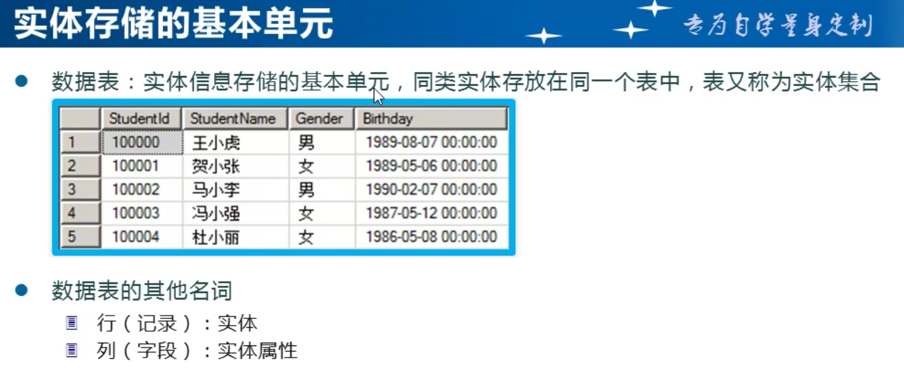

一个表格就是一个实体类的集合

### 不同实体的存储

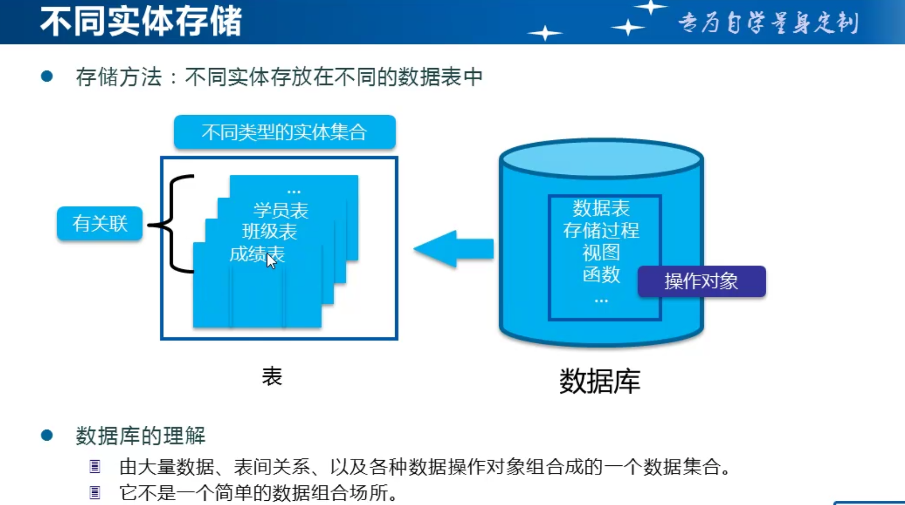

一个表存储一个实体，并且之间可以互相关联

### 数据库管理系统系统

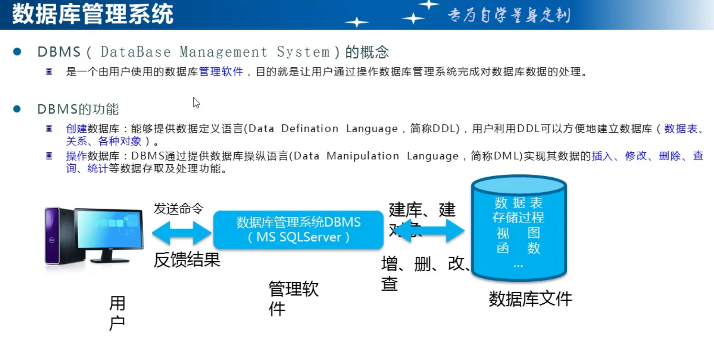

SQLServe，MySQL等都是提供管理操作这些文件数据的软件工具。

### 应用程序

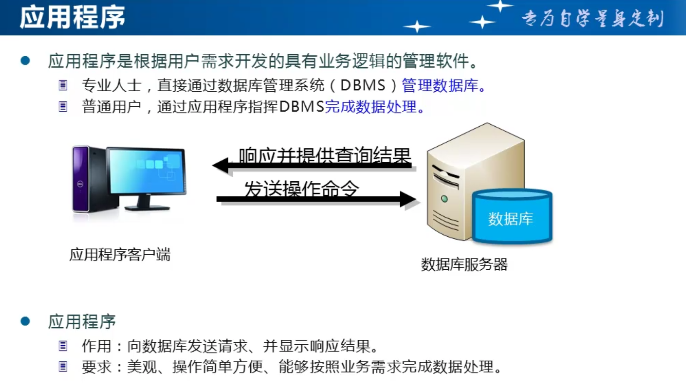

就是方便操作和展示数据库的内容，用户和操作人员就不需要会sql语句就能操作。

### 数据库服务

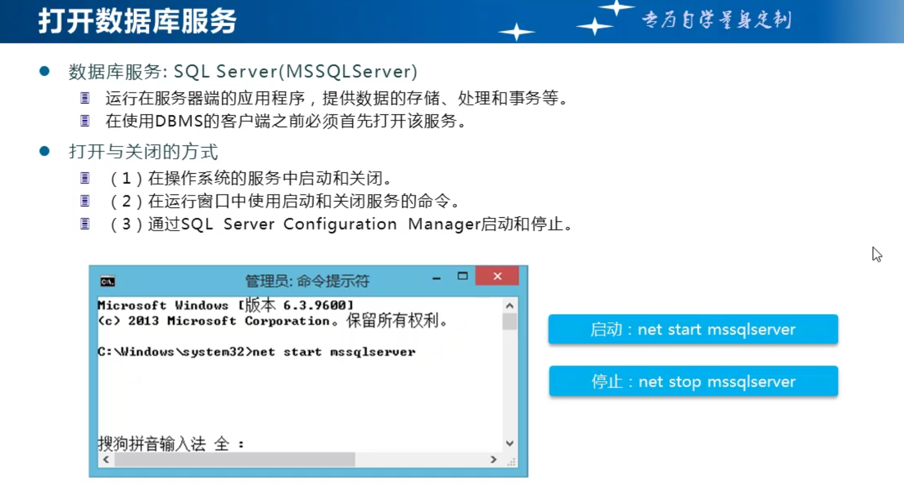

sql可视化软件，和我们的应用程序都是对数据库服务对接的，我们安装的就是数据库的服务，有了这个才能操作。

### 如何学习数据库

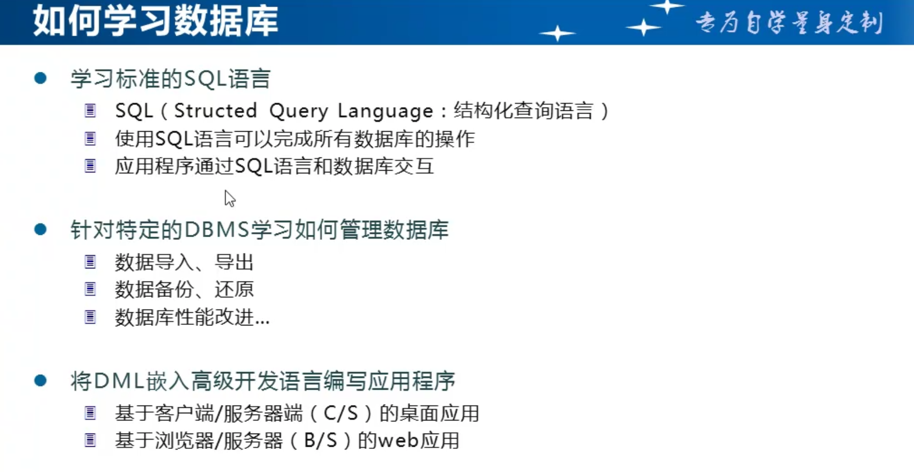

### SQL和T-SQL

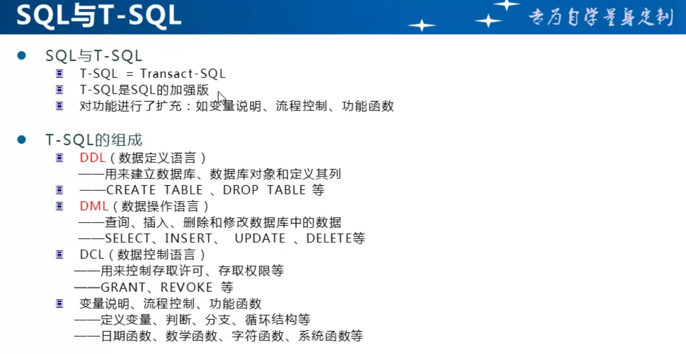

t-sql是对sql的加强

### 主流数据库

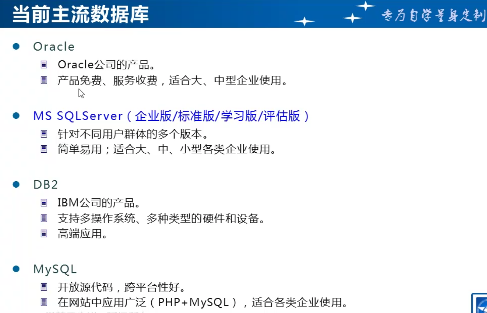

### 小结

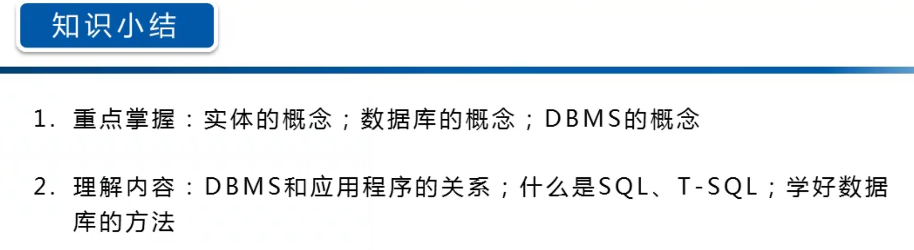

## 数据库的基本使用

### 打开SQLServe服务

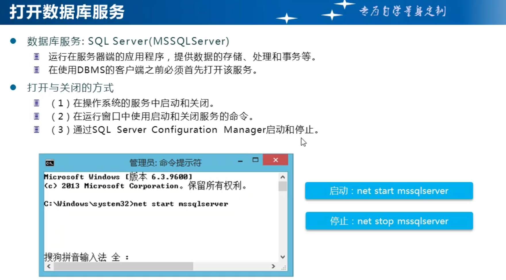

1.打开运行窗口，输入services.msc，找到对应的服务SQL Server (MSSQLSERVER)，打开即可。（推荐）

2.在cmd窗口输入命令可以实现打开和关闭。

3.可以打开安装的sql配置软件进行打开和关闭。

### 数据的连接

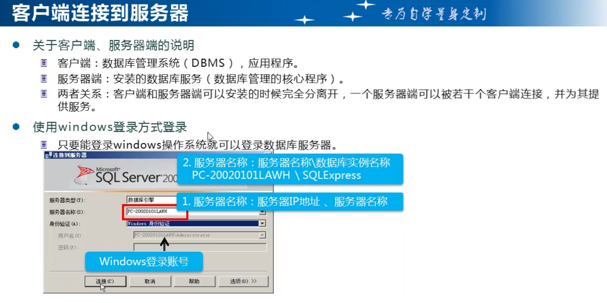

#### 本地登录可用以下名称

LAPTOP-PSG75HI9(自己电脑名)

localhost

.（推荐一个点）

域名（有对应的解析IP地址）

IP地址加端口(中间逗号分隔)：192.168.31.235,1433（要在sql配置工具中，打开tcp/ip并重启服务）

##### 端口号

默认是1433和MySQL的默认端口不一样，ip地址，后面的端口号连接用逗号。

查看端口号：要在sql配置工具中，双击[TCP/IP](https://link.zhihu.com/?target=https%3A//www.baidu.com/s%3Fwd%3DTCP%252FIP%26tn%3DSE_PcZhidaonwhc_ngpagmjz%26rsv_dl%3Dgh_pc_zhidao)检查端口，端口不对也会连接不上

#### 数据库更改端口

在Sql Server Configuration Manager配置工具中网络配置，属性下面更改。

#### 安装数据时的实例名称

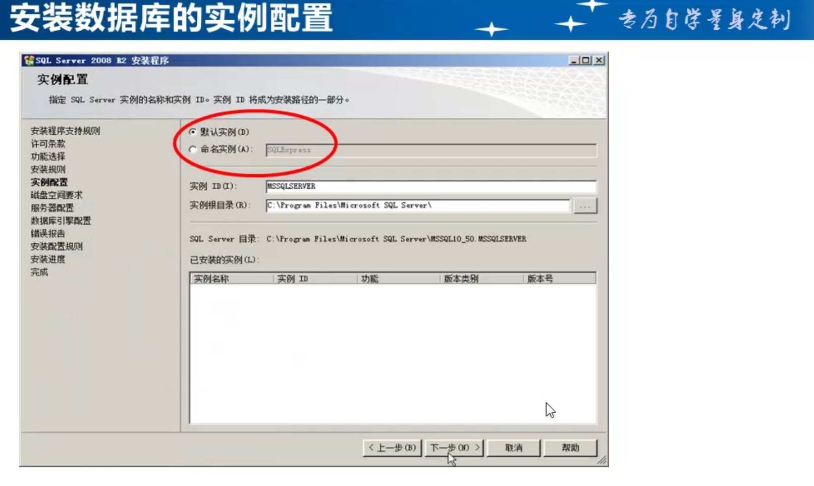

实例用于区分安装多个数据库服务，如安装2008，又安装2012，那么实例就不能用默认名称了，得改，两个不一样。每安装一个，都会有一个对应的实例服务，用那个开启那个。

#### 数据库连接常见错误

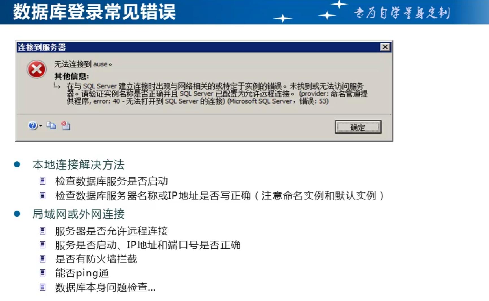

### 企业管理器与查询分析器

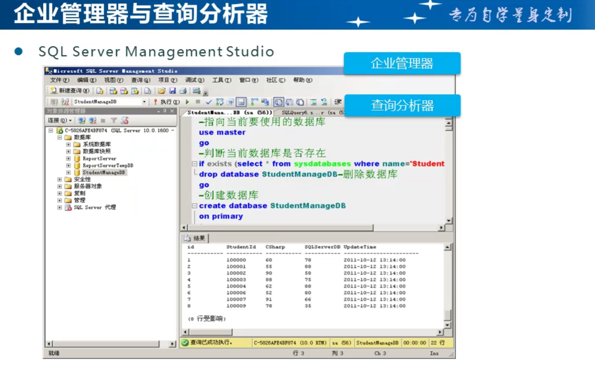

### SQLServer的登录方式

**打开msms可视化软件，用windows验证，查看和设置sa账户的密码**

1.启用SqlServer的登录方式

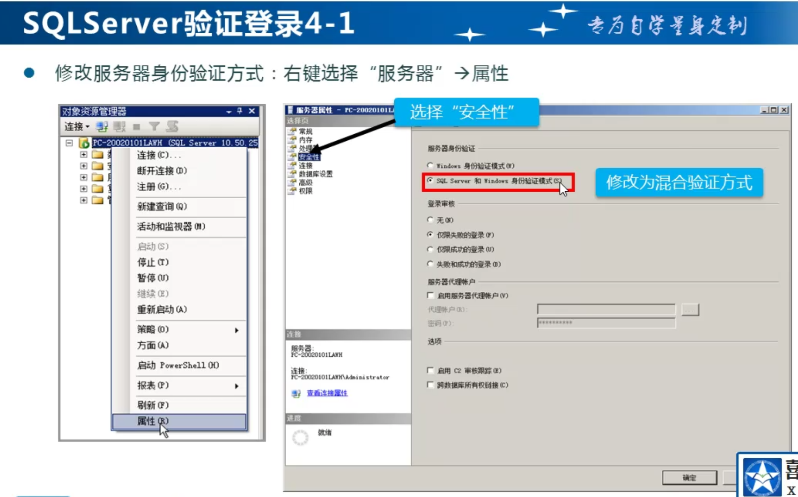

2.修改sa登录账号密码

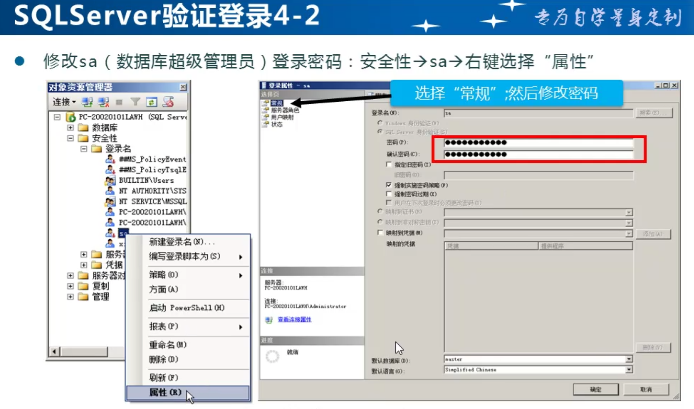

3.状态中设置允许连接的数据引擎

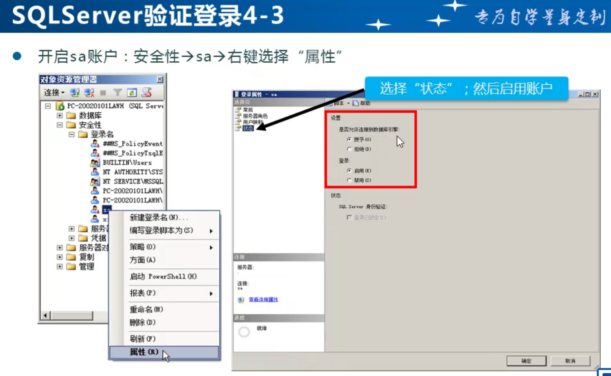

4.重新启动SqlServer服务

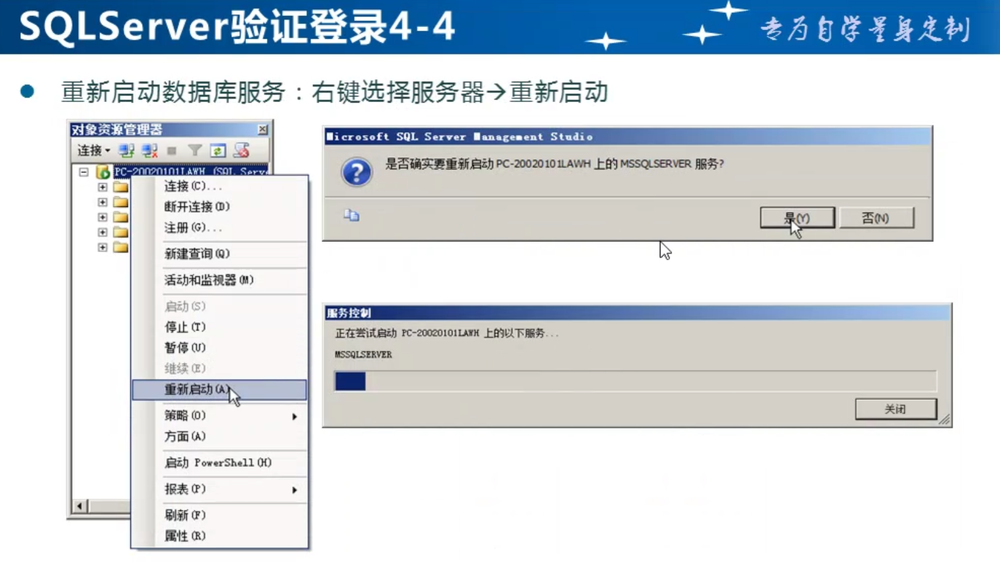
