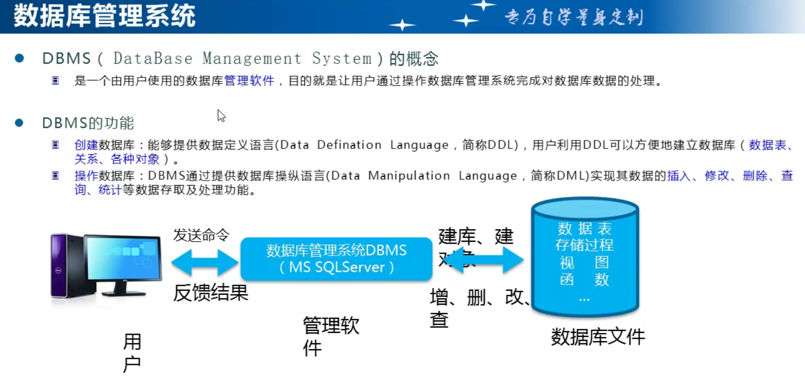
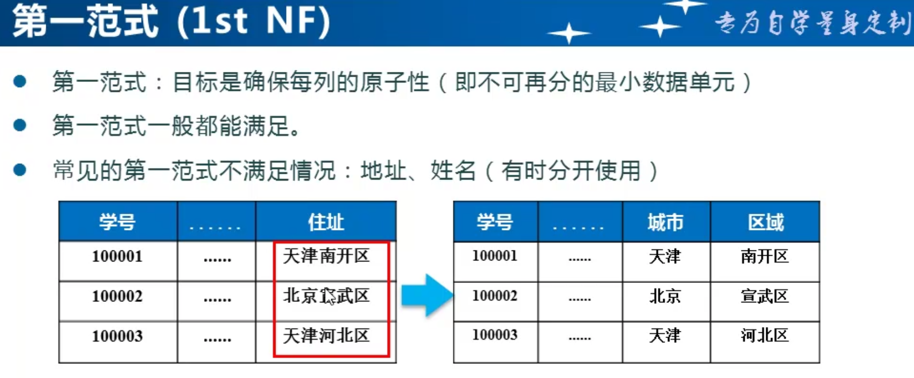
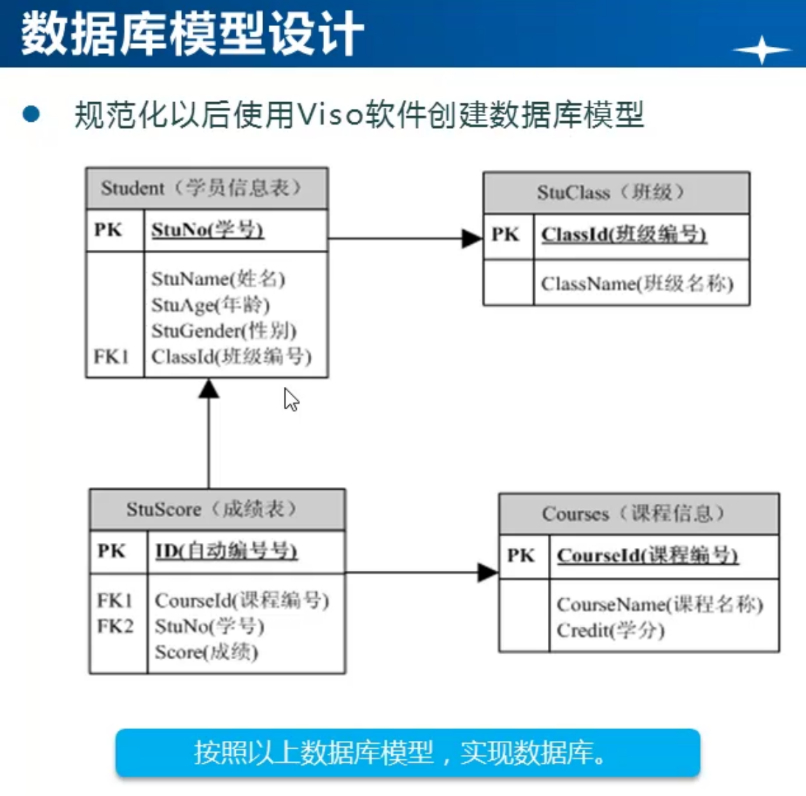

# sqlserver

## SQLServe的概念

### 数据库的概念


数据库就是对实体数据的统一存储，和高性能的操作

### 表格


一个表格就是一个实体类的集合

### 不同实体的存储


一个表存储一个实体，并且之间可以互相关联

### 数据库管理系统系统



SQLServe，MySQL等都是提供管理操作这些文件数据的软件工具。

### 应用程序


就是方便操作和展示数据库的内容，用户和操作人员就不需要会sql语句就能操作。

### 数据库服务


sql可视化软件，和我们的应用程序都是对数据库服务对接的，我们安装的就是数据库的服务，有了这个才能操作。

### 如何学习数据库


### SQL和T-SQL


t-sql是对sql的加强

### 主流数据库


### 小结


## 数据库的基本使用

### 打开SQLServe服务


1.打开运行窗口，输入services.msc，找到对应的服务SQL Server (MSSQLSERVER)，打开即可。（推荐）

2.在cmd窗口输入命令可以实现打开和关闭。

3.可以打开安装的sql配置软件进行打开和关闭。

### 数据的连接


#### 本地登录可用以下名称

LAPTOP-PSG75HI9(自己电脑名)

localhost

.（推荐一个点）

域名（有对应的解析IP地址）

IP地址加端口(中间逗号分隔)：192.168.31.235,1433（要在sql配置工具中，打开tcp/ip并重启服务）

##### 端口号

默认是1433和MySQL的默认端口不一样，ip地址，后面的端口号连接用逗号。

查看端口号：要在sql配置工具中，双击[TCP/IP](https://link.zhihu.com/?target=https%3A//www.baidu.com/s%3Fwd%3DTCP%252FIP%26tn%3DSE_PcZhidaonwhc_ngpagmjz%26rsv_dl%3Dgh_pc_zhidao)检查端口，端口不对也会连接不上

#### 数据库更改端口

在Sql Server Configuration Manager配置工具中网络配置，属性下面更改。

#### 安装数据时的实例名称


实例用于区分安装多个数据库服务，如安装2008，又安装2012，那么实例就不能用默认名称了，得改，两个不一样。每安装一个，都会有一个对应的实例服务，用那个开启那个。

#### 数据库连接常见错误


### 企业管理器与查询分析器


### SQLServer的登录方式

**打开msms可视化软件，用windows验证，查看和设置sa账户的密码**

1.启用SqlServer的登录方式


2.修改sa登录账号密码


3.状态中设置允许连接的数据引擎


4.重新启动SqlServer服务


### 问题

1.无法找到安装的SQLServer配置管理器，可以通过WIN+R输入下面的对应字符串打开。

各个sqlserver版本在textbox中输入对应的命令如下：

SQLServerManager16.msc（对于 SQL Server 2022 ）
SQLServerManager15.msc（对于 SQL Server 2019 ）
SQLServerManager14.msc（对于 SQL Server 2017 ）
SQLServerManager13.msc（对于 SQL Server 2016 ）
SQLServerManager12.msc（对于 SQL Server 2014）
SQLServerManager11.msc（对于 SQL Server 2012 ）

## SQL语句

二、基于T-SQL创建数据库

数据库：课程管理系统数据（CourseManageDB）

课程表（保存课程信息）

课程分类表（包括课程分类信息）

讲师表

——————————————————————————————

系统数据库：master数据主要用来管理其他数据库的信息。

    model数据库：模板数据...

### 一、用户数据库：

数据文件：

【1】主数据文件，一个数据库有，且只能有一个主数据文件。mdf扩展名。

【2】次要数据文件，可以根据需要，添加多个，并且分布到不同的磁盘路径。ndf扩展名

【3】日志文件，有且至少有一个。也可以有多个。ldf

学会，脚本的保存，和重新打开。大家跟着常老师学习T-SQL脚本，最大的好处就是

你能感觉到你学了东西！并且，在数据库兼容性上非常强大！

特别注意：drop关键字，如果你在开发中使用，要特别小心，万一删错是无法挽回的。

### 二、创建数据表

### 三、给数据表创建约束

Q：为什么要添加约束？

A：为了保证数据的有效性。

1.检查约束：也就是添加数据的时候，会检查这个字段的值，是否在约束的条件范围之内。

2.主键约束：要求不能重复。

3.标识列：也就是这个列也必须是唯一的，通常由系统帮我们自动生成，我们不用显式的插入数据。

格式：identity（标识种子，增值量）

identity（1000，1）

常见错误：标识列显式给值；插入的列的个数和对应的值个数不一致。

标识列，在删除数据后，不会自动补充，你也没必要考虑这个。

insert、update、delete、select 语句的基本语法格式，必须熟练。

4.默认约束：给字段添加默认值。

5.唯一约束：（自己学习）

#### 6.外键约束：

如果两个数据表之间有关系，但是我们没有约束，有时候在添加数据的时候，会造成数据不一致的情况。

作用1：当我们在外键表中，添加数据的时候，如果和主表建立引用关系，则会自动的从主表中对应的字段中查询数据是否一致，不一致会拒绝。保证数据一致。

作用2：后面我们讲解查询的时候，也是非常方便的管理数据。

#### 7.使用innser join 实现联合查询

通过联合查询，可以将多个表中的，自己需要的数据整合到一张表中

#### 8.数据库关系图的建立。

先设计出图，在开始建表。

建图软件。

### 数据库表的设计

#### 外键约束：

如果两个数据表之间有关系，但是我们没有约束，有时候在添加数据的时候，会造成数据不一致的情况。

作用1：当我们在外键表中，添加数据的时候，如果和主表建立引用关系，则会自动的从主表中对应的字段中查询数据是否一致，不一致会拒绝。保证数据一致。

作用2：后面我们讲解查询的时候，也是非常方便的管理数据。

## ADO.Net

通过Ado.net操作数据库，就是通过C#操作数据库

所有数据库操作数据的命令都差不多，都是实现的同一个接口。

### 5个大步骤

1.创建连接数据库的字符串和Connection对象。

2.创建要执行的SQL语句和Command对象

3.打开数据库open；注意这里才会正式访问数据库，前面都只是创建一个对象，这里执行。

4.执行要操作的SQL语句；也是这里才会操作数据库，前面只是定义对象。

5.关闭连接；close;

### SQLServer的连接

```
public static void ExecuteSingleResultSQL()
{
    //1.连接数据库
    string connectionString = "Server=.,13834;DataBase=CourseManageDB;Uid=sa;Pwd=922605ai";
    SqlConnection connection = new SqlConnection(connectionString);
    //定义SQL语句
    string sql = "SELECT COUNT(*) as 课程总数 FROM Course";
    //2.创建SqlCommand对象，为什么不一创建就执行能，这样Command对象可以复用，也可以在后面用的时候在调。
    SqlCommand command = new SqlCommand(sql, connection);
    //3.打开数据库连接
    connection.Open();
    //4.通过Command对象执行SQL语句
    object result = command.ExecuteScalar();
    Console.WriteLine("课程总数：" + result);
    //5.关闭数据库连接
    connection.Close();
}
```

### MYSQL的连接

需要下载单独的连接包。MYSQL.Data库

```
public static void ExecuteMySQL()
{
    //1.连接数据库
    string connectionString = "server=localhost;user id=root;password=922605ai;database=coursemanagedb";
    MySqlConnection connection = new MySqlConnection(connectionString);
  
    try
    {
        //2.创建command对象
        string sql = "SELECT COUNT(*) as 课程总数 FROM Course";
        MySqlCommand command = new MySqlCommand(sql, connection);
        //注意，前面的都没有和数据库打交道，只是创建了命令对象，还没有执行命令，只有执行命令后才会和数据库打交道
        //3.打开连接
        connection.Open();
        //4.执行命令并返回结果
        object result = command.ExecuteScalar();
        Console.WriteLine("课程总数：" + result);
    }
    catch (Exception ex)
    {
        Console.WriteLine(ex.Message);
    }
    finally
    {
        //5.关闭连接
        connection.Close();
    }
}
```

### 通过提取将固定的封装为一个方法

通用数据访问类SQLHelper的使用

1.编写通用的增删改方法。

2.关于字符配置问题。常见错误如下：

System.TypeInitializationException:““xiketang.com.Ado.Net.SQLHelper”的类型初始值设定项引发异常。”

解决方法：

#### 【1】项目的配置文件App.config，不能重复添加，而且名称不能修改！

【2】xml文件节点名称写错

```xml
<connectionString>
    <add name="connString" connectionString="Server=.;DataBase=CourseManageDB;Uid=sa;Pwd=a123456"/>
  </connectionString>
```

少了一个s，应该是connectionStrings

【3】配置节点中，name部分写错，比如多了一个空格

  `<add name="connString " connectionString="Server=.;DataBase=CourseManageDB;Uid=sa;Pwd=a123456"/>`

"connString " 这个地方有空格和没有空格是有区别的。

【4】配置节点中，name部分单词拼写错误，比如

name="connStrig"  当我们使用connString的时候，就找不到了。

【5】配置节点写的正确，但是读取的时候，C#部分，节点名写错

  private static string connString = ConfigurationManager.ConnectionStrings["conString"].ToString();

比如上面conString少了一个n，记住，在这个地方和前面一样，多一个空格也不行！

【6】配置文件App.config文件必须放到项目的“可启动项目的根目录下”，不能放到其他模块下面！

比如，有的学员把此文件，放到DAL或其他类库下面，都是不允许的。

以上情况， 大家必须自己会解决！

——————————————————————————————————————————————

3.封装单一结果查询方法

4.封装结果集查询方法

错误：System.InvalidOperationException:“阅读器关闭时尝试调用 Read 无效。”

原因：是我们在通用方法中关闭了链接，我们不能直接关闭，解决方法如下：

 添加枚举  return cmd.ExecuteReader(CommandBehavior.CloseConnection);

特别说明：

我们不能把链接对象Connection再次独立了。因为我们使用的静态方法，否则会出现冲突。


## 数据库的设计检验和模型

### 数据库设计的三范式（设计基础，要记牢）

正常工业使用一般这样设计没什么问题，数据量不大。当数据量大了的时候，就不一定按照这个规范了，因为按照规范，连接查询太多，性能可能会有影响。

#### 第一范式    保证每个列表是最小的，不可在分割的了



#### 第二范式   一个复杂的表要拆分成多个独立的表，就是相同的归为一张表，单独出来，不要在一张表上出现多个不相同的列。


#### 第三范式   在满足第二范式，表中的数据列都是相关的，然后就是再看一张表的数据，每个列是否都是对立的，不能存在多个表的列信息相同，否则该列数据错了，所以信息都要修改。

比如：学号，姓名，年龄，性别，班级编号，班级名称。都是满足第二范式，相关的数据都在一个表中。

但是：班级编号，班级名称。中如果班级名称错了，那么所有数据的班级名称全部都要修改。那么班级编号，班级名称。就可以在独立一个表，而原来那个表只需要关联一个主键就好。


第三范式


#### 通过输出模型来表示关系


