# WPF学习

## 布局

winform这个是平面和叠层的布局，都是在一个平面的画布中拖动控件。

WPF是树形结构布局。

前端布局（从上到下，从左往右，从内往外的布局）

一个xaml标签就是一个对象，比如grid就是一个对象。对象存储数据一般就是字段和属性，一般属性暴露在外。因为属性可以校验，字段不行。


## 基础概念

1.WPF和Winform

wpf和winform都是使用的.netframework 4.8运行（支持C#7.3的语法），所有dll库是互通的，只要不涉及到UI相关，因为两个框架的U渲染引擎不一样，所以编写通用的工具dll库最好不要涉及到UI，这样WPF和winform都能用。

2.winform的UI跟像素相关。wpf的UI是矢量渲染的，跟像素没有关系。

3.WPF底层渲染框架架构

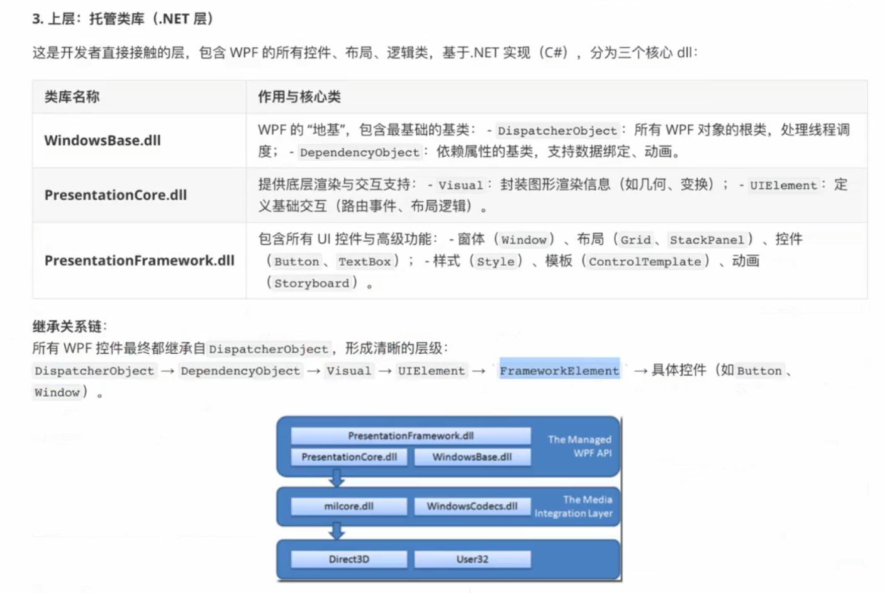

| 类库类型          | 通用情况            | 核心原因                                                         |
| ------------- | --------------- | ------------------------------------------------------------ |
| **非 UI 基础类库** | ✅ 完全通用          | 依赖.NET Framework/.NET Core/.NET 5 + 的**基础类库（BCL）**，与 UI 框架无关 |
| **UI 相关类库**   | ❌ 基本不通用（需特殊互操作） | 底层渲染引擎（GDI+ vs DirectX）、控件模型、布局系统完全不同                        |

WPF 和 WinForm 的**UI 体系完全独立**，底层设计理念差异巨大，导致 UI 类库无法直接复用，核心差异点如下：

| 对比维度     | WinForm                                                       | WPF                                                   |
| -------- | ------------------------------------------------------------- | ----------------------------------------------------- |
| 底层渲染引擎   | GDI+（基于像素绘制，传统 Windows 绘图技术）                                  | DirectX（硬件加速，矢量渲染，支持 3D / 动画）                         |
| UI 控件模型  | 重量级控件（依赖 Windows 原生句柄`HWND`，每个控件对应一个系统窗口）                     | 轻量级控件（大部分无句柄，基于可视化树`Visual Tree`渲染，支持自定义模板）           |
| 核心 UI 类库 | `System.Windows.Forms.dll`（控件如`Form`、`Button`、`DataGridView`） | `System.Windows.dll`（控件如`Window`、`Button`、`DataGrid`） |
| 布局系统     | 基于坐标和锚定（`Anchor`/`Dock`），需手动计算控件位置                            | 基于面板（`Grid`/`StackPanel`/`Canvas`），自动布局，支持响应式         |
| 数据绑定     | 简单数据绑定（仅支持单向 / 双向绑定，依赖`INotifyPropertyChanged`但体验差）           | 强大的数据绑定（支持多方向、数据模板、值转换器，核心是 MVVM 模式）                  |

2.如何学习WPF

学习WPF中的xaml标签的用法，和WPF的布局，MVVM设计模式。因为WPF和winform的差距就是xaml，其它的都是类似的。

xaml标签中，每个标签都可以看作是一个类，使用时<>创建。

## WPF编译运行底层

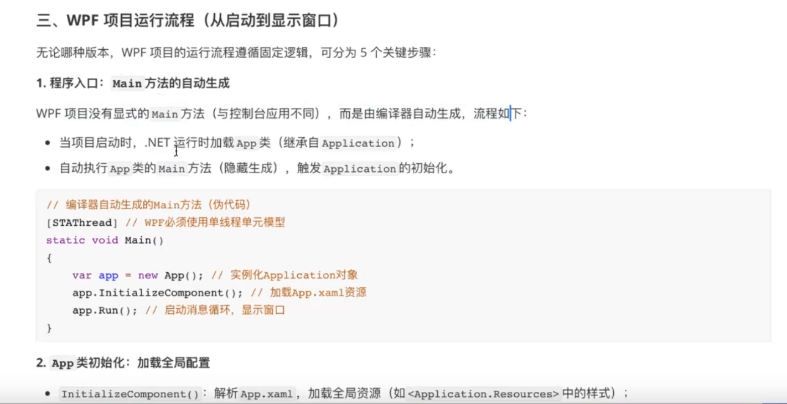

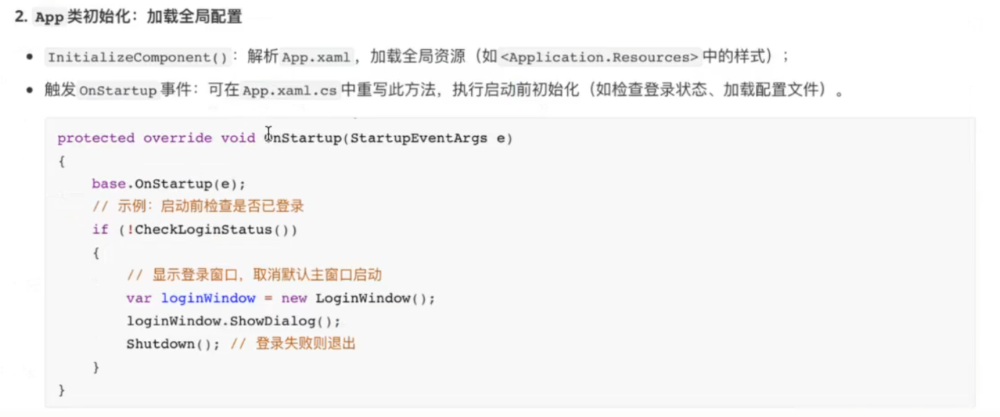

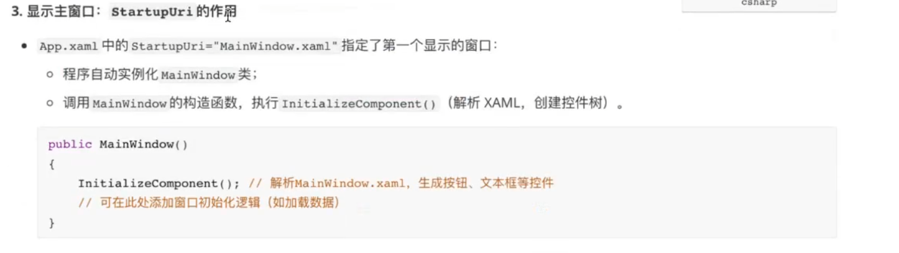


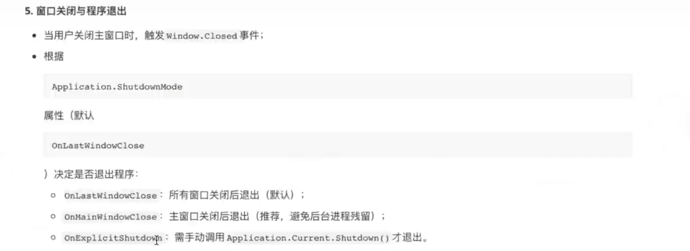

### 1.新建项目文件介绍

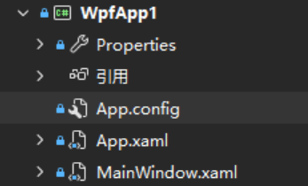

properties和app.config都是程序集的一些配置。

App.xaml是程序启动的入口，里面封装了main和设置startupUri第一个窗体的渲染，但是app本身不进行UI设计。当有对所有窗体生效的改变时，可以在App.xaml中添加。

MainWindow.xaml是程序窗体，用于页面Ui的展示渲染。

App.xaml继承Application，MainWindow.xaml继承Window。

在代码中，所有的xaml标签都是代码，可以查看的。Application标签就是app继承的application类。初始化都是通过反射解析的，将xaml中的标记语言解析到代码中的类，属性，事件进行绑定的。

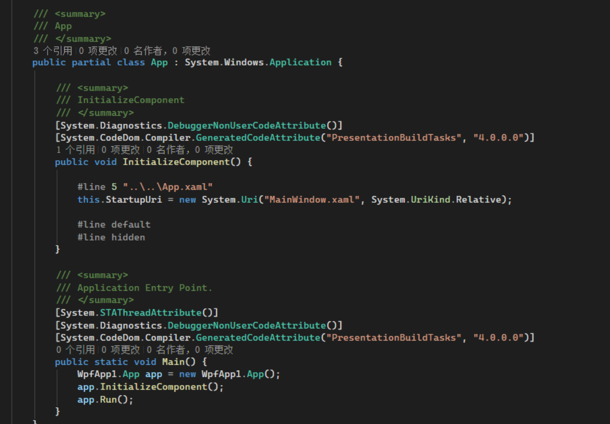

### 2.WPF的app.xaml介绍

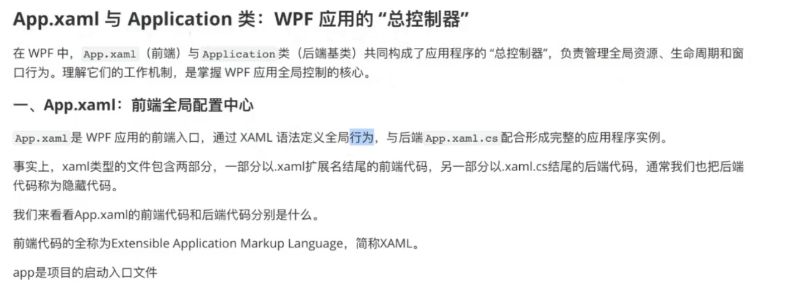

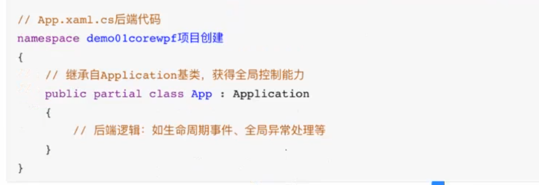

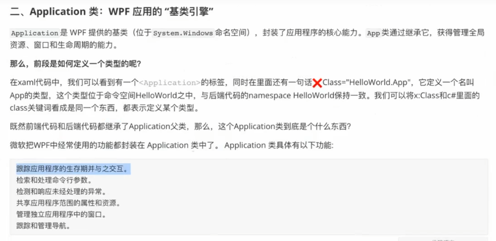

### 3.案例

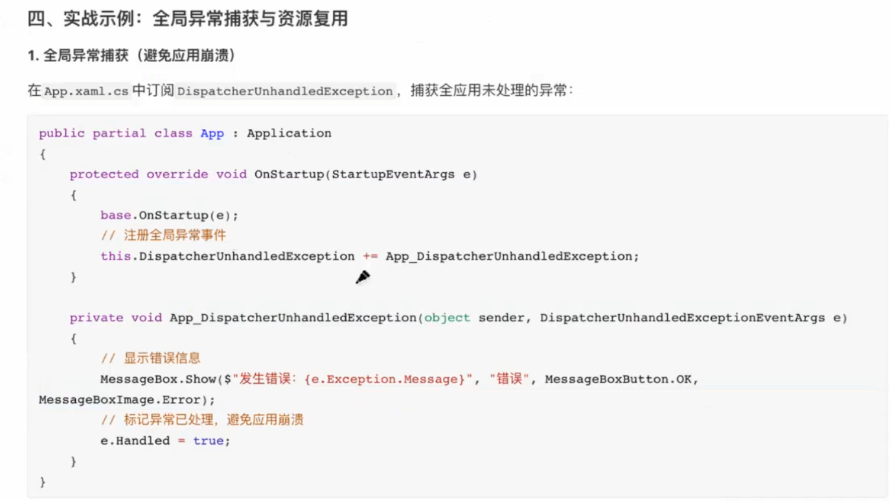

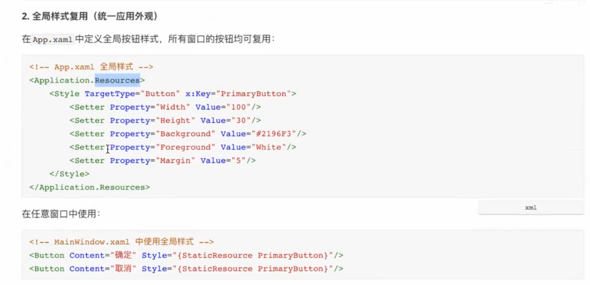

### 4.生命周期

应用程序application的生命周期，是全局的，所有窗体生效。

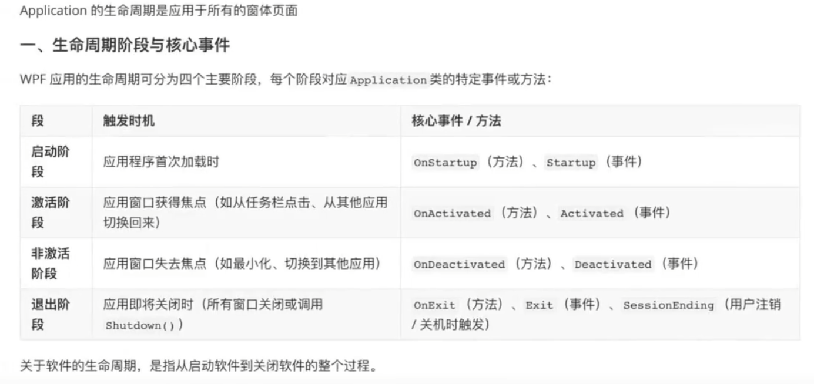


窗体的生命周期

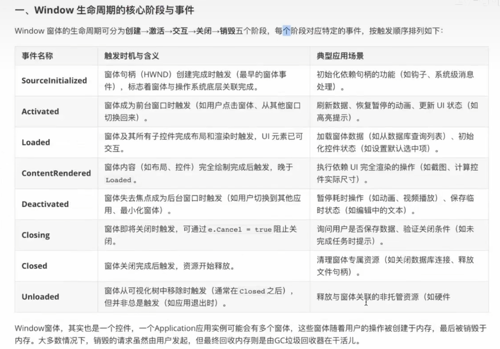


vs中，项目勾选控制台应用程序，这样控制台也会输出。

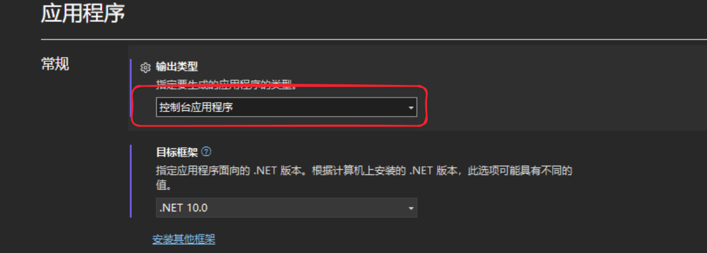


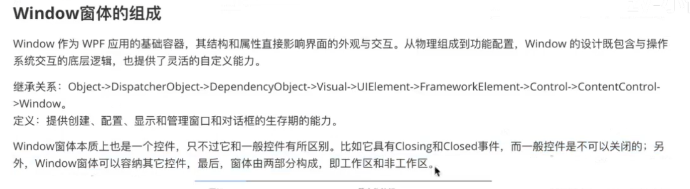


### 总结

1.WPF的整体文件。

2.app程序全局控制管理和全局样式。

3.Window窗体。

4.程序和窗体的生命周期。

明天看11.窗体页面的组成

## WPF程序架构

### 布局

winform是堆叠布局，wpf是树结构布局。一个标签表示一个类，通常类中存储数据的有字段和属性（attribute），一般属性暴露在外，可以在设置时作验证。而这里的标签类也是通过属性操作。

标签的几种用法：

XAML中为对象属性赋值：

1.Attribute=Value形式。类似Width=“120”

2.属性标签

但是遇到属性的值比较复杂时，就可以通过下面的方法设置，属性标签。两个标签<>中的区域叫的内容。</>

```html
<Button Width="120" Height="30"> 
    <Button.Content> 
        <!--这个里面就可以写Button中Content的属性的内容。 -->
        <Rectangle Width="20" Height="20" Stroke="DarkGreen" Fill="LawnGreen"> 
    </Button.Content> 
</Button>`
```

3.标签扩展


### WPF程序的生命周期

WPF没有winform的Load等生命周期事件。


## XAML基础（自己的笔记）

命名空间的由来和作用

WPF的UI代码继承Window。

Window x:Class="UI对应的类"，相当于一个Window对应的一个逻辑处理类。类似继承form的类。

xaml中的窗体页面等同于winform中的form窗体，创建一个窗体就是创建一个xaml。

xmlns:x="引用的命名空间"

xaml标签可以看成是面向对象的代码C#，只是写法类似html，有对象，属性，元素，实例化，事件等。

### X:Name和name的区别

有些空间没有name就没法在cs类中快速使用，x:name就是在所有空间中都可以使用。

在WPF的XAML中，`x:Name`和`Name`都用于标识元素，但两者的本质、适用范围和编译逻辑存在区别，具体如下：

1. 本质与归属不同
- **`Name`**：是WPF控件（如`Button`、`TextBox`等）自身的属性，属于控件类的成员（定义在`FrameworkElement`或`FrameworkContentElement`基类中）。  
  例如，`Button`控件继承自`FrameworkElement`，因此天然具备`Name`属性。

- **`x:Name`**：是XAML语言层面的属性（属于`x`命名空间，即`xmlns:x`），不属于任何控件类，而是XAML语法对元素的“标识指令”。  
  它的作用范围更广，不依赖于控件是否有`Name`属性。
2. 适用范围不同
- **`Name`**：仅适用于继承自`FrameworkElement`或`FrameworkContentElement`的UI元素（如窗口、按钮、文本框等）。  
  对于非UI元素（如`DataTemplate`中的数据对象、`Storyboard`动画对象等），或未继承上述基类的自定义元素，可能没有`Name`属性，此时无法使用`Name`。

- **`x:Name`**：适用于所有XAML中声明的元素，包括但不限于：  
  
  - 没有`Name`属性的非UI元素（如`BindingSource`、`AnimationClock`）；  
  - 数据模板（`DataTemplate`）或样式（`Style`）中定义的元素；  
  - 自定义的非`FrameworkElement`派生类实例。  
3. 编译后的效果差异

两者的核心作用都是让后台代码能访问XAML中的元素，但编译逻辑有细微区别：  

- 无论使用`Name`还是`x:Name`，编译器都会在后台生成一个**强类型字段**，指向该元素（方便在`.xaml.cs`中直接调用）。  

- 区别在于：  
  
  - 对于有`Name`属性的元素（如`Button`），`Name="btn"`本质是给控件的`Name`属性赋值，同时编译器会自动关联到`x:Name`的逻辑（等效于`x:Name="btn"`）。  
  - 对于没有`Name`属性的元素，`x:Name="xxx"`是唯一标识方式，编译器直接通过`x:Name`生成访问字段。  
  
  总结

- 日常开发中，对`Button`、`Window`等常见UI控件，`Name`和`x:Name`效果基本一致，可混用。  

- 当处理非UI元素、数据模板中的元素，或自定义非`FrameworkElement`派生类时，必须使用`x:Name`。  

- 本质区别：`Name`是控件自身属性，`x:Name`是XAML语言的标识指令，后者适用范围更广。
  
  
  
  
  
  
  
  

## XAML基础

### 1. 命名空间

- **作用**：XAML基于XML语法，命名空间（通过`xmlns`声明）用于避免不同来源的元素/属性命名冲突，明确标识标签对应的类库来源。
- **常用命名空间**：
  - 默认命名空间：`xmlns="http://schemas.microsoft.com/winfx/2006/xaml/presentation"`，包含WPF核心控件（如Window、Button等）。
  - x命名空间：`xmlns:x="http://schemas.microsoft.com/winfx/2006/xaml"`，提供XAML语法级特性（如`x:Class`、`x:Name`等）。

### 2. Window类与x:Class

- WPF的UI界面（窗体）本质是`Window`类的实例，XAML中的`<Window>`标签对应对`Window`类的实例化。
- `x:Class`属性：用于指定当前XAML对应的后台C#逻辑类（通常在`.xaml.cs`文件中），该类需继承自`Window`，从而建立界面与逻辑的关联。
  - 类比：类似WinForm中继承`Form`的类，负责窗体的交互逻辑处理。

### 3. XAML窗体的定位

- XAML窗体是WPF应用的基本界面单元，等同于WinForm中的`Form`窗体。
- 创建新窗体时，会自动生成`.xaml`文件（用于声明界面布局、控件等）和对应的`.xaml.cs`文件（用于编写逻辑代码）。

### 4. XAML与C#的关系

- XAML是**声明式语言**，本质是C#面向对象代码的“简化写法”：
  - 每个XAML标签对应C#中的一个类实例（如`<Button>`对应`Button`类的实例化）。
  - 标签的属性（如`Width="100"`）对应对象的属性赋值。
  - 子元素（如`<Window><Button /></Window>`）对应对象的成员关系（如Window包含Button）。
  - 事件绑定（如`Click="Btn_Click"`）对应C#中的事件处理方法关联。
- 语法形式类似HTML，但核心是对面向对象概念（对象、属性、实例化、事件等）的声明式表达。
  
  
  
  
  
  
  
  

# WPF入门教程：快速上手Windows桌面应用开发（AI）

WPF（Windows Presentation Foundation）是微软推出的桌面应用开发框架，以“分离UI与逻辑”为核心优势，支持丰富的视觉效果、数据绑定和样式定制，比传统WinForm更灵活高效。本文带你快速入门WPF的核心概念。

## 一、核心组成：XAML与C#的分工

WPF开发的核心是“声明式UI+命令式逻辑”的分离模式：

- **XAML**：一种XML风格的声明式语言，专门用于描述界面布局。你可以像写HTML一样定义窗口、按钮、文本框等控件，无需写一行逻辑代码。
- **C#（后台代码）**：负责处理交互逻辑（如按钮点击、数据计算），通常存放在`.xaml.cs`文件中，与XAML文件通过类名关联。

## 二、第一个WPF程序结构

新建WPF项目后，会自动生成两个文件：`MainWindow.xaml`（UI）和`MainWindow.xaml.cs`（逻辑）。

### XAML基础结构：

```xml
<Window 
    xmlns="http://schemas.microsoft.com/winfx/2006/xaml/presentation"  <!-- WPF核心控件命名空间 -->
    xmlns:x="http://schemas.microsoft.com/winfx/2006/xaml"  <!-- XAML语法命名空间 -->
    x:Class="WpfApp.MainWindow"  <!-- 关联的后台类 -->
    Title="我的第一个WPF程序" Height="300" Width="400">
    <!-- 控件布局区域 -->
    <Grid>
        <Button Content="点击我" Click="Button_Click" 
                Width="100" Height="30" Margin="50"/>
    </Grid>
</Window>
```

### 对应的后台代码（C#）：

```csharp
using System.Windows;

namespace WpfApp
{
    public partial class MainWindow : Window  // 继承自Window类
    {
        public MainWindow()
        {
            InitializeComponent();  // 初始化XAML定义的UI
        }

        // 按钮点击事件处理
        private void Button_Click(object sender, RoutedEventArgs e)
        {
            MessageBox.Show("Hello WPF!");
        }
    }
}
```

## 三、关键概念速览

- **命名空间**：通过`xmlns`声明，避免控件命名冲突。默认命名空间包含所有WPF基础控件，`x`命名空间提供语法特性（如`x:Class`）。
- **布局容器**：`Grid`（网格）、`StackPanel`（栈式布局）等控件用于管理子元素位置，替代传统的坐标定位，适配不同窗口大小。
- **事件绑定**：XAML中通过`事件名="方法名"`关联后台逻辑，如`Click="Button_Click"`。

## 四、运行与扩展

按下F5运行程序，点击按钮会弹出消息框。后续可深入学习：布局控件（如`StackPanel`）、数据绑定（让UI自动同步数据）、样式（统一控件外观）等功能。

WPF的核心是“用XAML画界面，用C#写逻辑”，这种分离模式让界面设计与功能开发可并行进行，适合构建美观且易维护的桌面应用。


## MVVM开发

开发学习环境

Microsoft Prism：用于支持mvvm的框架

Microsoft Blend SDK：用于设计页面的

必要的知识

MVVM不是所有项目都上的，一些简单的，几个窗体的项目可以就普通的模块结构就好了，不需要过度设计。或者有些项目不适配mvvm，比如游戏开发，就不适合mvvm的架构。

mes等，这些可以用mvvm架构，提高可维护性。

MVVM设计模式详解

MVVM = Model -View-ViewModel

Model：就是数据的对象的抽象集合，用于数据的展示和传递。

View：展示操作的UI界面，用户操作的界面

ViewModel：用于响应View中用户操作UI的操作，比如页面上点击了某个按钮，那么ViewModel中就要有响应View的操作方法。

上面的分层都是针对页面的。
