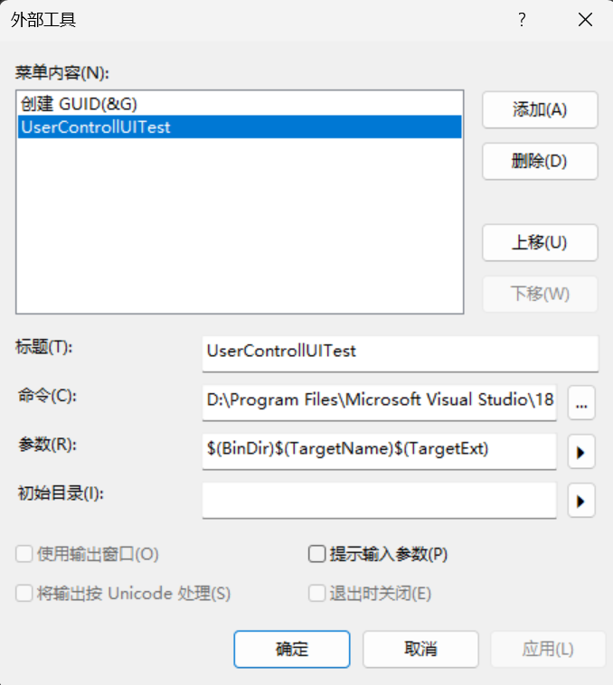
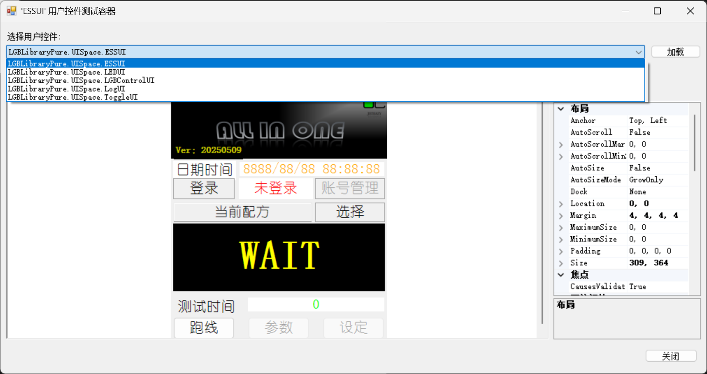

# WinForm笔记

## 1.项目结构规范

### 1.1 命名规范

主窗口要改名，改成和项目相关的名字，如TrayToTrayMainForm。

主窗体对象的创建：在Program类里面：  Application.Run(new FrmMain());

### 1.2 formwork4.8支持的语法版本

支持C#7.3的语法，在高级就不支持了。


### 1.3 WPF和Winform

wpf和winform都是使用的.netframework 4.8运行，所有dll库是互通的，只要不涉及到UI相关，因为两个框架的U渲染引擎不一样，所以编写通用的工具dll库最好不要涉及到UI，这样WPF和winform都能用。

| 类库类型          | 通用情况            | 核心原因                                                         |
| ------------- | --------------- | ------------------------------------------------------------ |
| **非 UI 基础类库** | ✅ 完全通用          | 依赖.NET Framework/.NET Core/.NET 5 + 的**基础类库（BCL）**，与 UI 框架无关 |
| **UI 相关类库**   | ❌ 基本不通用（需特殊互操作） | 底层渲染引擎（GDI+ vs DirectX）、控件模型、布局系统完全不同                        |

WPF 和 WinForm 的**UI 体系完全独立**，底层设计理念差异巨大，导致 UI 类库无法直接复用，核心差异点如下：

| 对比维度     | WinForm                                                       | WPF                                                   |
| -------- | ------------------------------------------------------------- | ----------------------------------------------------- |
| 底层渲染引擎   | GDI+（基于像素绘制，传统 Windows 绘图技术）                                  | DirectX（硬件加速，矢量渲染，支持 3D / 动画）                         |
| UI 控件模型  | 重量级控件（依赖 Windows 原生句柄`HWND`，每个控件对应一个系统窗口）                     | 轻量级控件（大部分无句柄，基于可视化树`Visual Tree`渲染，支持自定义模板）           |
| 核心 UI 类库 | `System.Windows.Forms.dll`（控件如`Form`、`Button`、`DataGridView`） | `System.Windows.dll`（控件如`Window`、`Button`、`DataGrid`） |
| 布局系统     | 基于坐标和锚定（`Anchor`/`Dock`），需手动计算控件位置                            | 基于面板（`Grid`/`StackPanel`/`Canvas`），自动布局，支持响应式         |
| 数据绑定     | 简单数据绑定（仅支持单向 / 双向绑定，依赖`INotifyPropertyChanged`但体验差）           | 强大的数据绑定（支持多方向、数据模板、值转换器，核心是 MVVM 模式）                  |

## 2.代码结构简介

Form类通过partial分为两个类。避免混乱，如果觉得还是分的，也可以通过partial在分一个类。

Form.Designer：主要是代码自动生成的一些属性，很少动的。

InitializeComponent就是在Form.Designer中，如果不加partial就会在一个类中很混乱。

Form：主要是事件，经常编辑的

### 2.1 控件对象与窗体容器集合（Controls）

控件对象与窗体容器集合（Controls）

#### 2.1.1 Controls

**每个窗口**都会有一个Controls，里面放着所有控件集合。

可以通过 `Controls.SetChildIndex` 方法来改变控件dock的顺序。

#### 2.1.2 Control

```
在.NET 框架中，大多数 Windows Forms 控件都继承自System.Windows.Forms.Control类

在 C# 的 Windows Forms 编程中，Form 类继承自 Control 类，所以 Form 属于 Control。下面为你详细解释相关内容。
继承关系说明
在 .NET 的 Windows Forms 库中，Control 类是所有用户界面控件的基类，它提供了控件的基本功能，像显示、布局、事件处理等。而 Form 类继承自 ContainerControl，ContainerControl 又继承自 ScrollableControl，ScrollableControl 最终继承自 Control。这种继承关系使得 Form 拥有 Control 的所有特性，同时还具备窗体特有的功能，如标题栏、边框、最大化最小化按钮等。
```

可以通过遍历Controls获取每个控件或者容器

```
//首先判断容器中是否有其他的窗体
foreach (Control item in Controls)
{
    if (item is Button)
    {

    }
}
```

#### 【1】控件和组件的区别：控件是在窗体上可见的。组件是在窗体下面不可见的，也就是不占用窗体的空间。也就是没有可视化的界面。

【2】按钮控件的使用与代码分析。控件从拖放到显示，经过的步骤：

第一、创建该对象的成员变量。

第二、初始化这个成员变量的相关属性。（我们可以通过可视化属性窗口完成）

第三、窗体本身是一个容器，所有的控件，都会加到Controls集合中。

当我在窗体上添加一个容器控件的时候（比如GroupBox或者Panel）容器控件和其他的控件一样，也会被添加到Controls集合中。当我在容器中添加相关的控件的时候，这时候，容器中的控件，会添加到当前容器的Controls集合中，而不是窗体的Controls中，请大家务必记住。

2.1.1 窗体的所有控件都是成员变量，在Designer中声明。

2.1.2 InitializeComponent方法里面的代码最好不要改动

#### 2.2.1 控件所需代码

```csharp
第一、创建该对象的成员变量。默认在Designer.cs中创建的
private Button btnMinimize;
第二、初始化这个成员变量的相关属性。（我们可以通过可视化属性窗口完成），当然也不一定都要在InitializeComponent中初始化。
 private void InitializeComponent()
 {
btnMinimize = new Button();
// 
// btnMinimize
// 
btnMinimize.Anchor = AnchorStyles.Top | AnchorStyles.Right;
btnMinimize.Location = new Point(967, 9);
btnMinimize.Margin = new Padding(2);
btnMinimize.Name = "btnMinimize";
btnMinimize.Size = new Size(22, 24);
btnMinimize.TabIndex = 2;
btnMinimize.Text = "-";
btnMinimize.UseVisualStyleBackColor = true;
btnMinimize.Click += btnMinimize_Click;

}

第三、窗体本身是一个容器，所有的控件，都会加到Controls集合中。这是加入了panel容器下面的Controles中。
panel1.Controls.Add(btnMinimize);

```

#### 2.2.2 事件的基本代码

```csharp
 private void InitializeComponent()
 {
btnMinimize = new Button();
// 
// btnMinimize
// 
btnMinimize.Anchor = AnchorStyles.Top | AnchorStyles.Right;
btnMinimize.Location = new Point(967, 9);
btnMinimize.Margin = new Padding(2);
btnMinimize.Name = "btnMinimize";
btnMinimize.Size = new Size(22, 24);
btnMinimize.TabIndex = 2;
btnMinimize.Text = "-";
btnMinimize.UseVisualStyleBackColor = true;
btnMinimize.Click += btnMinimize_Click;
//添加当对应的事件触发时，执行的方法
btnToggleMaximize.Click += btnToggleMaximize_Click;
}
//执行的方法
private void btnMinimize_Click(object sender, EventArgs e)
{
    this.WindowState = FormWindowState.Minimized;
}

```

1

#### 事件的sender参数

sender就是当前调用的对象，使用时，只需要转换一下对应的对象类型。

```
private void button1_Click(object sender, EventArgs e)
{
    Button btn = (Button)sender;
}
```

#### EventArgs

EventArgs只是一个类

控件中的都是事件要传递的方法，都是类，里面不是事件和委托，只是用来绑定事件和委托的方法。

#### 事件的统一关联

就是将多个事件都统一成一个，多个事件调用这一个事件处理方法即可。

##### 控件的Tag属性

### 2.2程序对窗体的操作

每个程序都有个管理窗体的类Application，可以获取程序中所有的窗体操作。可以看成程序是一个大窗体，根节点，窗体就是这个程序的泛伸。

### 2.3启动代码

[STAThread]

 C# 中，`[STAThread]` 是一个 **线程模型属性**，用于标记程序的入口点（通常是 `Main` 方法），指定该线程运行在 **单线程单元（Single-Threaded Apartment，简称 STA）** 中。它在 WinForms、WPF 等桌面应用程序中至关重要，尤其是依赖 COM 组件（如 UI 控件）的场景。

一、核心含义：单线程单元（STA）

Windows 系统中，线程模型分为 **STA（单线程单元）** 和 **MTA（多线程单元）**，用于管理 COM 组件（如早期 Windows 控件、ActiveX 组件）的线程安全：

* **STA**：线程拥有独立的 “消息队列”，且 COM 组件在 STA 中创建后，**只能由该线程访问**（其他线程不能直接操作），确保组件的线程安全。
* **MTA（多线程单元）**：多个线程共享一个单元，COM 组件可被多个线程访问（需组件自身实现线程安全）。

二、非桌面应用的场景

* **控制台应用**：默认使用 MTA 模式，若不涉及 COM 组件，无需 `[STAThread]`；若需访问 STA 类型的 COM 组件（如 Office 互操作），需标记 `[STAThread]`。
* **[ASP.NET](https://asp.net/) 或服务程序**：通常使用 MTA 模式，无需 `[STAThread]`（这些场景极少依赖 STA 类型的 COM 组件）。

三、总结

`[STAThread]` 是 WinForms 等桌面应用程序的**必备属性**，其核心作用是：

1. 声明主线程运行在 STA 模式下，适配依赖 COM 技术的 UI 控件；
2. 确保控件绘制、用户交互（如点击、拖放）等功能正常工作；
3. 避免因线程模型不匹配导致的程序崩溃或异常。

开发 WinForms 程序时，必须在 `Main` 方法上添加 `[STAThread]` 标记，否则可能出现各种 UI 相关的问题。


<B>Application.EnableVisualStyles();</B>

一、核心作用：让控件显示现代外观

Windows 系统从 XP 开始引入 “视觉样式”（也称 “主题”），支持控件的渐变颜色、阴影效果、圆角等现代设计（例如按钮悬停时的高亮效果、复选框的立体样式）。

`Application.EnableVisualStyles()` 的作用是：**告诉应用程序 “使用系统视觉样式渲染控件”**，使控件外观与当前系统主题保持一致（例如 Windows 10/11 的圆角按钮、浅色 / 深色模式适配）。

二、不调用的后果：控件显示为 “经典样式”

如果不调用 `Application.EnableVisualStyles()`，WinForms 控件会默认使用 **Windows 经典样式**（类似 Windows 98/2000 的外观）：

* 按钮是扁平的灰色，无悬停 / 点击动画；
* 复选框、单选框是简单的黑白样式；
* 窗口边框、标题栏也会显示为旧样式，与系统主题脱节。
  
  

<B>Application.SetCompatibleTextRenderingDefault(false);</B>

`Application.SetCompatibleTextRenderingDefault(bool)` 是 WinForms 中用于 **设置控件文本渲染模式** 的关键方法，其参数为 `true` 时，会强制应用程序中所有支持的控件使用 **GDI 兼容的文本渲染方式**（而非默认的 GDI+ 方式）。这一设置主要用于解决 **旧版本 .NET 程序的兼容性问题**，具体作用和影响如下：

### 一、核心作用：切换文本渲染引擎

Windows 平台的文本渲染依赖两种底层技术：

* **GDI**：传统图形设备接口（Graphics Device Interface），.NET 1.0/1.1 时代的默认文本渲染方式，渲染逻辑较简单，不支持复杂的抗锯齿和布局优化。
* **GDI+**：.NET 2.0 及以后引入的增强版图形接口，支持抗锯齿、更精确的文本测量和现代字体渲染，是 WinForms 的默认方式。
  
  

使用Application.Run

| 场景       | `Application.Run(主窗体)`                 | `new 窗体().ShowDialog()`                         |
| -------- | -------------------------------------- | ----------------------------------------------- |
| 消息循环范围   | 全局（处理所有窗口的消息）                          | 仅当前模态窗口（其他窗口的消息可能无法处理）                          |
| 窗口关闭后行为  | 主窗体关闭 → 消息循环终止 → 整个应用程序退出              | 模态窗口关闭 → 临时消息循环终止 → 程序直接退出                      |
| 多窗口支持    | 支持打开多个非模态窗口（共享全局消息循环）                  | 若在模态窗口中打开其他非模态窗口，可能因消息循环限制导致无响应                 |
| 视觉样式与兼容性 | 通常搭配 `EnableVisualStyles()` 启用现代控件样式   | 若未手动调用 `EnableVisualStyles()`，控件可能显示为旧样式（如灰色按钮） |
| 应用程序级事件  | 支持 `Application.ApplicationExit` 等全局事件 | 不触发应用程序级事件，无法监听全局状态变化                           |

相当于设置一个窗体为主窗体


## 3. WinForm基本使用

### 绘制机制

在类库中，有个窗口，里面有个label标签，pic_Main是一个pictureBox，想设置label标签为透明的，要加下面的才有用，为什么this.label1.Parent = this.pic_Main;

在 Windows Forms 中，当你将 `Label` 控件的 `Parent` 属性设置为 `PictureBox`（如 `this.label1.Parent = this.pic_Main;`）后，`Label` 控件看起来变为透明，这主要和 Windows Forms 的绘制机制与控件的层次结构有关，下面为你详细解释：

#### 1. 绘制机制

在 Windows Forms 里，每个控件都会在其自身的区域绘制内容。默认情况下，`Label` 控件会绘制一个不透明的背景，将其背后的内容覆盖。当你设置 `Label` 的 `BackColor` 为 `Color.Transparent` 时，本意是想让它显示背后的内容，但这并不意味着它真的 “透明” 了。

#### 2. 控件层次结构与父容器

当你执行 `this.label1.Parent = this.pic_Main;` 时，你改变了 `Label` 控件的父容器，把 `Label` 放在了 `PictureBox` 之上。这时候，`Label` 控件会认为它的背景应该是 `PictureBox` 的内容。

#### 3. 透明效果的实现原理

* **绘制顺序** ：Windows Forms 会按照控件的层次结构依次绘制控件。当 `Label` 的父容器是 `PictureBox` 时，`PictureBox` 会先被绘制，然后再绘制 `Label`。
* **透明背景处理** ：当 `Label` 的 `BackColor` 被设置为 `Color.Transparent` 时，`Label` 不会绘制自己的背景，而是直接显示父容器（即 `PictureBox`）的内容，从而实现了透明效果。

#### 示例代码

以下是一个简单的示例，展示了如何通过设置 `Parent` 属性让 `Label` 控件实现透明效果：

csharp

```csharp
using System;
using System.Drawing;
using System.Windows.Forms;

namespace TransparentLabelExample
{
    public partial class Form1 : Form
    {
        public Form1()
        {
            InitializeComponent();

            // 创建 PictureBox 控件
            PictureBox pic_Main = new PictureBox();
            pic_Main.Image = Image.FromFile("your_image_path.jpg");
            pic_Main.SizeMode = PictureBoxSizeMode.StretchImage;
            pic_Main.Dock = DockStyle.Fill;
            this.Controls.Add(pic_Main);

            // 创建 Label 控件
            Label label1 = new Label();
            label1.Text = "这是一个透明的标签";
            label1.ForeColor = Color.White;
            label1.BackColor = Color.Transparent;
            label1.Location = new Point(50, 50);

            // 设置 Label 的父容器为 PictureBox
            label1.Parent = pic_Main;

            // 将 Label 添加到窗体中
            this.Controls.Add(label1);
        }
    }
}
```

#### 总结

通过将 `Label` 控件的 `Parent` 属性设置为 `PictureBox`，并将 `BackColor` 设置为 `Color.Transparent`，可以让 `Label` 控件显示其背后 `PictureBox` 的内容，从而实现透明效果。

**编辑**

### 3.1 事件的关联和移除

就是多播委托事件

### 3.2 窗口关闭按钮的提示框

FormClosing：事件

```csharp
// 窗体关闭前事件
private void 窗口的关闭和事件的添加移除_FormClosing(object sender, FormClosingEventArgs e)
{
    DialogResult result = MessageBox.Show("是否关闭", "提示", MessageBoxButtons.OKCancel, MessageBoxIcon.Question);
    if (result == DialogResult.Cancel)
    {
        //取消关闭窗体的事件
        e.Cancel = true;
    }
}
```

### 3.3 窗口集合Controls和Control类

窗体中，只要显示画面的的都要加入Controls集合中（动态添加的也是会加入Controls中的），Controls集合中子要Control类，所以所有控件都是继承了Control类的。

```csharp
//这个都是创建控件，自动生成的代码
this.Controls.Add(this.button13);
```

3

### 3.4 获取所有form窗体对象，winform中的application

当前程序所有打开的窗体引用都会在openForms中，类似窗体form中所有的控件都在controllers中。

`Application.OpenForms` 和 `Form.Controls` 在用途和功能上有明显的区别，并不类似，下面为你详细分析：

#### 用途和功能概述

* **`Application.OpenForms`** ：它是 `Application` 类的一个属性，返回一个 `FormCollection` 对象，该对象包含了当前应用程序中所有打开的顶级窗体。主要用于管理和操作应用程序中所有打开的窗体，比如在某个操作中需要对所有打开的窗体进行统一处理，就可以通过 `Application.OpenForms` 来获取这些窗体对象。
* **`Form.Controls`** ：这是 `Form` 类的一个属性，返回一个 `ControlCollection` 对象，该对象包含了该窗体上的所有控件，像按钮（`Button`）、文本框（`TextBox`）、标签（`Label`）等。主要用于管理和操作窗体上的各种控件，例如动态添加、移除控件，或者对控件的属性进行修改等。

### 4.控件刷新

控件是双向绑定的，改变控件属性，会自动刷新页面。

* **文本相关属性** ：除了前面提到的 `Text`属性外，`RichTextBox`的 `Text`属性、`TextBox`的 `Text`属性等，当这些属性值改变时，都会自动刷新显示新的文本内容。
* **可见性属性** ：`Visible`属性用于设置控件是否可见。当更改该属性值时，界面会自动刷新以显示或隐藏控件。例如，`button1.Visible = false;`会隐藏按钮，界面会立即更新显示。
* **位置和大小属性** ：`Location`属性（用于设置控件的坐标位置）和 `Size`属性（用于设置控件的大小）发生改变时，控件会在界面上自动重新定位和调整大小，触发界面刷新。如 `button1.Location = new Point(100, 100);`或 `button1.Size = new Size(150, 50);`。
* **颜色属性** ：改变控件的 `BackColor`（背景颜色）、`ForeColor`（前景颜色，如文本颜色）等颜色相关属性，会使控件以新的颜色显示，界面自动刷新以呈现新的外观。

## 4.UI设计

4.1 外观设计要求

1.主窗体无边框化，扁平化：FormBorderStyle：None

2.textbox：BorderStyle：FixedSingle

3.Button：FlatStyle: Flat

Dock：锚定

## 5.常用控件和组件的属性

### 5.0 通用属性

### 5.1 主窗体

StartPosition：设置窗体第一次出现位置

5.1.1 布局中的属性：

AutoScaleMode：Inherit或者None。

5.1.2 右键菜单

ContextMenuStrip：使用要选择一个窗体菜单

#### 5.1.3 窗体加载关闭触发事件


#### 5.1.4 双缓冲

在行为分类的DoubleBuffered属性，改为true，就是开启双缓冲。

#### 双缓冲属性

在行为分类的DoubleBuffered属性，改为true，就是开启双缓冲。

#### 窗体刷新

Invalidate()函数，激发一个OnPaint消息

```csharp
 // 刷新窗体
    this.Invalidate();
    // 或者
    // this.Refresh();
```

#### 将子窗体设置成非顶级控件,否则无法嵌入

form.TopLevel = false;

#### 窗口置为顶级窗口,但是还能点击其它窗口

loginForm.TopMost = true;

#### 模态窗体，模态窗体不关闭，无法点击其它页面

* 当调用 `ShowDialog` 方法来显示一个模态对话框时，当前线程会被阻塞，程序的执行流程会暂停在调用 `ShowDialog` 的地方，直到用户对对话框进行操作并关闭它。这意味着在对话框关闭之前，`ShowDialog` 方法后面的代码不会被执行。
* 这种阻塞行为是为了确保程序在处理对话框相关的操作时，不会继续执行其他可能会干扰对话框操作或导致逻辑混乱的代码。例如，在用户完成登录对话框的输入并点击确定按钮之前，不应该继续执行需要登录后才能进行的操作。

//不通过Show,通过ShowDialog显示模态窗体，模态窗体不关闭，无法点击其它页面,DialogResult返回的结果，loginForm创建的窗体对象
DialogResult result = loginForm.ShowDialog();

注意：当你使用 `ShowDialog()` 方法显示一个窗体时，该方法会以模态方式显示窗体。模态窗体意味着在用户关闭这个模态窗体之前，应用程序的控制权会被锁定在这个模态窗体上，调用 `ShowDialog()` 方法之后的代码将不会执行，直到模态窗体关闭。

当一个窗体被显示为模态对话框（例如使用 `ShowDialog` 方法显示）时，设置 `DialogResult` 属性为 `DialogResult.OK` 或其他有效值，会导致窗体自动关闭，并将该结果返回给调用者。

下面的代码会使使用了ShowDialog()的窗体关闭返回DialogResult.OK。可用于登录窗体中的判断

```csharp
// 设置DialogResult为OK
            this.DialogResult = DialogResult.OK;
```

#### 窗口隐藏和关闭

Hide();隐藏

close();关闭。

#### 窗体上的颜色透明

TransparentKey属性，可以设置窗体中对应的颜色变成透明的。

### 5.2 CheckBox复选框

`CheckBox` 是 Windows Forms 中常用的一个控件，用于为用户提供复选功能，即用户可以选择或取消选择某个选项。

5.2.1 外观中的属性

Checked：默认选中还是不选中

### 5.3 ComboBox 下拉框

通过单击事件，就可以获取选取的值

SelectedItem获取选中的项

```
private void button1_Click(object sender, EventArgs e)
        {
            // 使用 SelectedItem 获取选中项的文本
            if (comboBox1.SelectedItem != null)
            {
                string selectedText = comboBox1.SelectedItem.ToString();
                MessageBox.Show($"你选择的是: {selectedText}");
            }
            else
            {
                MessageBox.Show("请选择一个选项。");
            }
        }
```

2

### 5.4 dataGridView

    数据展示控件,要想展示数据，每列的属性都要设置3个，name，data，text。

* 具备强大的数据绑定功能，可以直接绑定到数据源（如 `DataTable`、`BindingSource` 等），实现数据的自动更新和同步。当数据源发生变化时，`DataGridView` 会自动更新显示内容。

#### 基本使用：

1.这个一般全部不勾。


2.美化

2.1改背景色属性：BackgroundColor

2.2

RowHeadersWidthSizeMode:EnableResizing。行的宽高可调。

ColumnHeadersHeightSizeMod:EnableResizing.列的宽高可调。

ColumnHeadersHeight：30.根据变化调节宽高。

ColumnHeadersBorderStyle：single。让用户的设置生效

EnableHeadersVisualStyles：true

GridColor：分割线颜色

ColumnHeadersDefaultCellStyle：可以设置标题的字体大小，居中

AlternatingRowsDefoultCellStyle：设置奇数行的样式。

奇数行展示的样式，通过给某个列设置file属性，自动铺满，来占满整个了列。


#### 数据展示

AutoGenerateColumns = false;关闭自动生成列。防止根据绑定的数据，自动生成列。

### 5.5 容器

#### 5.5.1 panel

容器里面加入控件页面也是通过Controls.Add加入的，动态展示也会加入Controls管理。

### 5.6 Button

#### 5.6.1 按钮的使能

### 5.7 列表框 ListBox

可以用来展示输出信息，里面的内容一行一行的输出

#### 5.7.1 信息的添加

ListBox.Item.Add();

#### 5.7.2 信息的清空

ListBox.Item.Clear();

#### 5.7.3 水平滚动条

属性：HorizontalScrollbar

### 5.8 Timer 控件

该控件运行在UI主线程的，相当于一个定时器，到了一定的时间，主线程就过来执行，类似单片机中的。定时器执行的过程中，主线程吧是卡着的。

### 5.9 ContextMenStrip窗体右键菜单

`ContextMenuStrip` 是 Windows Forms 中用于创建上下文菜单（即右键菜单）的控件。当用户在某个控件上右键单击时，会弹出一个包含一系列操作选项的菜单。

必须绑定到其它控件上。

### 5.10 ImageList组件

`ImageList` 是 Windows Forms 中一个非常有用的控件，它用于管理一组图像，方便在其他控件（如 `ListView`、`TreeView`、`ToolStrip` 等）中重复使用这些图像。下面从创建、添加图像、关联其他控件等方面详细介绍 `ImageList` 的使用。

#### 1. 创建 `ImageList` 控件

在 Visual Studio 的窗体设计器中，你可以从工具箱里把 `ImageList` 控件拖放到窗体上，或者通过代码来创建 `ImageList` 对象。

```
using System;
using System.Drawing;
using System.Windows.Forms;

namespace ImageListExample
{
    public partial class Form1 : Form
    {
        private ImageList imageList;

        public Form1()
        {
            InitializeComponent();
            // 创建 ImageList 对象
            imageList = new ImageList();
            // 设置图像的尺寸
            imageList.ImageSize = new Size(32, 32); 
        }
    }
}
```

要设置存储的图片大小。

### 5.11 弹窗

#### 显示MessageBox.show()

显示弹框可以自定义图标，文本，标题。

方案一：ok和cancel

```
string okText = _languageService.GetString("OkButtonText");
            string cancelText = _languageService.GetString("CancelButtonText");
            string message = _languageService.GetString("MessageBoxMessage");
            string caption = _languageService.GetString("MessageBoxCaption");

            MessageBoxButtons buttons = MessageBoxButtons.OKCancel;
            MessageBoxIcon icon = MessageBoxIcon.Information;

            DialogResult result = MessageBox.Show(message, caption, buttons, icon, MessageBoxDefaultButton.Button1, 0, okText, cancelText);

            if (result == DialogResult.OK)
            {
                // 处理确定按钮点击事件
            }
            else if (result == DialogResult.Cancel)
            {
                // 处理取消按钮点击事件
            }
```

方案二：yes和no

```
// 从语言服务中获取对应语言的文本
            string yesText = _languageService.GetString("YesButtonText");
            string noText = _languageService.GetString("NoButtonText");
            string message = _languageService.GetString("MessageBoxMessage");
            string caption = _languageService.GetString("MessageBoxCaption");

            // 使用包含自定义按钮文本的 MessageBox.Show 重载方法
            DialogResult result = MessageBox.Show(message, caption, MessageBoxButtons.YesNo, MessageBoxIcon.Question, MessageBoxDefaultButton.Button1, 0, yesText, noText);

            if (result == DialogResult.Yes)
            {
                // 处理“是”按钮点击事件
                MessageBox.Show("你点击了是");
            }
            else if (result == DialogResult.No)
            {
                // 处理“否”按钮点击事件
                MessageBox.Show("你点击了否");
            }
```

1

#### 打开文件弹窗

```
// 创建OpenFileDialog对象
OpenFileDialog openFileDialog = new OpenFileDialog();
// 设置文件筛选器，这里只允许选择图片文件
openFileDialog.Filter = "图片文件|*.jpg;*.png;*.bmp";
// 显示打开文件对话框，用户选择文件后，DialogResult为OK表示选择了文件
if (openFileDialog.ShowDialog() == DialogResult.OK)
{
string path = openFileDialog.FileName;
//操作
}
```

#### 打开文件夹弹窗

```
// 创建FolderBrowserDialog对象
FolderBrowserDialog folderBrowserDialog = new FolderBrowserDialog();
// 显示打开文件夹对话框，用户选择文件夹后，DialogResult为OK表示选择了文件夹
if (folderBrowserDialog.ShowDialog() == DialogResult.OK)
{
// 获取用户选择的文件夹路径
string folderPath = folderBrowserDialog.SelectedPath;
// 可以在这里对选择的文件夹进行操作，比如显示文件夹路径
 MessageBox.Show($"选择的文件夹路径：{folderPath}");
}
```

#### 保存文件弹窗

```
// 创建SaveFileDialog对象
SaveFileDialog saveFileDialog = savaFileDialog();
// 设置文件筛选器，这里只允许保存为JPEG、PNG或BMP格式
saveFileDialog.Filter = "JPEG图片|*.jpg|PNG图片|*.png|BMP图片|*.bmp";
// 显示保存文件对话框，用户选择保存路径和文件名后，DialogResult为OK表示确认保存
if (saveFileDialog.ShowDialog() == DialogResult.OK)
{
// 获取用户选择的保存文件格式
 string fileExtension = System.IO.Path.GetExtension(saveFileDialog.FileName);
}
```

### 5.12 pictrueBox图片显示

//本地资源图片引用

pictureBox.Image = global::WinformSplash.Properties.Resources.jeteazy_log;

pictruec存储的是Image类型图片

设置显示图片

pictrue.image;

保存图片

pictrue.image.save()

SizeMode属性：

None:不使用

AutoSize：控件适应图片的自动大小

StretchImage:拉伸图片填充控件

CenterImage：图片中间部分填充kongj

ZOOM:比例变大

### 5.13 textBox

多行编辑属性，也可以用于日志展示：

**`Multiline`属性** ：这是控制 `TextBox`是否为多行模式的关键属性。当设置为 `true`时，`TextBox`允许用户输入和显示多行文本；设置为 `false`时（默认值），`TextBox`只能显示和输入一行文本。

**`ScrollBars`属性** ：通常在 `Multiline`属性设置为 `true`后，可以设置 `ScrollBars`属性来为 `TextBox`添加滚动条，方便用户查看和编辑超出显示区域的文本。

**`WordWrap`属性** ：该属性用于指定当文本超出 `TextBox`的宽度时是否自动换行。当 `Multiline`为 `true`时，若 `WordWrap`设置为 `true`（默认值），文本会自动换行；若设置为 `false`，文本将在一行中继续显示，直到遇到用户手动输入的换行符或到达文本的末尾，此时可能需要水平滚动条来查看完整文本。

### 6.RichTextbox

用于log日志的展示，nlog就是用的这个控件。

### 7.progressBar

进度条展示

### 8.PropertyGrid

属性展示控件

`PropertyGrid` 是 Windows Forms 中的一个强大控件，它可以用于显示和编辑对象的属性，为用户提供了一个直观且方便的方式来查看和修改对象的属性值。

### 9.ListView

也是用来展示数据的控件

主要用于以列表形式展示数据。它提供了多种视图模式，可根据不同需求展示和操作数据

### 10.ToolStrip

`ToolStrip` 是 Windows Forms 里一个用于创建工具栏和菜单系统的控件，它具有高度的可定制性和灵活性。下面将从创建、添加项目、事件处理等方面详细介绍 `ToolStrip` 的使用。

ToolStrip可以看成类似软件的顶部的工具栏菜单，比如VS和VSCCode最上面的

### 11.ToolStripContainer

`ToolStripContainer` 是 Windows Forms 中的一个容器控件，它提供了一个用于停靠 `ToolStrip` 控件的区域，并且包含一个中央区域可用于放置其他控件，像 `Form`、`Panel` 等。

ToolStripContainer就相当于VS拖拉顶部的工具栏到左边，右边等停靠。

### 12.MenuStripStatusStripExample

`MenuStrip` 和 `StatusStrip` 是两个常用的控件，分别用于创建菜单栏和状态栏

`MenuStrip`创建VS的主菜单栏容器，如文件，编辑等。

`StatusStrip`用于最下面的状态栏，可以用来显示一些状态信息，比如PLC的链接实时通信，IP地址，中英文等信息。

### 13.ToolTip

`ToolTip` 是 Windows Forms 里的一个控件，其作用是在用户将鼠标指针悬停在某个控件上时，显示一段提示信息。

### 14.RadioButton

* 属于单选控件，在一组 `RadioButton` 中，用户只能选择一个选项。这是因为同一容器内的 `RadioButton` 会自动形成一个单选组，选中一个时，其他的会自动取消选中。
* 适用于在多个互斥的选项中做出单一选择的场景，例如选择性别（男 / 女）、选择支付方式（现金 / 信用卡 / 支付宝）等。

#### 利用继承来实现，通过继承其它已有组件，来进行二次开发。

1.新建库项目

2.添加组件类，更改要二次开发的继承

3.添加融合的控件或者组件

4.添加控件方法，编译，导入工具栏，调用。

#### 通过新建控件开发

新建库项目，添加控件开发。

控件开发其实就是给个画布，里面添加各种组合控件。

##### 属性

在画布代码中添加的属性，也会在使用控件时出现。里面的属性也可以通过属性返回控件中的对象。

##### 事件

控件中，想展示的事件可以写出来，在控件中的事件中调用展示的控件。

##### 在vs设计器中的属性窗口展示自定义控件的属性。

```

using System;
using System.ComponentModel;
using System.Windows.Forms;

namespace CustomControlLibrary
{
    public partial class CustomControl : UserControl
    {
        public CustomControl()
        {
            InitializeComponent();
        }

        // 定义一个公共属性来公开 Label 的 Text 属性
        [Category("自定义属性")] // 设置属性在属性窗口中的分类
        [Description("设置 Label 的文本内容")] // 设置属性的描述信息
        public string LabelText
        {
            get { return label1.Text; }
            set { label1.Text = value; }
        }
    }
}

```

### 15.checkListBox

* 是复选控件，用户可以同时选择多个选项。每个选项前都有一个复选框，用户可根据需求勾选或取消勾选。
* 适用于需要选择多个选项的场景，例如选择兴趣爱好（阅读、运动、音乐等）、选择要打印的文件列表等。
* 支持直接绑定数据源，如 `List`、`DataTable` 等。绑定后，`CheckedListBox` 会自动显示数据源中的数据，并且可以方便地获取用户的选择结果。

### 16.Chart图表

主要属性

* Chart
  * ChartAreas
  * Series
  * Titles
  * Legends
  * Annotations

Series：可以通过设置`Chart`组件`Series`集合属性内的`ChartType`属性来调整图表样式。


[C# Winform编程（10）Chart图表控件_winform chart-CSDN博客](https://blog.csdn.net/songyulong8888/article/details/134069624)


### 自定义控件加入工具栏

1.将库文件的dll文件引用到项目中

1. 创建自定义控件库项目

在开始导入自定义控件库之前，你需要先创建一个自定义控件库项目并完成控件的开发。

* 打开 Visual Studio，选择 “创建新项目”，挑选 “类库（.NET Framework）” 或者 “类库（.NET Core）”，依据开发需求选定合适的 .NET 版本。
* 在项目里，右键点击项目名称，选择 “添加” -> “用户控件”，为控件命名后点击 “添加”。
* 在设计器中设计控件外观布局，同时在代码文件编写控件逻辑。
* 完成控件设计和代码编写后，点击 “生成” -> “生成解决方案”，将项目编译成 DLL 文件，生成的 DLL 文件一般位于项目的 `bin\Debug` 或 `bin\Release` 目录下。

2.通过引用添加

1. **添加项目引用** ：在目标项目的 “解决方案资源管理器” 中，右键点击 “引用”，选择 “添加引用”。
2. **浏览并选择 DLL 文件** ：在 “引用管理器” 对话框中，点击 “浏览” 按钮，找到自定义控件库的 DLL 文件，选中后点击 “确定”。

3.在目标项目中导入和使用自定义控件库

通过工具箱添加

1. **打开目标项目** ：打开你要使用自定义控件的 Windows Forms 项目。
2. **添加自定义控件到工具箱** ：在 “工具箱” 中右键点击，选择 “选择项”。
3. **浏览并添加 DLL 文件** ：在弹出的 “选择工具箱项” 对话框中，点击 “浏览” 按钮，找到之前编译生成的自定义控件库的 DLL 文件，选中后点击 “打开”。
4. **确认添加** ：此时，自定义控件会显示在 “选择工具箱项” 对话框中，勾选要添加的控件，点击 “确定”。自定义控件就会出现在 “工具箱” 中。
5. **使用自定义控件** ：在设计器中，从 “工具箱” 中拖动自定义控件到窗体上，就可以像使用普通控件一样使用它了。在代码中也可以通过控件的名称来访问和操作它

### 问题

#### textBox和ComboBox如何调整高度

**textBOX更改为多行编辑： `Multiline`属性** ：这是控制 `TextBox`是否为多行模式的关键属性。当设置为 `true`时，`TextBox`允许用户输入和显示多行文本；设置为 `false`时（默认值），`TextBox`只能显示和输入一行文本。

#### NuGet的UI框架如何加入工具栏中

方法一：

VS菜单栏中：项目＝》刷新项目工具箱


方法二：

菜单栏中：工具＝》选项＝》**Windows**窗体设计器＝》常规＝》工具箱=》自动填充工具箱=》True


#### 项目引用报错

排查一：查看引用中是否有黄色感叹号，有那么移除掉，重新加载进来，黄色感叹号表示引用没有加载进来。

#### 自定义控件里面的子控件如何操作

方法一：在自定义组件中，将子控件对象设置为public

#### 程序中显示的图形如何能够放大缩小操作

#### 重复调用load事件

如果设计器中添加了事件，代码中又添加就会导致重复的调用这个事件，绑定两次。

所以绑定事件的初始化最好自己手写。

## 多国语言切换

1.主窗体设置

* 选中要进行本地化的 WinForm 窗体或控件，在属性窗口中，将 `Localizable`属性设置为 `True`
* 将 `Language`属性设置为默认语言，如 `Chinese (Simplified)`
* 然后设置控件的 `Text`等属性为本地化字符串，如将按钮的 `Text`属性设置为 `确定`，不切换语言时，默认就是本地语言。
* 创建和编写多语言的资源文件，资源文件命名方式基本就是当前主窗体的名称，后面跟上要添加的语言信息代码。因为后面资源管理器做绑定的时候，就是按照这个命名规则查找的。

2.代码实现

* 获取当前的语言字符串
* 设置当前线程的语言
  * 这个一般都会有一个单独的类，对所有的控件和窗体进行遍历切换。
* 通过ComponentResourceManager(资源管理器类)进行资源绑定。
* 刷新页面

### 用到的类

#### 获取在setting中的语言字符串，可以是放在其它地方的文本文件或者数据库中值

```
 //获取上次存储的语言，进行界面的更新
 string language = Properties.Settings.Default.DefaultLanguage;
```

#### 切换当前UI文化(就是当前线程的语言)

```
private void SetCulture(string language)
        {
            // 创建 CultureInfo 对象
            CultureInfo culture = new CultureInfo(language);
            // 设置当前线程的 UI 文化
            Thread.CurrentThread.CurrentUICulture = culture;
            // 设置当前线程的文化
            Thread.CurrentThread.CurrentCulture = culture;
            // 重新加载资源和更新 UI 元素
            LoadLanguage();
        }
```

#### 资源类 ComponentResourceManager

从技术上讲，你可以将 `MainForm.zh-CN.resx` 命名为 `zh-CN.resx`，但这可能会带来一些潜在的问题和不便，以下是详细解释：

##### 命名约定和最佳实践

- **常规命名约定**：
  - 在 Windows 窗体应用程序中，通常将资源文件命名为 `[FormName].[CultureName].resx` 的形式，例如 `MainForm.zh-CN.resx`，这样可以清晰地表示该资源文件是与 `MainForm` 相关联的，并且适用于 `zh-CN`（中文-中国大陆）文化。
  - 这种命名方式有助于组织和管理资源文件，尤其是当你有多个窗体和多种语言时，方便你快速找到与特定窗体和文化对应的资源文件。

##### 可能的问题

- **资源文件的关联问题**：
  
  - 如果你将 `MainForm.zh-CN.resx` 改为 `zh-CN.resx`，在使用 `ComponentResourceManager` 时，可能会导致资源查找和应用的混淆。因为 `ComponentResourceManager` 通常会根据资源文件的名称来查找与窗体相关的资源。
  - 例如，以下代码可能无法正确找到 `zh-CN.resx` 中的资源：
  
  ```csharp
  Type formType = typeof(MainForm);
  ComponentResourceManager resources = new ComponentResourceManager(formType);
  ```
  
  - 因为 `ComponentResourceManager` 会期望资源文件的名称与 `formType` 的名称关联，即 `MainForm.zh-CN.resx`。

##### 替代方案和解决方法

- **使用 Neutral Resources Language**：
  
  - 如果你想简化资源文件的命名，可以使用中性资源语言（Neutral Resources Language）。例如，你可以将默认语言的资源文件命名为 `MainForm.resx`，并在项目属性中设置中性资源语言为默认语言（如英语）。
  - 对于其他语言，你可以使用 `[CultureName].resx` 的形式，例如 `zh-CN.resx`。
  - 在 `AssemblyInfo.cs` 文件中，添加以下代码来设置中性资源语言：
  
  ```csharp
  [assembly: NeutralResourcesLanguage("en-US")]
  ```
  
  - 当使用 `ComponentResourceManager` 时，它会先查找特定文化的资源文件（如 `zh-CN.resx`），如果找不到，会使用中性资源语言的资源文件（`MainForm.resx`）。

##### 示例代码

以下是一个使用中性资源语言的示例：

```csharp
using System;
using System.Windows.Forms;
using System.Threading;
using System.Globalization;
using System.ComponentModel;

namespace LanguageSwitchExample
{
    public partial class MainForm : Form
    {
        public MainForm()
        {
            InitializeComponent();
            // 初始加载默认语言
            LoadLanguage();
        }

        private void LoadLanguage()
        {
            // 获取当前线程的 UI 文化
            CultureInfo culture = Thread.CurrentThread.CurrentUICulture;
            Type formType = typeof(MainForm);
            ComponentResourceManager resources = new ComponentResourceManager(formType);
            // 应用资源到窗体及其子控件
            ApplyResources(this, resources);
        }

        private void ApplyResources(Control control, ComponentResourceManager resources)
        {
            resources.ApplyResources(control, control.Name);
            // 递归应用资源到子控件
            foreach (Control subControl in control.Controls)
            {
                ApplyResources(subControl, resources);
            }
        }

        private void btnSwitchToChinese_Click(object sender, EventArgs e)
        {
            // 切换到中文（中国大陆）
            ChangeLanguage("zh-CN");
        }

        private void ChangeLanguage(string language)
        {
            // 创建 CultureInfo 对象
            CultureInfo culture = new CultureInfo(language);
            // 设置当前线程的 UI 文化
            Thread.CurrentThread.CurrentUICulture = culture;
            // 设置当前线程的文化
            Thread.CurrentThread.CurrentCulture = culture;
            // 重新加载语言资源
            LoadLanguage();
        }
    }
}
```

##### 总结

- 虽然可以将 `MainForm.zh-CN.resx` 改为 `zh-CN.resx`，但遵循 `[FormName].[CultureName].resx` 的命名约定可以更好地组织和管理资源文件，避免资源查找和应用的混淆。
- 如果你确实想简化命名，可以考虑使用中性资源语言，并在 `AssemblyInfo.cs` 中设置中性资源语言，同时使用 `[CultureName].resx` 的形式命名其他语言的资源文件。

##### 注意事项

- 无论采用哪种命名方式，都要确保资源文件中的资源键与控件的名称和属性相匹配，以便正确应用资源。
- 在进行语言切换时，确保资源文件包含所需的资源，并且资源键准确无误。

### 使用JSON多语言化

控件等都可以用JSON进行多语言化。弹窗等按钮可以使用简单的英语，如OK,Cancel等来作为通用不变的。

## dll类库，控件的导入

在工具栏中，右键选择项，找到对应的dll文件，添加进来就行。

## 好用的UI工具库

### Emgu.CV.UI

NuGet 包管理器搜索并安装 `Emgu.CV`和 `Emgu.CV.UI`包来实现

Emgu.CV.UI.ImageBox

## 6.通用代码

### 6.1无边框窗体移动代码

使用方法：

将代码复制到添加事件的类中，然后在窗体的事件中选择对应的方法绑定即可。

```
#region 窗体移动

        private Point mouseOff;//鼠标移动位置变量
        private bool leftFlag;//标签是否为左键
        private void Frm_MouseDown(object sender, MouseEventArgs e)
        {
            if (e.Button == MouseButtons.Left)
            {
                mouseOff = new Point(-e.X, -e.Y); //得到变量的值
                leftFlag = true;                  //点击左键按下时标注为true;
            }
        }
        private void Frm_MouseMove(object sender, MouseEventArgs e)
        {
            if (leftFlag)
            {
                Point mouseSet = Control.MousePosition;
                mouseSet.Offset(mouseOff.X, mouseOff.Y);  //设置移动后的位置
                Location = mouseSet;
            }
        }
        private void Frm_MouseUp(object sender, MouseEventArgs e)
        {
            if (leftFlag)
            {
                leftFlag = false;//释放鼠标后标注为false;
            }
        }

        #endregion
```

### 6.2 窗体的放大缩小和关闭

```
 #region 窗体的大小切换和关闭
 private void btnClose_Click(object sender, EventArgs e)
 {
     this.Close();
 }

 private void btnToggleMaximize_Click(object sender, EventArgs e)
 {
     //窗体放大或者缩小
     if (this.WindowState == FormWindowState.Maximized)
     {
         this.WindowState = FormWindowState.Normal;
     }
     else if (this.WindowState == FormWindowState.Normal)
     {
         this.WindowState = FormWindowState.Maximized;
     }
 }

 private void btnMinimize_Click(object sender, EventArgs e)
 {
     this.WindowState = FormWindowState.Minimized;
 }
 #endregion
```

s

6.2.1

### 6.3 非UI线程使用UI控件对象

不要this访问，这样所有控件都全部变成UI线程使用了，那个控件要更新，就用哪个UI控件对象。

通过控件的Invoke或BeginInvoke方法，将操作委托给 UI 线程执行。

基础用法：Invoke（同步）和BeginInvoke（异步）
 Invoke：阻塞当前线程，等待 UI 线程执行委托（适用于需要获取返回值的场景）。
 BeginInvoke：不阻塞当前线程，异步在 UI 线程执行委托（适用于无需等待结果的场景）。

invoke都是执行委托的操作，将要执行的方法和参数都给invoke，invoke会执行该委托。

方法一

```csharp
// 检查当前线程是否为UI线程
    if (textBox.InvokeRequired)
    {
        // 非UI线程：委托给UI线程执行
        textBox.Invoke(new Action<TextBox, string>(UpdateUIText), textBox, text);
    }
    else
    {
        // UI线程：直接操作
        textBox.Text = text;
    }
<<<<<<< HEAD
=======

updateUIText(Text t, string s) 
{
    t.Text = text;
}


```

方法二、简化写法：使用 Lambda 表达式

```csharp
// 异步更新，无需等待
    pictureBox1.BeginInvoke(new Action(() =>
    {
        // 此处代码将在UI线程执行
        pictureBox1.Image = new Bitmap("result.png");
        pictureBox1.Refresh();
    }));

    // 同步更新，需要等待结果
    var isSuccess = (bool)button1.Invoke(new Func<bool>(() =>
    {
        button1.Text = "操作完成";
        return true;
    }));
```


### 6.4 多线程

#### 6.4.1 同步锁

1. lock 语句（推荐基础用法）
   lock 是 C# 中最常用的同步锁，本质是对 Monitor 类的封装，简洁且安全。
   用法：

```csharp
// 定义一个专用的锁对象（必须是引用类型，且为静态以保证全局唯一）
private static readonly object _lockObj = new object();
private int _sharedValue = 0; // 共享资源

// 多线程访问的方法
public void IncrementValue()
{
    // lock块内的代码同一时间只能被一个线程执行
    lock (_lockObj)
    {
        _sharedValue++; // 临界区：操作共享资源
        Console.WriteLine($"当前值：{_sharedValue}，线程ID：{Thread.CurrentThread.ManagedThreadId}");
    }
}
```


注意：
锁对象必须是 引用类型（如object），且通常声明为 static readonly（**确保所有线程使用同一把锁**）。
避免使用 string、this 或值类型作为锁对象（string 有字符串驻留机制，可能导致意外的锁冲突；this 可能被外部对象锁定）。
lock 会自动处理异常：即使发生异常，也会释放锁，避免死锁。

#### 6.4.2 死锁案例

两个锁对象互斥，导致死锁，一般情况下所有线程应该使用一把锁

```csharp
using System;
using System.Threading;

class Program
{
    // 定义两把锁
    private static readonly object _lock1 = new object();
    private static readonly object _lock2 = new object();

    static void Main(string[] args)
    {
        // 线程1：先锁_lock1，再等_lock2
        Thread thread1 = new Thread(() =>
        {
            lock (_lock1)
            {
                Console.WriteLine("线程1：已获取锁1，等待锁2...");
                // 模拟处理时间，让线程2有机会先获取锁2
                Thread.Sleep(100);

                lock (_lock2)
                {
                    Console.WriteLine("线程1：成功获取锁2（不会执行）");
                }
            }
        });

        // 线程2：先锁_lock2，再等_lock1
        Thread thread2 = new Thread(() =>
        {
            lock (_lock2)
            {
                Console.WriteLine("线程2：已获取锁2，等待锁1...");
                // 模拟处理时间，让线程1有机会先获取锁1
                Thread.Sleep(100);

                lock (_lock1)
                {
                    Console.WriteLine("线程2：成功获取锁1（不会执行）");
                }
            }
        });

        // 启动线程
        thread1.Start();
        thread2.Start();

        // 等待线程（会永久阻塞）
        thread1.Join();
        thread2.Join();

        Console.WriteLine("程序结束（不会执行）");
    }
}
```


### 6.5 Application.DoEvents()，保持页面响应

`Application.DoEvents()` 是 **单线程场景下临时保持 UI 响应的 “权宜之计”**，通过强制处理消息队列让界面 “不冻结”；但由于存在重入风险和性能问题，**现代应用更推荐用多线程 / 异步编程** 从根本上避免 UI 线程阻塞


### 6.6不同平台的换行符

System.Environment.NewLine


## 7.架构，程序的设计

其实开发语法哪些不是最难的，多记下就好了，还是程序的设计，这个搞明白了，其实就差不多很厉害了。

设计模式和编程思想，数据结构与算法

### 7.1 项目的分析

一、项目类型

1.没有数据的项目：要求使用OOP思想和方法设计，完全各个类的设计过程，确定类之间的关系。

2.有数据库的项目：项目的框架和思路相对固定，在框架的约束下开发相对容易。

  常见的框架：三层架构、MVC、或者两者结合使用...

二、核心的问题

1.一个项目中怎么样确定多少个类？

（1）名词分析法：我们根据项目的名称或者项目中的关键词，进行筛选，往往项目的名称就能给我们提供
    非常重要的类名称。实际情况中，我们可能会找到挺多的名称。我们筛选需要的名词是有一个标准的。
    我们筛选的名称将来一定要设计成类，也就是看看这个类有没有属性、方法等。
    初步找到：双色球、选号器  （随机，无法找到属性、和方法）
    双色球：红色球、蓝色球
    选号器：红色球池、蓝色球池、存储所选双色球的属性
    随机数生成方法、（打印、远程保存）
    按照对象职责明确原则，把属性和方法分配给对应的对象（类），同时你还要考虑，这个属性或者
    你找的方法，是不是我们需要的（与项目是否相关的）

（2）头脑风暴法：大家一起商量，各抒己见，按照少数服从多数的方法进行筛选。
    最后结果，不同人，不同的团队设计出来是有差别的。只要设计合理，就好。

---

2. 找到的这些类（对象）如何确定他们之间的关系？

（1）一对一的关系：一个类的对象作为另一个类的属性。数据库中数据表也会有一对一的关系。

（2）一对多的关系：一个类的多个对象作为另一个类的属性，通常这个属性是集合类型（List `<T>`）
    Dictionary<k,v>  如果是数据表这种关系体现为“主外键关系”。

### 7.2 实体类和数据库

实体类：是存储模型

数据库：是存储这些实体的数据。


### 7.3 项目的生成

在项目中，所有的dll库都会在最终执行的bin文件中存在。

## 8.前后端分离

### 8.1现在项目中

现在都流行将要展示的UI给布局好，画出来，什么都不该，控件名字也不改，在后面使用时，直接代码调用其属性。

前提是我们要画出来，布局好。后面使用时做数据填充和展示隐藏。

## 9.页面设计

### 9.1 什么时候用控件和form

当要展示一个新的窗口时候，就用form。当只是在页面中展示的内容，就用创建控件。

### 9.2页面布局设计，提高性能

#### 1. 选择合适的布局容器

* **FlowLayoutPanel** ：当控件需要按水平或垂直方向依次排列时，此容器很适用。它会依据控件添加顺序进行排列，且能在空间不足时自动换行。
* **TableLayoutPanel** ：适用于表格形式的布局。你可以定义行和列的数量、大小，把控件放置在相应单元格中，便于创建整齐的布局。
* **Panel** ：简单的容器控件，可用于对相关控件进行分组。不过，使用时要注意避免嵌套过深，因为这会增加布局计算的复杂度。

#### 2. 减少嵌套层次

嵌套过多的布局容器会增加布局计算的复杂度，从而降低性能。所以，应尽量减少布局容器的嵌套层次。例如，若能用一个 `TableLayoutPanel`实现布局，就不要使用多个嵌套的 `Panel`。

#### 3. 避免动态布局的频繁更新

频繁的动态布局更新会消耗大量性能。若需要动态添加或移除控件，可考虑批量操作，而非每次操作都触发布局更新。你可以使用 `SuspendLayout`和 `ResumeLayout`方法来暂停和恢复布局更新。

#### 4. 优化控件的绘制

* **双缓冲技术** ：启用双缓冲可减少闪烁，提高绘制性能。对于频繁重绘的控件，可设置 `DoubleBuffered`属性为 `true`。
* **按需重绘** ：仅在必要时重绘控件。可通过重写 `OnPaint`方法，只更新需要更新的部分。

#### 5. 合理使用锚定和停靠

* **锚定（Anchor）** ：把控件的位置与父容器的边缘关联起来，当父容器大小改变时，控件会依据锚定设置自动调整位置。
* **停靠（Dock）** ：把控件停靠在父容器的边缘或填充整个父容器。合理运用锚定和停靠能确保布局在不同窗口大小下保持一致，减少手动调整布局的需求。

#### 示例代码

以下是一个使用 `SuspendLayout`和 `ResumeLayout`方法批量添加控件的示例：

csharp

```csharp
using System;
using System.Windows.Forms;

namespace WinFormsLayoutPerformance
{
    public partial class Form1 : Form
    {
        public Form1()
        {
            InitializeComponent();
        }

        private void AddControlsButton_Click(object sender, EventArgs e)
        {
            // 暂停布局更新
            this.SuspendLayout();

            // 批量添加控件
            for (int i = 0; i < 10; i++)
            {
                Button button = new Button();
                button.Text = $"Button {i}";
                button.Location = new System.Drawing.Point(10, 10 + i * 30);
                this.Controls.Add(button);
            }

            // 恢复布局更新
            this.ResumeLayout();
        }
    }
}
```

在这个示例里，使用 `SuspendLayout`方法暂停布局更新，批量添加按钮控件，最后使用 `ResumeLayout`方法恢复布局更新，这样可减少布局计算的次数，提高性能。

## 10.资源文件的导入

直接在资源文件中添加会有问题。错误的，正确的是在当前项目，属性，资源中添加


### 添加方式

选择要将资源添加的项目，右键点击属性，找到资源，添加资源，现有文件，选择要添加的图片就好了。

### 引用资源图片

global::HIBIRD.Properties.Resources.jeteazy_log;

当资源图片加载到资源类中时，其实就是创建了一个静态字段。上面的其实就是在调用静态字段。

## 11.Nlog日志使用

## 12.winformwork窗体的UI线程

UI线程只是这个线程我们自己取的名字，UI线程也叫主线程。

### 多线程操作UI控件问题：

多线程操控UI需要InvokeRequired来操作控件，不是同一个线程创建的UI，不能直接操作，必须通过InvokeRequired的Invoke操作。如程序打开时的加载页面。

this.txtReceiver.Invoke(new Action `<string>`(s => { this.txtReceiver.Text += "   " + s; }), data);该方法会将data传递给参数s。

一个 WinForms 程序打开时，默认至少有一个主线程，也称为 UI 线程。

前面是要改变的控件对象，如果用整个窗体的对象调用，会卡住，那个空军改变，就用那个控件调用Invoke。

主线程主要负责以下工作：

* **界面绘制与更新** ：负责创建和显示 WinForms 应用程序的用户界面，包括窗体、控件等的绘制。当应用程序需要更新界面元素的状态，如更改按钮的文本、显示图片等，都是在主线程中进行的。
* **消息循环处理** ：运行一个消息循环，用于接收和处理 Windows 操作系统发送给应用程序的各种消息，例如鼠标点击、键盘输入、窗口大小改变等事件。通过消息循环，应用程序能够及时响应用户的操作和系统事件。

在一些情况下，WinForms 程序可能会根据需要创建额外的线程，例如当执行一些耗时操作，如文件读取、网络访问或复杂的计算任务时，为了避免阻塞 UI 线程，导致界面卡顿，开发人员可能会手动创建新的线程来执行这些操作。但如果不手动创建额外线程，WinForms 程序默认就只有主线程来处理所有的 UI 相关操作和其他同步任务。

### 主线程是后台线程吗

在 WinForms 程序中， **主线程不是后台线程** ，而是前台线程。

前台线程和后台线程的主要区别在于它们对应用程序生命周期的影响。前台线程会阻止应用程序的进程退出，只要有前台线程在运行，应用程序就会继续运行。而后台线程则不会阻止应用程序的进程退出，当所有前台线程都结束时，不管后台线程是否完成，应用程序都会退出。

WinForms 程序的主线程作为前台线程，负责处理用户界面的交互、消息循环以及各种 UI 相关的操作。它的存在确保了应用程序在有用户交互或其他重要任务进行时不会意外退出，只有当主线程结束或者所有前台线程都执行完毕后，应用程序才会正常退出。

#### .NET Framework 4.8 WinForm 中的线程可归纳为：

STA线程就是winform的UI线程，主线程

| 线程类型                  | 线程模型       | 核心职责             | 典型使用场景       |
| --------------------- | ---------- | ---------------- | ------------ |
| UI 线程（主线程）            | STA        | 管理 UI 控件、处理消息循环  | 界面绘制、事件响应    |
| 手动创建的 Thread          | MTA/STA    | 执行独立耗时任务         | 大型文件处理、复杂计算  |
| 线程池线程                 | MTA        | 执行轻量、短期异步任务      | 网络请求回调、小数据解析 |
| BackgroundWorker 工作线程 | MTA        | 后台任务执行（配合 UI 回调） | 带进度反馈的耗时操作   |
| Forms.Timer 关联线程      | STA（UI 线程） | 定时触发 UI 相关逻辑     | 界面定时刷新       |


## 13.GDI+

GDI+ 是 Windows 操作系统提供的一个图形设备接口（Graphical Device Interface）的高级版本，用于在 .NET 应用程序中进行 2D 图形的绘制、图像的处理以及文本的渲染。以下从几个方面为你详细介绍：

### 坐标系统

1. GDI+ 使用的是左上角为原点 (0, 0) 的坐标系，X 轴向右为正，Y 轴向下为正。

### 主要功能

* **图形绘制** ：能够绘制各种基本图形，像直线、矩形、椭圆、多边形等。借助不同的画笔（`Pen`）和画刷（`Brush`），可以为图形设置不同的线条样式、颜色和填充效果。
* **图像操作** ：支持多种图像格式的加载、保存和编辑。你可以对图像进行缩放、旋转、裁剪、颜色调整等操作，还能实现图像的透明度处理。
* **文本渲染** ：可以在界面上显示文本，并能设置字体、字号、颜色、对齐方式等文本属性，同时支持文本的抗锯齿渲染，使文本显示更加清晰。

### 核心对象和类

* **`Graphics` 类** ：这是 GDI+ 的核心类，它提供了大量用于绘制图形、图像和文本的方法。通过 `Graphics` 对象，可以在各种绘图表面（如窗体、控件、图像等）上进行绘制操作。
* **`Pen` 类** ：用于定义线条的属性，如线条的宽度、颜色、样式（实线、虚线等）。在绘制直线、矩形边框等图形时会用到 `Pen` 对象。
* **`Brush` 类** ：用于填充图形的内部区域，有不同的子类，如 `SolidBrush`（纯色画刷）、`LinearGradientBrush`（线性渐变画刷）、`TextureBrush`（纹理画刷）等。
* **`Image` 类** ：是处理图像的基类，可用于加载、保存和操作图像。`Bitmap` 类是 `Image` 类的一个子类，专门用于处理位图图像。
* **`Font` 类** ：用于定义文本的字体、字号、样式（粗体、斜体等）。在绘制文本时，需要使用 `Font` 对象来指定文本的显示格式。
* **Color** ：表示颜色，你可以使用预定义的颜色，也可以通过 RGB 值或 ARGB 值来创建自定义颜色。

#### graphice的画布获取

/1.通过订阅Form窗体或者控件的的 Paint 事件
this.Paint += MainForm_Paint;

2.重写OnPaint的方法

protected override void OnPaint(PaintEventArgs e)

3.bitmap画布

```csharp
// 创建一个 800x600 的 Bitmap 对象
        Bitmap bitmap = new Bitmap(800, 600);

        // 从 Bitmap 获取 Graphics 对象
        using (Graphics g = Graphics.FromImage(bitmap))
        {
```

1

### 基本使用

```
using System;
using System.Drawing;
using System.Windows.Forms;

namespace PaintExample
{
    public class CustomForm : Form
    {
        protected override void OnPaint(PaintEventArgs e)
        {
            // 调用基类的 OnPaint 方法,以确保之前的控件的正常绘制
            base.OnPaint(e);

            // 在这里添加自定义的绘制代码
            Graphics g = e.Graphics;//画布
            Pen pen = new Pen(Color.Red, 2);//画笔
            g.DrawLine(pen, 10, 10, 100, 10);//绘制
            pen.Dispose();//释放画笔
        }
    }

    class Program
    {
        static void Main()
        {
            Application.Run(new CustomForm());
        }
    }
}
```

1

抗锯齿高质量，但是可能影响性能

```
g.TextRenderingHint = System.Drawing.Text.TextRenderingHint.ClearTypeGridFit;
g.SmoothingMode = System.Drawing.Drawing2D.SmoothingMode.AntiAlias;
g.SmoothingMode = System.Drawing.Drawing2D.SmoothingMode.HighQuality;
```

1

### `PaintEventArgs e` 参数

* **含义** ：`PaintEventArgs` 是 `EventArgs` 的派生类，`e` 这个参数封装了与绘制操作相关的信息。`PaintEventArgs` 类包含了两个重要的属性：`Graphics` 和 `ClipRectangle`。
* `Graphics` 属性：提供了用于绘制图形、文本和图像的方法和属性，你可以通过它在控件上进行各种绘制操作。
* `ClipRectangle` 属性：表示需要进行绘制的区域，通常是控件的可见区域。
* **作用** ：`e` 参数主要用于在事件处理方法中进行实际的绘制操作。你可以使用 `e.Graphics` 来调用各种绘制方法，如 `DrawLine`、`DrawRectangle`、`DrawString` 等。

### 作用区域

那个控件重新定义了OnPaint方法，绘制就会在那个控件中生效。

### 重绘 `Invalidate` 和 `Refresh`

在 C# 的 Windows Forms 编程里，`Invalidate` 和 `Refresh` 方法都和控件的重绘操作相关，但它们在功能和使用上存在差异，下面为你详细介绍。

#### 1. 功能概述

- **`Invalidate` 方法**：该方法的作用是把控件的全部或者部分区域标记成无效。被标记为无效的区域会在系统下次消息循环时触发 `Paint` 事件，从而对该区域进行重绘。不过，`Invalidate` 方法不会马上触发重绘操作，它只是设置了重绘的需求。
- **`Refresh` 方法**：`Refresh` 方法会强制控件立即重绘自己。它实际上是先调用 `Invalidate` 方法将整个控件区域标记为无效，接着调用 `Update` 方法强制立即处理重绘请求。

#### 2. 详细区别

##### 重绘时机

- **`Invalidate`**：调用 `Invalidate` 方法后，重绘操作不会立刻执行，而是要等到系统的下一次消息循环才会触发 `Paint` 事件来完成重绘。这种延迟重绘的机制能够提升性能，因为系统可以把多个 `Invalidate` 请求合并处理，减少不必要的重绘操作。

```csharp
using System;
using System.Windows.Forms;

namespace InvalidateExample
{
    public partial class Form1 : Form
    {
        public Form1()
        {
            InitializeComponent();
        }

        private void button1_Click(object sender, EventArgs e)
        {
            // 标记整个窗体区域为无效
            this.Invalidate(); 
            // 这里不会立即重绘，而是等待消息循环
            Console.WriteLine("调用 Invalidate 方法");
        }
    }
}
```

- **`Refresh`**：调用 `Refresh` 方法会马上触发重绘操作，它会强制系统立即处理 `Paint` 事件，更新控件的显示内容。

```csharp
private void button2_Click(object sender, EventArgs e)
{
    // 强制立即重绘整个窗体
    this.Refresh(); 
    Console.WriteLine("调用 Refresh 方法，立即重绘");
}
```

##### 性能影响

- **`Invalidate`**：由于 `Invalidate` 采用延迟重绘的方式，系统有机会合并多个重绘请求，所以在需要多次重绘控件的场景下，使用 `Invalidate` 方法能减少不必要的重绘，从而提高性能。
- **`Refresh`**：`Refresh` 方法会立即触发重绘，频繁调用可能会导致性能下降，特别是在需要进行大量重绘操作时。

##### 重绘区域

- **`Invalidate`**：有多种重载形式，可以指定只重绘控件的部分区域，这样能进一步减少重绘的工作量，提高性能。

```csharp
// 标记指定矩形区域为无效
Rectangle rect = new Rectangle(10, 10, 100, 100);
this.Invalidate(rect); 
```

- **`Refresh`**：总是会重绘整个控件，无法指定只重绘部分区域。

#### 3. 使用场景建议

- **`Invalidate`**：适用于需要多次更新控件状态，但不需要立即看到更新结果的情况。例如，在数据更新时，可以多次调用 `Invalidate` 方法，最后让系统统一处理重绘请求。
- **`Refresh`**：适用于需要立即看到控件更新结果的情况。例如，在用户点击按钮后需要马上更新界面显示时，可以使用 `Refresh` 方法。

## 14.控件

控件：输入或者操作数据的对象。控件有自己的属性、方法、事件。

属性--外观

方法--功能

事件--行为--控件页面上能操作的部分如按钮。

特征：
    可视化，可以与用户进行交互
    暴露出来的属性和方法、事件 可供开发人员使用
    可发布和重用

### 自定义控件开发

一般都是创建一个dll类库，里面存放自定义控件。

#### 什么时候用组件和用户控件。

组件没有设计器的，用户控件有设计器。组件一般用于对winform提供的基础控件进行修改，比如button，通过创建自定义组件，修改继承的类为button，然后添加一些事件和属性等修改，用户控件一般是用于将多个winform的控件组合成一个，然后提供对应的属性和事件方法。

#### 基础代码

一般自定义用户控件初始化时，会添加一些样式代码，如双缓冲等。

```
///设置窗体样式,双缓冲
SetStyle(ControlStyles.Selectable, true);
SetStyle(ControlStyles.AllPaintingInWmPaint, true);//忽略窗口消息，减少闪烁
SetStyle(ControlStyles.OptimizedDoubleBuffer, true);//绘制到缓冲区，减少闪烁
SetStyle(ControlStyles.UserPaint, true);//控件由其自身而不是操作系统绘制
SetStyle(ControlStyles.ResizeRedraw, true);//控件调整其大小时重绘
SetStyle(ControlStyles.SupportsTransparentBackColor, true);//支持透明背景

this.UpdateStyles();// 使设置的样式立即生效
```

#### 通过GDI+绘制

通过创建用户控件，然后通过设置属性，事件等绘制自定义控件，如按钮指示灯。

#### 控件设计思想

1.观察者模式，可以设置一个事件，触发时，调用的使用者提供的方法。

2.设计属性：想清楚一个控件所需要的属性

3.初始化：一个控件初始化需要的参数。

4.默认事件：可以设置自定义控件在使用时，双击添加的默认事件。添加到自定义控件的类前面[DefaultEvent("CheckedChanged")]

### 自定义控件如何在visual studio直接运行

#### Visual Studio用户控件测试容器配置方法

用到的：D:\Program Files\Microsoft Visual Studio\2022\Enterprise\Common7\IDE\UserControlTestContainer.exe

工具：外部工具



运行以后可以切换调试的控件。




## 15.属性

属性的特性描述

```
常用IDE特性描述
Browsable
指定属性是否应该在属性窗口中显示，使用布尔值设置。一般情况下，对于常用的和比较重要的属性设置Browsable为true，否则，设置Browsable为false。

EditorBrowsable
设置属性在编辑器中的可见性，比如设置在智能提示列表不显示或高级用户才可以看到该属性。

Category
指定属性在属性浏览器中进行分组显示的类别。该设计时特性帮助可视化编辑器将属性进行逻辑分组。通常分为：外观（Appearance）、行为（Behavior）、布局（Layout）、数据（Data）、操作（Action）、键盘（Key）和鼠标（Mouse）等。如果您安装的是中文版的IDE，则默认情况下中文分类和英文分类是通用的，即设置成“数据”或“Data”类别是等价的。

Description
设置显示在属性窗口最下面的描述属性功能的文字说明。

DisplayName("地址")
设置属性显示名称

EditorBrowsable
          控制属性或事件是否显示于IntelliSense窗口中，表B-1是可能的值。          Never 不显示          Always 显示          Advanced 仅显示于进阶用户模式，进阶者模式可通过Tools|Options|Text Editor| C#中打开

ReadOnly    
指定属性是否只读。    

Bindable  
指定属性是否支持Data Binding
```


## 16.单元测试

<<<<<<< HEAD

=======
可以用VS自带的MSTest编写。

1.初始化每个测试方法要的数据

2.编写每个测试方法后，要清理的数据

3.编写测试案例

> > > > > > > bddbb858899dd95d473a389a4508e595d77658e0


## 常用方法

1.触发点击事件

```
1. 针对 Button 控件（最简单方式）
Button 控件自带 PerformClick() 方法，可直接触发单击事件：
csharp
// 假设按钮名为 button1，直接调用该方法即可触发其 Click 事件
button1.PerformClick();
2. 通用方式（适用于所有支持 Click 事件的控件）
对于 Label、PictureBox 等其他控件，可直接调用其事件处理方法：
csharp
// 假设控件的 Click 事件处理方法名为 label1_Click
// 直接传入 sender 和 e 参数（通常可传 null 或实际控件对象）
label1_Click(label1, EventArgs.Empty);
示例：
csharp
// 定义 Label 的 Click 事件处理方法
private void label1_Click(object sender, EventArgs e)
{
    MessageBox.Show("Label 被点击了！");
}

// 在其他地方手动触发该事件
private void TriggerLabelClick()
{
    // 手动调用事件处理方法，触发单击逻辑
    label1_Click(label1, EventArgs.Empty);
}
3. 更规范的通用触发（通过事件委托）
如果需要严格模拟事件触发流程（例如在自定义控件中），可通过事件委托触发：
csharp
// 检查控件的 Click 事件是否有绑定方法，有则触发
if (pictureBox1.Click != null)
{
    // 触发 PictureBox 的 Click 事件
    pictureBox1.Click(pictureBox1, EventArgs.Empty);
}

注意事项
手动触发事件时，需确保事件处理方法已正确绑定到控件的 Click 事件（可在设计器中绑定或通过代码 += 绑定）。
传入的 sender 参数通常为控件本身，e 可使用 EventArgs.Empty（空参数）。
对于按钮，优先使用 PerformClick()，这是最符合设计规范的方式。
```


## 小技巧

1.窗体关闭按钮：设置字体为webdings，通过输入0，r等字符，就会变成对应的符号。

2.快捷键：
    以下几种情况必须用快捷键操作程序：笔记本电脑没有可能没有外接鼠标，某些用户热衷键使用键盘，专业的操作人员为了提高工作效率不使用键盘。因此菜单和按钮要有快捷键。大部分Winform开发工具中只要设置菜单或按钮的Text属性包含 号“&”+ 字符形式的为本即可。例如：“增加（&A）”在运行期就是“增加(A)”,使用快捷键为“Alt+A”。

3.想要查看页面中有哪些控件，直接通过查看代码中Designer.cs文件就好，里面是vs生成的窗体代码，能够清晰的查看哪些控件，都列出来字段了的。

4.有时候不知道代码类如何编写的思路了，可以看看微软代码如何编写的。借鉴一下

## 通讯

## 文件格式

JSON：数据交互文件

XML：数据交互文件

ini：一般用于保存配方或者配置文件

# 项目编写 Allinone

AOI测试

## 学习

这个架构大致分为两部分，util通用工具和allinone主要项目。

util中的项目都是窗体控件类库或者类库项目，直接生成dll给其它地方使用。

这个架构类似于若依模块化，一个类库项目就是一个模块，每个模块下面都可以有下面的功能。

### 架构下面的模块文件夹命名规则

主要功能 + Space

例如：

BasicSpace：基本代码

CCDSpace：相机相关

ControllerSpace：

DBSpace：数据相关

FormSpace：页面空间

GlobalSpace：通用空间

Interface：

OPSpace：操作类通用命名控件

PropertyGridSpace：

UISpace：用于存放自定义控件

#### Universal.cs一个静态类，用于一些项目全局使用的 属性

debug：就是让代码离线使用，不加载PLC和控制逻辑，就只是模拟一些逻辑。

项目图片资源，配置文件等路径。也可以写里面

Universal类可以放置一些程序全局需要的通用代码

### 代码编写

FormSpace放页面跳转，按钮点击触发的事件等等逻辑，获取数据，PLC通讯类的都放在FormSpace外面。

ControllerSpace放具体的功能实现，页面的按钮中，只需要调用Controller写好的方法就行。

变量声明，包括控件都放在最前面

在构造函数中，重声明的控件和拖拉的做绑定，放在InitializeComponent()后面，下面在是 事件的绑定等等。

最后在是多语言化，防止开始没用重命名，导致多语言化的名称不对。

label标签最好关闭自动大小，否则切换多语言时，会自己边大小。

### 项目通用功能

日志记录：会一点点，NLog

报表导入导出：还没做过

多国语言：会一点点

INI文件的读取

通信

登陆，权限管理

参数加解密：

软件加解密

页面实时刷新。

测试时间

全局异常捕获：分为UI线程和普通线程

程序防止多开

#### 全局异常捕获

在 C# 里，你可以借助应用程序域的事件来捕获全局异常，而不必在每个可能出现异常的地方都使用 `try-catch` 块。以下是针对控制台应用程序和 Windows 窗体应用程序的全局异常捕获示例：

在控制台应用程序中，你可以使用 `AppDomain.UnhandledException` 事件来捕获未处理的异常。

##### 控制台应用程序

在控制台应用程序中，你可以使用 `AppDomain.UnhandledException` 事件来捕获未处理的异常。

- `AppDomain.CurrentDomain.UnhandledException`：这是一个事件，当应用程序域中出现未处理的异常时会触发该事件。
- `CurrentDomain_UnhandledException` 方法：该方法是事件处理程序，当 `UnhandledException` 事件触发时会调用此方法。在这个方法中，你可以获取异常对象并进行相应的处理，例如记录日志或显示错误信息。

##### Windows 窗体应用程序

在 Windows 窗体应用程序中，除了 `AppDomain.UnhandledException` 事件外，还可以使用 `Application.ThreadException` 事件来捕获主线程中的异常，使用 `AppDomain.UnhandledException` 事件捕获其他线程中的异常。

通过以上方法，你可以在不使用 `try-catch` 块的情况下捕获全局异常。

## 架构

1.要想看一个行业的规范，可以找网上的优秀开源项目，看看他们的框架怎么写的，就大概知道架构规范了。C#中，主要是事件驱动机制。

2.每个方法和类：原子性，每个方法都尽量独立。

3.全局静态的，可以在加载mainform窗体前SplashForm船体里面初始化，比如PLC对象初始化，相机初始化，运动轴回原，蜂鸣器三色灯回原。全局静态的和枚举都单独一个类或者命名空间来写，隔离出来。

4.代码是一步步写出来的，不要一下子先代码架构写的多好，先假设一步步的写一个小功能，后面在优化代码。先把一个项目分为几个模块，在一个个模块分层一个个功能，一步步实现。先不考虑那么多设计模式。先想直接要什么功能列出来，然后怎样一步步实现拆分。先拖出需要交互的控件，完成一个个需要交互的逻辑功能。

5.写代码时，当需要什么小功能或者重复的功能的时候，就将它提取出来，为一个方法封装到自己的DLL库中。这样当你把很多小功能完成了以后，你发现写大功能时，你就只需要调一下小功能就OK了。

6.流程：就是可以单独开一个定时器或者线程，每隔10ms检测一次状态，然后跳转到对应的case执行，执行完就跳回case：0等待。直到下次改变，改变状态时，还得注意当前状态是否为0，为0时才能改变状态，否则等待前一个状态完成，状态之间的数据传递可以通过成员变量或者属性。在状态流程（如状态机）中使用 `switch-case` 时，不同状态（`case`）间的数据传递可以通过**共享数据容器**（如上下文对象、类成员变量）实现。核心思路是：用一个统一的载体存储所有状态需要共享的数据，每个状态（`case`）在处理时读取 / 修改该载体，再切换到下一个状态，从而实现数据在状态间流转。


### 状态机

1.普通状态机，switch和case。case用枚举，不要用数字，不同步骤就加一个枚举。


### 编写线程安全的方法

以编写全局通用的工具类为案例，在实现线程安全时，**全静态类**和**单例模式**均可使用，但需根据具体场景选择，并针对性地处理共享资源的同步。两者的核心差异在于 “状态管理方式（就是全局的字段，多个线程的访问同一个字段）”，因此线程安全的实现方式也略有不同：

#### 一、无状态场景：优先用全静态类（天然线程安全）

如果工具类是**无状态**的（仅包含静态方法，无静态字段，或静态字段是`readonly`常量），全静态类天然线程安全，无需额外同步。

**示例（无状态全静态类）**：

```csharp
public static class MathUtils
{
    // 静态常量（只读，无状态）
    public static readonly double Pi = 3.1415926;

    // 无状态静态方法（仅依赖输入参数，不修改任何共享状态）
    public static double CalculateCircleArea(double radius)
    {
        return Pi * radius * radius; // 仅读取常量，无共享修改
    }

    public static int Sum(int a, int b)
    {
        return a + b; // 纯计算，无状态依赖
    }
}
```

**线程安全原因**：无状态方法的执行不依赖任何可修改的共享资源，多个线程同时调用不会导致数据冲突。

#### 二、有状态场景：全静态类 vs 单例模式的线程安全实现

若工具类需要维护状态（如计数器、缓存、配置等），则需对共享状态的访问进行同步控制。两种模式的实现方式如下：

##### 1. 有状态全静态类的线程安全实现

全静态类的状态存储在**静态字段**中（所有线程共享），需通过 `lock`、`Interlocked` 等同步静态资源。

**示例（线程安全的有状态全静态类）**：

```csharp
public static class StaticCounter
{
    // 共享的静态状态（需同步）
    private static int _count = 0;
    // 同步锁（静态锁对象，确保全局唯一）
    private static readonly object _lock = new object();

    // 线程安全的增量方法
    public static int Increment()
    {
        // 用lock确保"读取-修改-写入"原子性
        lock (_lock)
        {
            _count++;
            return _count;
        }

        // 或用Interlocked（更高效的原子操作）
        // return Interlocked.Increment(ref _count);
    }

    // 线程安全的读取方法
    public static int GetCount()
    {
        lock (_lock)
        {
            return _count;
        }
    }
}
```

##### 2. 单例模式的线程安全实现

单例的状态存储在**实例字段**中（唯一实例的状态），需同步实例字段的访问；同时需保证**单例初始化过程**的线程安全（避免多线程创建多个实例）。

**示例（线程安全的单例）**：

```csharp
public class SingletonCounter : IDisposable
{
    // 唯一实例（用Lazy<T>确保延迟初始化和线程安全）
    private static readonly Lazy<SingletonCounter> _instance = new Lazy<SingletonCounter>(
        () => new SingletonCounter(), 
        isThreadSafe: true // 确保Lazy初始化线程安全
    );

    // 实例状态（共享资源）
    private int _count = 0;
    // 同步锁（实例级锁，每个单例一个锁）
    private readonly object _lock = new object();

    // 私有构造函数（禁止外部实例化）
    private SingletonCounter() { }

    // 全局访问点
    public static SingletonCounter GetInstance() => _instance.Value;

    // 线程安全的增量方法
    public int Increment()
    {
        lock (_lock)
        {
            _count++;
            return _count;
        }
    }

    // 释放资源（单例可主动释放资源，静态类无法做到）
    public void Dispose()
    {
        // 释放实例持有的资源（如文件流、连接等）
    }
}
```

#### 三、如何选择？

| 场景           | 推荐模式 | 线程安全关键点                                                                                |
| ------------ | ---- | -------------------------------------------------------------------------------------- |
| 无状态工具方法      | 全静态类 | 无需同步（天然安全）                                                                             |
| 有状态且无需扩展     | 全静态类 | 对静态字段用 `lock` 或 `Interlocked` 同步                                                       |
| 有状态且需要扩展     | 单例模式 | 1. 用 `Lazy<T>` 或双重检查锁定确保初始化安全；  <br>2. 对实例字段用 `lock` 同步；  <br>3. 支持 `IDisposable` 释放资源 |
| 依赖外部资源（如 IO） | 单例模式 | 单例可通过 `Dispose` 主动释放资源，静态类无法主动释放                                                       |

#### 总结

* **无状态场景**：没有要修改的全局属性变量等，全静态类更简洁，天然线程安全，优先选择。
* **有状态场景**：
  * 若功能简单、无需扩展，可用全静态类 + 静态锁同步；
  * 若需扩展、资源管理（如释放）或更好的测试性，单例模式更合适，需注意初始化安全和实例字段同步。
    
    

基本数据类型变量作为参数传递是线程安全的都是独立copy的副本，但是引用类型在参数传递时，多线程传递可能造成线程不安全，有必要加lock。

方法都是线程安全的，只要不在方法里面操作全局属性和变量。如果操作共享的变量，添加lock锁就好。

核心原则：**无论哪种模式，只要存在可修改的共享资源，就必须通过同步机制（`lock`、原子操作等）保证 “读取 - 修改 - 写入” 的原子性**。


# 架构新的理解

MVC（controller，view，model）和MVVM（model，view，viewModel）都是UI框架或者是只是一个设计模式，和后台的三层框架是不互相影响的。

1.为什么要分层？
分层架构是将软件模块按照水平切分的方式分成多个层，一个系统由多层组成，每层由多个模块组成。同时，每层有自己独立的职责，多个层次协同提供完整的功能。

如果系统没有分层，当业务规模增加或流量增大时我们只能针对整体系统来做扩展。分层之后可以很方便的把一些模块抽离出来，独立成一个系统，并且有如下的特点（好处）：

高内聚：分层的设计可以简化系统设计，让不同的层专注做某一模块的事
低耦合：层与层之间通过接口或API来交互，依赖方不用知道被依赖方的细节
复用：分层之后可以做到很高的复用
扩展性：分层架构可以让我们更容易做横向扩展
分层设计的本质其实就是将复杂问题简单化，基于单一职责原则让每层代码各司其职，基于“高内聚，低耦合”的设计思想实现相关层对象之间的交互。从而，提升代码的可维护性和可扩展性。

2.传统MVC架构？
当我们实现一个应用程序时（不使用O/R Mapping），我们可能会写特别多数据访问层的代码，从数据库保存、删除、读取对象信息，而这些代码都是重复的。而使用ORM则会大大减少重复性代码。对象关系映射（Object Relational Mapping，简称ORM），主要实现程序对象到关系数据库数据的映射。

优点：关注前后端分离
缺点：模型层分层太粗，融合了数据处理、业务处理等所有的功能。核心的复杂业务逻辑都放到模型层，导致模型层很乱
适应场景：后端业务逻辑简单的服务，比如接口直接提供对数据库增删改查


模型M：核心逻辑和数据 --业务模型 （模型，承载数据，对用户提交请求进行计算的模块。分为两类，一类称为数据承载Bean，一类称为业务处理Bean。数据承载Bean是指实体类，专门承载业务数据的，如Student、User等。而业务处理Bean则是指Service或Dao对象，专门用于处理用户提交请求的。
视图V：展示数据 --用户界面 （视图，为用户提供使用界面，与用户直接进行交互。）
控制器C：处理用户的输入，解耦 --控制器 （控制器，用于将用户请求转发给相应的Model进行处理，并处理Model的计算结果向用户提供响应。）
作用：使用mvc的作用是将M和V进行分离，从而使同一个程序可以使用不同的表现形式，其实就是一组数据，可以分别用柱状图或者饼状图来进行展示

3.后端三层架构？
表现层：controller （通俗讲就是展现给用户的界面，对应项目中的Web层包含Servlet和Controller等。）
逻辑层：service（也称作领域层，负责系统业务逻辑的处理，对应项目中Service和ServiceImpl等。）
数据访问层：dao（该层所做事务直接操作数据库，针对数据的增添、删除、修改、更新、查找等，对应项目中的Dao。）


优点：逻辑与数据层分离
缺点：模型层分层比较粗，核心的复杂业务逻辑都放到模型层，导致模型层很乱
适应场景：后端业务逻辑简单的服务，比如接口直接提供对数据库增删改查
4.后端三层架构和MVC的区别与联系？


MVC严格说是三层架构中的UI层，也就是说，MVC把三层架构中的UI层再度进行了分化，分成了控制器、视图、实体三个部分，控制器完成页面逻辑，通过实体来与界面层完成通话，而C层直接与三层中的BLL进行对话。

三层架构和MVC可以共存。三层架构是基于业务逻辑来分的，而MVC是基于页面来分的。MVC是表现模式（Presentation Pattern），三层架构是典型的架构模式（Architecture Pattern）。

三层架构的分层模式是典型的上下关系，上层依赖于下层。但MVC作为表现模式是不存在上下关系的，而是相互协作关系。即使将MVC当作架构模式，也不是分层模式。MVC和三层架构基本没有可比性，是应用于不同领域的技术。
————————————————

原文链接：https://blog.csdn.net/qq_40519943/article/details/120967287

## 分层架构

分层架构是将软件模块按照水平切分的方式分成多个层，一个系统由多层组成，每层由多个模块组成。同时，每层有自己独立的职责，多个层次协同提供完整的功能。

如果系统没有分层，当业务规模增加或流量增大时我们只能针对整体系统来做扩展。分层之后可以很方便的把一些模块抽离出来，独立成一个系统，并且有如下的特点（好处）：

高内聚：分层的设计可以简化系统设计，让不同的层专注做某一模块的事低耦合：层与层之间通过接口或API来交互，依赖方不用知道被依赖方的细节复用：分层之后可以做到很高的复用扩展性：分层架构可以让我们更容易做横向扩展分层设计的本质其实就是将复杂问题简单化，基于单一职责原则让每层代码各司其职，基于“高内聚，低耦合”的设计思想实现相关层对象之间的交互。从而，提升代码的可维护性和可扩展性。

### 分层

展示还没想好。

BasicSpace：

GlobalSpace：里面一般放置Univers，通用的全局参数

CCDSpace：相机

MotorSpace：运动控制

DBSpace：数据库

FormSpace：窗口

ModelSpace：实体类

CommonSpace：常见的方法

UISpace：自定义控件

## 工具库编写

编写通用工具库，应该将UI部分和逻辑部分分开，不能混合，因为winform和WPF都是基于.NetFramework的框架，但是UI渲染部分使用的不一样，导致UI部分不能共用，但是逻辑部分是共用的。

### 编写规范

通过定义接口，里面提前定义各种需要的功能，然后继承的类实现，如果遇到漏定义的方法，但是有很多实现类了，那么就可以重新定义一个接口，继承前面的接口，后面的实现类就实现最新的接口，还可以继承老的实现类，这样可以少些一些实现方法。
<<<<<<< HEAD

=======

> > > > > > > bddbb858899dd95d473a389a4508e595d77658e0
