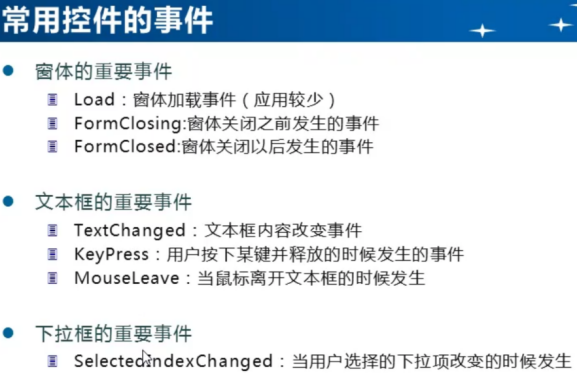
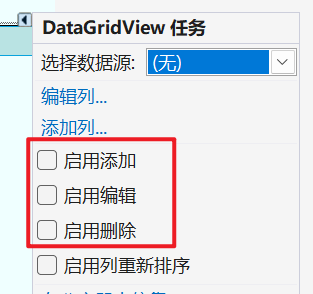
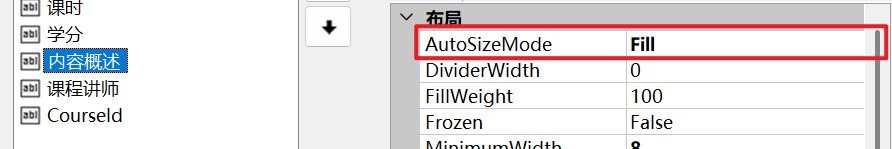
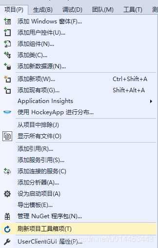
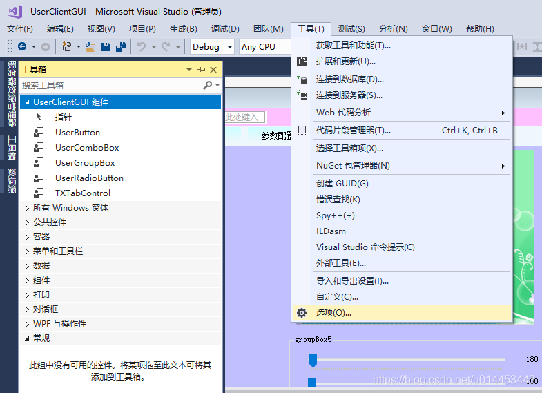
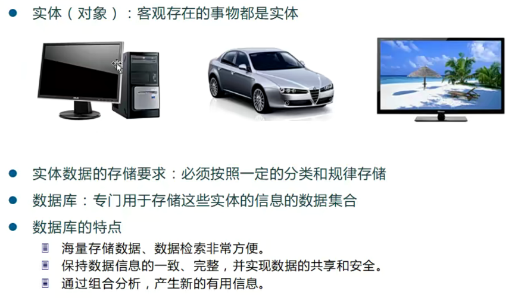
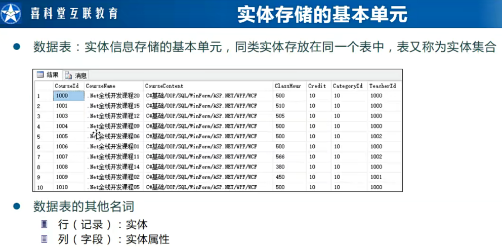
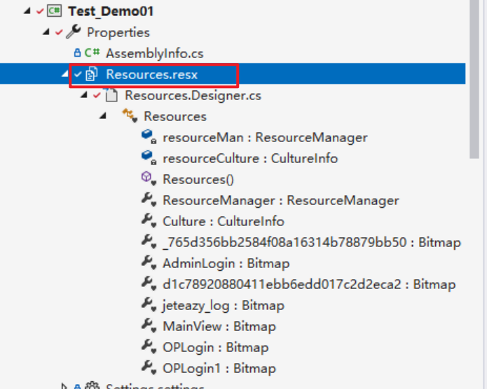

# WinForm笔记

## 1.项目结构规范

### 1.1 命名规范

主窗口要改名，改成和项目相关的名字，如TrayToTrayMainForm。

主窗体对象的创建：在Program类里面：  Application.Run(new FrmMain());

## 2.代码结构简介

Form类通过partial分为两个类。避免混乱，如果觉得还是分的，也可以通过partial在分一个类。

Form.Designer：主要是代码自动生成的一些属性，很少动的。

InitializeComponent就是在Form.Designer中，如果不加partial就会在一个类中很混乱。

Form：主要是事件，经常编辑的

### 2.1 控件对象与窗体容器集合（Controls）

控件对象与窗体容器集合（Controls）

#### 2.1.1 Controls

**每个窗口**都会有一个Controls，里面放着所有控件集合。

#### 2.1.2 Control

```
在.NET 框架中，大多数 Windows Forms 控件都继承自System.Windows.Forms.Control类
```

可以通过遍历Controls获取每个控件或者容器

```
//首先判断容器中是否有其他的窗体
foreach (Control item in Controls)
{
    if (item is Button)
    {
  
    }
}
```

#### 【1】控件和组件的区别：控件是在窗体上可见的。组件是在窗体下面不可见的，也就是不占用窗体的空间。也就是没有可视化的界面。

【2】按钮控件的使用与代码分析。控件从拖放到显示，经过的步骤：

第一、创建该对象的成员变量。

第二、初始化这个成员变量的相关属性。（我们可以通过可视化属性窗口完成）

第三、窗体本身是一个容器，所有的控件，都会加到Controls集合中。

当我在窗体上添加一个容器控件的时候（比如GroupBox或者Panel）容器控件和其他的控件一样，也会被添加到Controls集合中。当我在容器中添加相关的控件的时候，这时候，容器中的控件，会添加到当前容器的Controls集合中，而不是窗体的Controls中，请大家务必记住。

2.1.1 窗体的所有控件都是成员变量，在Designer中声明。

2.1.2 InitializeComponent方法里面的代码最好不要改动

#### 2.2.1 控件所需代码

```csharp
第一、创建该对象的成员变量。默认在Designer.cs中创建的
private Button btnMinimize;
第二、初始化这个成员变量的相关属性。（我们可以通过可视化属性窗口完成），当然也不一定都要在InitializeComponent中初始化。
 private void InitializeComponent()
 {
btnMinimize = new Button();
// 
// btnMinimize
// 
btnMinimize.Anchor = AnchorStyles.Top | AnchorStyles.Right;
btnMinimize.Location = new Point(967, 9);
btnMinimize.Margin = new Padding(2);
btnMinimize.Name = "btnMinimize";
btnMinimize.Size = new Size(22, 24);
btnMinimize.TabIndex = 2;
btnMinimize.Text = "-";
btnMinimize.UseVisualStyleBackColor = true;
btnMinimize.Click += btnMinimize_Click;

}

第三、窗体本身是一个容器，所有的控件，都会加到Controls集合中。这是加入了panel容器下面的Controles中。
panel1.Controls.Add(btnMinimize);

```

#### 2.2.2 事件的基本代码

```csharp
 private void InitializeComponent()
 {
btnMinimize = new Button();
// 
// btnMinimize
// 
btnMinimize.Anchor = AnchorStyles.Top | AnchorStyles.Right;
btnMinimize.Location = new Point(967, 9);
btnMinimize.Margin = new Padding(2);
btnMinimize.Name = "btnMinimize";
btnMinimize.Size = new Size(22, 24);
btnMinimize.TabIndex = 2;
btnMinimize.Text = "-";
btnMinimize.UseVisualStyleBackColor = true;
btnMinimize.Click += btnMinimize_Click;
//添加当对应的事件触发时，执行的方法
btnToggleMaximize.Click += btnToggleMaximize_Click;
}
//执行的方法
private void btnMinimize_Click(object sender, EventArgs e)
{
    this.WindowState = FormWindowState.Minimized;
}

```

#### 事件的sender参数

sender就是当前调用的对象，使用时，只需要转换一下对应的对象类型。

```
private void button1_Click(object sender, EventArgs e)
{
	Button btn = (Button)sender;
}
```

#### 事件的统一关联

就是将多个事件都统一成一个，多个事件调用这一个事件处理方法即可。

##### 控件的Tag属性

## 3. WinForm基本使用

### 3.1 事件的关联和移除

就是多播委托事件

### 3.2 窗口关闭按钮的提示框

FormClosing：事件

```csharp
// 窗体关闭前事件
private void 窗口的关闭和事件的添加移除_FormClosing(object sender, FormClosingEventArgs e)
{
    DialogResult result = MessageBox.Show("是否关闭", "提示", MessageBoxButtons.OKCancel, MessageBoxIcon.Question);
    if (result == DialogResult.Cancel)
    {
        //取消关闭窗体的事件
        e.Cancel = true;
    }
}
```

### 3.3 窗口集合Controls和Control类

窗体中，只要显示画面的的都要加入Controls集合中（动态添加的也是会加入Controls中的），Controls集合中子要Control类，所以所有控件都是继承了Control类的。

```csharp
//这个都是创建控件，自动生成的代码
this.Controls.Add(this.button13);
```

## 4.UI设计

4.1 外观设计要求

1.主窗体无边框化，扁平化：FormBorderStyle：None

2.textbox：BorderStyle：FixedSingle

3.Button：FlatStyle: Flat

Dock：锚定

## 5.常用组件的属性

### 5.0 通用属性

### 5.1 主窗体

StartPosition：设置窗体第一次出现位置

5.1.1 布局中的属性：

AutoScaleMode：Inherit或者None。

5.1.2 右键菜单

ContextMenuStrip：使用要选择一个窗体菜单

#### 5.1.3 窗体加载关闭触发事件



#### 5.1.4 双缓冲

在行为分类的DoubleBuffered属性，改为true，就是开启双缓冲。

#### 双缓冲属性

在行为分类的DoubleBuffered属性，改为true，就是开启双缓冲。

#### 窗体刷新

Invalidate()函数，激发一个OnPaint消息

```csharp
 // 刷新窗体
    this.Invalidate();
    // 或者
    // this.Refresh();
```

#### 将子窗体设置成非顶级控件,否则无法嵌入

form.TopLevel = false;

#### 窗口置为顶级窗口,但是还能点击其它窗口

loginForm.TopMost = true;

#### 模态窗体，模态窗体不关闭，无法点击其它页面

//不通过Show,通过ShowDialog显示模态窗体，模态窗体不关闭，无法点击其它页面,DialogResult返回的结果，loginForm创建的窗体对象
DialogResult result = loginForm.ShowDialog();

注意：当你使用 `ShowDialog()` 方法显示一个窗体时，该方法会以模态方式显示窗体。模态窗体意味着在用户关闭这个模态窗体之前，应用程序的控制权会被锁定在这个模态窗体上，调用 `ShowDialog()` 方法之后的代码将不会执行，直到模态窗体关闭。

#### 窗口隐藏和关闭

Hide();隐藏

close();关闭。


### 5.2 CheckBox复选框

5.2.1 外观中的属性

Checked：默认选中还是不选中

### 5.3 ComboBox 下拉框

通过单击事件，就可以获取选取的值

SelectedItem获取选中的项

```
private void button1_Click(object sender, EventArgs e)
        {
            // 使用 SelectedItem 获取选中项的文本
            if (comboBox1.SelectedItem != null)
            {
                string selectedText = comboBox1.SelectedItem.ToString();
                MessageBox.Show($"你选择的是: {selectedText}");
            }
            else
            {
                MessageBox.Show("请选择一个选项。");
            }
        }
```

2

### 5.4 dataGridView

数据展示控件,要想展示数据，每列的属性都要设置3个，name，data，text。

#### 基本使用：

1.这个一般全部不勾。



2.美化

2.1改背景色属性：BackgroundColor

2.2

RowHeadersWidthSizeMode:EnableResizing。行的宽高可调。

ColumnHeadersHeightSizeMod:EnableResizing.列的宽高可调。

ColumnHeadersHeight：30.根据变化调节宽高。

ColumnHeadersBorderStyle：single。让用户的设置生效

EnableHeadersVisualStyles：true

GridColor：分割线颜色

ColumnHeadersDefaultCellStyle：可以设置标题的字体大小，居中

AlternatingRowsDefoultCellStyle：设置奇数行的样式。

奇数行展示的样式，通过给某个列设置file属性，自动铺满，来占满整个了列。



#### 数据展示

### 5.5 容器

#### 5.5.1 panel

容器里面加入控件页面也是通过Controls.Add加入的，动态展示也会加入Controls管理。

### 5.6 Button

#### 5.6.1 按钮的使能

### 5.7 列表框 ListBox

可以用来展示输出信息

#### 5.7.1 信息的添加

ListBox.Item.Add();

#### 5.7.2 信息的清空

ListBox.Item.Clear();

#### 5.7.3 水平滚动条

属性：HorizontalScrollbar

### 5.8 Timer 控件

该控件运行在UI主线程的，相当于一个定时器，到了一定的时间，主线程就过来执行，类似单片机中的。

### 5.9 ContextMenStrip窗体右键菜单

### 5.10 ImageList控件

### 5.11 弹窗

#### 显示MessageBox.show()

显示弹框可以自定义图标，文本，标题。

方案一：ok和cancel

```
string okText = _languageService.GetString("OkButtonText");
            string cancelText = _languageService.GetString("CancelButtonText");
            string message = _languageService.GetString("MessageBoxMessage");
            string caption = _languageService.GetString("MessageBoxCaption");

            MessageBoxButtons buttons = MessageBoxButtons.OKCancel;
            MessageBoxIcon icon = MessageBoxIcon.Information;

            DialogResult result = MessageBox.Show(message, caption, buttons, icon, MessageBoxDefaultButton.Button1, 0, okText, cancelText);

            if (result == DialogResult.OK)
            {
                // 处理确定按钮点击事件
            }
            else if (result == DialogResult.Cancel)
            {
                // 处理取消按钮点击事件
            }
```

方案二：yes和no

```
// 从语言服务中获取对应语言的文本
            string yesText = _languageService.GetString("YesButtonText");
            string noText = _languageService.GetString("NoButtonText");
            string message = _languageService.GetString("MessageBoxMessage");
            string caption = _languageService.GetString("MessageBoxCaption");

            // 使用包含自定义按钮文本的 MessageBox.Show 重载方法
            DialogResult result = MessageBox.Show(message, caption, MessageBoxButtons.YesNo, MessageBoxIcon.Question, MessageBoxDefaultButton.Button1, 0, yesText, noText);

            if (result == DialogResult.Yes)
            {
                // 处理“是”按钮点击事件
                MessageBox.Show("你点击了是");
            }
            else if (result == DialogResult.No)
            {
                // 处理“否”按钮点击事件
                MessageBox.Show("你点击了否");
            }
```

1

#### 打开文件弹窗

```
// 创建OpenFileDialog对象
OpenFileDialog openFileDialog = new OpenFileDialog();
// 设置文件筛选器，这里只允许选择图片文件
openFileDialog.Filter = "图片文件|*.jpg;*.png;*.bmp";
// 显示打开文件对话框，用户选择文件后，DialogResult为OK表示选择了文件
if (openFileDialog.ShowDialog() == DialogResult.OK)
{
string path = openFileDialog.FileName;
//操作
}
```

#### 打开文件夹弹窗

```
// 创建FolderBrowserDialog对象
FolderBrowserDialog folderBrowserDialog = new FolderBrowserDialog();
// 显示打开文件夹对话框，用户选择文件夹后，DialogResult为OK表示选择了文件夹
if (folderBrowserDialog.ShowDialog() == DialogResult.OK)
{
// 获取用户选择的文件夹路径
string folderPath = folderBrowserDialog.SelectedPath;
// 可以在这里对选择的文件夹进行操作，比如显示文件夹路径
 MessageBox.Show($"选择的文件夹路径：{folderPath}");
}
```

#### 保存文件弹窗

```
// 创建SaveFileDialog对象
SaveFileDialog saveFileDialog = savaFileDialog();
// 设置文件筛选器，这里只允许保存为JPEG、PNG或BMP格式
saveFileDialog.Filter = "JPEG图片|*.jpg|PNG图片|*.png|BMP图片|*.bmp";
// 显示保存文件对话框，用户选择保存路径和文件名后，DialogResult为OK表示确认保存
if (saveFileDialog.ShowDialog() == DialogResult.OK)
{
// 获取用户选择的保存文件格式
 string fileExtension = System.IO.Path.GetExtension(saveFileDialog.FileName);
}
```

### 5.12 pictrueBox图片显示

//本地资源图片引用

pictureBox.Image = global::WinformSplash.Properties.Resources.jeteazy_log;

pictruec存储的是Image类型图片

设置显示图片

pictrue.image;

保存图片

pictrue.image.save()

### 5.13 textBox

多行编辑属性，也可以用于日志展示：

**`Multiline`属性** ：这是控制 `TextBox`是否为多行模式的关键属性。当设置为 `true`时，`TextBox`允许用户输入和显示多行文本；设置为 `false`时（默认值），`TextBox`只能显示和输入一行文本。

**`ScrollBars`属性** ：通常在 `Multiline`属性设置为 `true`后，可以设置 `ScrollBars`属性来为 `TextBox`添加滚动条，方便用户查看和编辑超出显示区域的文本。

**`WordWrap`属性** ：该属性用于指定当文本超出 `TextBox`的宽度时是否自动换行。当 `Multiline`为 `true`时，若 `WordWrap`设置为 `true`（默认值），文本会自动换行；若设置为 `false`，文本将在一行中继续显示，直到遇到用户手动输入的换行符或到达文本的末尾，此时可能需要水平滚动条来查看完整文本。

### 6.RichTextbox

用于log日志的展示，nlog就是用的这个控件。

### 7.progressBar

进度条展示

### PropertyGrid

属性展示控件

### winform控件的二次开发

#### 利用继承来实现，通过继承其它已有组件，来进行二次开发。

1.新建库项目

2.添加组件类，更改要二次开发的继承

3.添加融合的控件或者组件

4.添加控件方法，编译，导入工具栏，调用。

#### 通过新建控件开发

新建库项目，添加控件开发。

控件开发其实就是给个画布，里面添加各种组合控件。

##### 属性

在画布代码中添加的属性，也会在使用控件时出现。里面的属性也可以通过属性返回控件中的对象。

##### 在vs设计器中的属性窗口展示自定义控件的属性。

```

using System;
using System.ComponentModel;
using System.Windows.Forms;

namespace CustomControlLibrary
{
    public partial class CustomControl : UserControl
    {
        public CustomControl()
        {
            InitializeComponent();
        }

        // 定义一个公共属性来公开 Label 的 Text 属性
        [Category("自定义属性")] // 设置属性在属性窗口中的分类
        [Description("设置 Label 的文本内容")] // 设置属性的描述信息
        public string LabelText
        {
            get { return label1.Text; }
            set { label1.Text = value; }
        }
    }
}

```

1

### 自定义控件加入工具栏

1.将库文件的dll文件引用到项目中

1. 创建自定义控件库项目

在开始导入自定义控件库之前，你需要先创建一个自定义控件库项目并完成控件的开发。

* 打开 Visual Studio，选择 “创建新项目”，挑选 “类库（.NET Framework）” 或者 “类库（.NET Core）”，依据开发需求选定合适的 .NET 版本。
* 在项目里，右键点击项目名称，选择 “添加” -> “用户控件”，为控件命名后点击 “添加”。
* 在设计器中设计控件外观布局，同时在代码文件编写控件逻辑。
* 完成控件设计和代码编写后，点击 “生成” -> “生成解决方案”，将项目编译成 DLL 文件，生成的 DLL 文件一般位于项目的 `bin\Debug` 或 `bin\Release` 目录下。

2.通过引用添加

1. **添加项目引用** ：在目标项目的 “解决方案资源管理器” 中，右键点击 “引用”，选择 “添加引用”。
2. **浏览并选择 DLL 文件** ：在 “引用管理器” 对话框中，点击 “浏览” 按钮，找到自定义控件库的 DLL 文件，选中后点击 “确定”。

3.在目标项目中导入和使用自定义控件库

通过工具箱添加

1. **打开目标项目** ：打开你要使用自定义控件的 Windows Forms 项目。
2. **添加自定义控件到工具箱** ：在 “工具箱” 中右键点击，选择 “选择项”。
3. **浏览并添加 DLL 文件** ：在弹出的 “选择工具箱项” 对话框中，点击 “浏览” 按钮，找到之前编译生成的自定义控件库的 DLL 文件，选中后点击 “打开”。
4. **确认添加** ：此时，自定义控件会显示在 “选择工具箱项” 对话框中，勾选要添加的控件，点击 “确定”。自定义控件就会出现在 “工具箱” 中。
5. **使用自定义控件** ：在设计器中，从 “工具箱” 中拖动自定义控件到窗体上，就可以像使用普通控件一样使用它了。在代码中也可以通过控件的名称来访问和操作它

### 问题

#### textBox和ComboBox如何调整高度

**textBOX更改为多行编辑： `Multiline`属性** ：这是控制 `TextBox`是否为多行模式的关键属性。当设置为 `true`时，`TextBox`允许用户输入和显示多行文本；设置为 `false`时（默认值），`TextBox`只能显示和输入一行文本。

#### NuGet的UI框架如何加入工具栏中

方法一：

VS菜单栏中：项目＝》刷新项目工具箱



方法二：

菜单栏中：工具＝》选项＝》**Windows**窗体设计器＝》常规＝》工具箱=》自动填充工具箱=》True



#### 项目引用报错

排查一：查看引用中是否有黄色感叹号，有那么移除掉，重新加载进来，黄色感叹号表示引用没有加载进来。

#### 自定义控件里面的子控件如何操作

方法一：在自定义组件中，将子控件对象设置为public

#### 程序中显示的图形如何能够放大缩小操作

#### 重复调用load事件

如果设计器中添加了事件，代码中又添加就会导致重复的调用这个事件，绑定两次。

所以绑定事件的初始化最好自己手写。

## 多国语言切换

1.主窗体设置

* 选中要进行本地化的 WinForm 窗体或控件，在属性窗口中，将 `Localizable`属性设置为 `True`
* 将 `Language`属性设置为默认语言，如 `Chinese (Simplified)`
* 然后设置控件的 `Text`等属性为本地化字符串，如将按钮的 `Text`属性设置为 `确定`，不切换语言时，默认就是本地语言。
* 创建和编写多语言的资源文件，资源文件命名方式基本就是当前主窗体的名称，后面跟上要添加的语言信息代码。因为后面资源管理器做绑定的时候，就是按照这个命名规则查找的。

2.代码实现

* 获取当前的语言字符串
* 设置当前线程的语言
  * 这个一般都会有一个单独的类，对所有的控件和窗体进行遍历切换。
* 通过ComponentResourceManager(资源管理器类)进行资源绑定。
* 刷新页面

### 用到的类

#### 获取在setting中的语言字符串，可以是放在其它地方的文本文件或者数据库中值

```
 //获取上次存储的语言，进行界面的更新
 string language = Properties.Settings.Default.DefaultLanguage;
```

#### 切换当前UI文化(就是当前线程的语言)

```
private void SetCulture(string language)
        {
            // 创建 CultureInfo 对象
            CultureInfo culture = new CultureInfo(language);
            // 设置当前线程的 UI 文化
            Thread.CurrentThread.CurrentUICulture = culture;
            // 设置当前线程的文化
            Thread.CurrentThread.CurrentCulture = culture;
            // 重新加载资源和更新 UI 元素
            LoadLanguage();
        }
```

#### 资源类 ComponentResourceManager

从技术上讲，你可以将 `MainForm.zh-CN.resx` 命名为 `zh-CN.resx`，但这可能会带来一些潜在的问题和不便，以下是详细解释：

##### 命名约定和最佳实践

- **常规命名约定**：
  - 在 Windows 窗体应用程序中，通常将资源文件命名为 `[FormName].[CultureName].resx` 的形式，例如 `MainForm.zh-CN.resx`，这样可以清晰地表示该资源文件是与 `MainForm` 相关联的，并且适用于 `zh-CN`（中文-中国大陆）文化。
  - 这种命名方式有助于组织和管理资源文件，尤其是当你有多个窗体和多种语言时，方便你快速找到与特定窗体和文化对应的资源文件。

##### 可能的问题

- **资源文件的关联问题**：

  - 如果你将 `MainForm.zh-CN.resx` 改为 `zh-CN.resx`，在使用 `ComponentResourceManager` 时，可能会导致资源查找和应用的混淆。因为 `ComponentResourceManager` 通常会根据资源文件的名称来查找与窗体相关的资源。
  - 例如，以下代码可能无法正确找到 `zh-CN.resx` 中的资源：

  ```csharp
  Type formType = typeof(MainForm);
  ComponentResourceManager resources = new ComponentResourceManager(formType);
  ```

  - 因为 `ComponentResourceManager` 会期望资源文件的名称与 `formType` 的名称关联，即 `MainForm.zh-CN.resx`。

##### 替代方案和解决方法

- **使用 Neutral Resources Language**：

  - 如果你想简化资源文件的命名，可以使用中性资源语言（Neutral Resources Language）。例如，你可以将默认语言的资源文件命名为 `MainForm.resx`，并在项目属性中设置中性资源语言为默认语言（如英语）。
  - 对于其他语言，你可以使用 `[CultureName].resx` 的形式，例如 `zh-CN.resx`。
  - 在 `AssemblyInfo.cs` 文件中，添加以下代码来设置中性资源语言：

  ```csharp
  [assembly: NeutralResourcesLanguage("en-US")]
  ```

  - 当使用 `ComponentResourceManager` 时，它会先查找特定文化的资源文件（如 `zh-CN.resx`），如果找不到，会使用中性资源语言的资源文件（`MainForm.resx`）。

##### 示例代码

以下是一个使用中性资源语言的示例：

```csharp
using System;
using System.Windows.Forms;
using System.Threading;
using System.Globalization;
using System.ComponentModel;

namespace LanguageSwitchExample
{
    public partial class MainForm : Form
    {
        public MainForm()
        {
            InitializeComponent();
            // 初始加载默认语言
            LoadLanguage();
        }

        private void LoadLanguage()
        {
            // 获取当前线程的 UI 文化
            CultureInfo culture = Thread.CurrentThread.CurrentUICulture;
            Type formType = typeof(MainForm);
            ComponentResourceManager resources = new ComponentResourceManager(formType);
            // 应用资源到窗体及其子控件
            ApplyResources(this, resources);
        }

        private void ApplyResources(Control control, ComponentResourceManager resources)
        {
            resources.ApplyResources(control, control.Name);
            // 递归应用资源到子控件
            foreach (Control subControl in control.Controls)
            {
                ApplyResources(subControl, resources);
            }
        }

        private void btnSwitchToChinese_Click(object sender, EventArgs e)
        {
            // 切换到中文（中国大陆）
            ChangeLanguage("zh-CN");
        }

        private void ChangeLanguage(string language)
        {
            // 创建 CultureInfo 对象
            CultureInfo culture = new CultureInfo(language);
            // 设置当前线程的 UI 文化
            Thread.CurrentThread.CurrentUICulture = culture;
            // 设置当前线程的文化
            Thread.CurrentThread.CurrentCulture = culture;
            // 重新加载语言资源
            LoadLanguage();
        }
    }
}
```

##### 总结

- 虽然可以将 `MainForm.zh-CN.resx` 改为 `zh-CN.resx`，但遵循 `[FormName].[CultureName].resx` 的命名约定可以更好地组织和管理资源文件，避免资源查找和应用的混淆。
- 如果你确实想简化命名，可以考虑使用中性资源语言，并在 `AssemblyInfo.cs` 中设置中性资源语言，同时使用 `[CultureName].resx` 的形式命名其他语言的资源文件。

##### 注意事项

- 无论采用哪种命名方式，都要确保资源文件中的资源键与控件的名称和属性相匹配，以便正确应用资源。
- 在进行语言切换时，确保资源文件包含所需的资源，并且资源键准确无误。

### 使用JSON多语言化

控件等都可以用JSON进行多语言化。弹窗等按钮可以使用简单的英语，如OK,Cancel等来作为通用不变的。

## dll类库，控件的导入

在工具栏中，右键选择项，找到对应的dll文件，添加进来就行。

## 好用的UI工具库

### Emgu.CV.UI

NuGet 包管理器搜索并安装 `Emgu.CV`和 `Emgu.CV.UI`包来实现

Emgu.CV.UI.ImageBox

## 6.通用代码

### 6.1无边框窗体移动代码

使用方法：

将代码复制到添加事件的类中，然后在窗体的事件中选择对应的方法绑定即可。

```
#region 窗体移动

        private Point mouseOff;//鼠标移动位置变量
        private bool leftFlag;//标签是否为左键
        private void Frm_MouseDown(object sender, MouseEventArgs e)
        {
            if (e.Button == MouseButtons.Left)
            {
                mouseOff = new Point(-e.X, -e.Y); //得到变量的值
                leftFlag = true;                  //点击左键按下时标注为true;
            }
        }
        private void Frm_MouseMove(object sender, MouseEventArgs e)
        {
            if (leftFlag)
            {
                Point mouseSet = Control.MousePosition;
                mouseSet.Offset(mouseOff.X, mouseOff.Y);  //设置移动后的位置
                Location = mouseSet;
            }
        }
        private void Frm_MouseUp(object sender, MouseEventArgs e)
        {
            if (leftFlag)
            {
                leftFlag = false;//释放鼠标后标注为false;
            }
        }

        #endregion
```

### 6.2 窗体的放大缩小和关闭

```
 #region 窗体的大小切换和关闭
 private void btnClose_Click(object sender, EventArgs e)
 {
     this.Close();
 }

 private void btnToggleMaximize_Click(object sender, EventArgs e)
 {
     //窗体放大或者缩小
     if (this.WindowState == FormWindowState.Maximized)
     {
         this.WindowState = FormWindowState.Normal;
     }
     else if (this.WindowState == FormWindowState.Normal)
     {
         this.WindowState = FormWindowState.Maximized;
     }
 }

 private void btnMinimize_Click(object sender, EventArgs e)
 {
     this.WindowState = FormWindowState.Minimized;
 }
 #endregion
```

s

6.2.1

## 7.架构，程序的设计

其实开发语法哪些不是最难的，多记下就好了，还是程序的设计，这个搞明白了，其实就差不多很厉害了。

设计模式和编程思想，数据结构与算法

### 7.1 项目的分析

一、项目类型

1.没有数据的项目：要求使用OOP思想和方法设计，完全各个类的设计过程，确定类之间的关系。

2.有数据库的项目：项目的框架和思路相对固定，在框架的约束下开发相对容易。

  常见的框架：三层架构、MVC、或者两者结合使用...

二、核心的问题

1.一个项目中怎么样确定多少个类？

（1）名词分析法：我们根据项目的名称或者项目中的关键词，进行筛选，往往项目的名称就能给我们提供

    非常重要的类名称。实际情况中，我们可能会找到挺多的名称。我们筛选需要的名词是有一个标准的。

    我们筛选的名称将来一定要设计成类，也就是看看这个类有没有属性、方法等。

    初步找到：双色球、选号器  （随机，无法找到属性、和方法）

    双色球：红色球、蓝色球

    选号器：红色球池、蓝色球池、存储所选双色球的属性

    随机数生成方法、（打印、远程保存）

    按照对象职责明确原则，把属性和方法分配给对应的对象（类），同时你还要考虑，这个属性或者

    你找的方法，是不是我们需要的（与项目是否相关的）

（2）头脑风暴法：大家一起商量，各抒己见，按照少数服从多数的方法进行筛选。

    最后结果，不同人，不同的团队设计出来是有差别的。只要设计合理，就好。

---

2. 找到的这些类（对象）如何确定他们之间的关系？

（1）一对一的关系：一个类的对象作为另一个类的属性。数据库中数据表也会有一对一的关系。

（2）一对多的关系：一个类的多个对象作为另一个类的属性，通常这个属性是集合类型（List `<T>`）

    Dictionary<k,v>  如果是数据表这种关系体现为“主外键关系”。

### 7.2 实体类和数据库

实体类：是存储模型

数据库：是存储这些实体的数据。





### 7.3 项目的生成

在项目中，所有的dll库都会在最终执行的bin文件中存在。

## 8.前后端分离

### 8.1现在项目中

现在都流行将要展示的UI给布局好，画出来，什么都不该，控件名字也不改，在后面使用时，直接代码调用其属性。

前提是我们要画出来，布局好。后面使用时做数据填充和展示隐藏。

## 9.页面设计

#### 什么时候用控件和form

当要展示一个新的穿的时候，就用form。当只是在页面中展示的内容，就用创建控件。

## 10.资源文件的导入

直接在资源文件中添加会有问题。



### 添加方式

选择要将资源添加的项目，右键点击属性，找到资源，添加资源，现有文件，选择要添加的图片就好了。

## 11.Nlog日志使用

## 12.winformwork窗体的UI线程

### 多线程操作UI控件问题：

多线程操控UI需要InvokeRequired来操作控件，不是同一个线程创建的UI，不能直接操作，必须通过InvokeRequired的Invoke操作。如程序打开时的加载页面。

## 通讯

# 项目编写 Allinone

AOI测试

## 学习

这个架构大致分为两部分，util通用工具和allinone主要项目。

util中的项目都是窗体控件类库或者类库项目，直接生成dll给其它地方使用。

这个架构类似于若以模块化，一个类库项目就是一个模块，每个模块下面都可以有下面的功能。

### 架构下面的模块项目命名规则

主要功能 + Space

例如：

BasicSpace：基本代码

CCDSpace：

ControllerSpace：

DBSpace：

FormSpace：

GlobalSpace：通用

Interface：

OPSpace：

PropertyGridSpace：

UISpace：用于存放自定义控件

#### Universal一个静态类，用于一些项目全局使用的 属性

deubg模式：就是让代码离线使用，不加载PLC和控制逻辑，就只是模拟一些逻辑。

#### Universal.cs类可以放置一些程序全局需要的通用代码

### 代码编写

FormSpace放页面跳转，按钮点击触发的事件等等逻辑，获取数据，PLC通讯类的都放在FormSpace外面。

ControllerSpace放具体的功能实现，页面的按钮中，只需要调用Controller写好的方法就行。

变量声明，包括控件都放在最前面

在构造函数中，重声明的控件和拖拉的做绑定，放在InitializeComponent()后面。

下面在是事件的绑定等等。

最后在是多语言化，防止开始没用重命名，导致多语言化的名称不对
